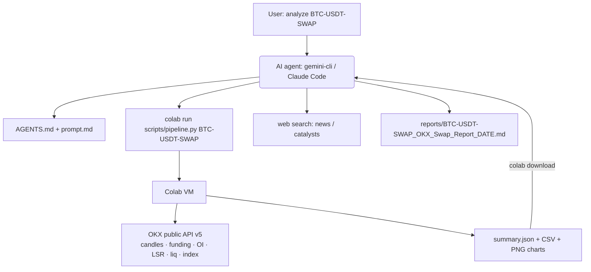

# vibe-trading-okx-futures

> From vibe coding to vibe trading — for **OKX USDT-margined perpetual swaps**, with the heavy lifting done on a **Google Colab VM through the Colab CLI**.

A port of [wanghsinche/vibe-trading](https://github.com/wanghsinche/vibe-trading) (an equity-research agent built on `gemini-cli` + MCP data servers) to crypto derivatives. The AI agent (`gemini-cli`, Claude Code, or any agent that reads `AGENTS.md`) follows `prompt.md`, runs a public-API data pipeline on Colab, reads the resulting `summary.json` and charts, and writes a derivatives research report ending in **LONG / SHORT / NO TRADE**.

Research only. Nothing here places orders or needs an exchange API key.

## What changed vs. the original

| Original (equities) | This repo (OKX swaps) |
|---|---|
| PlusE `fin-data-mcp` (paid, stocks) | `scripts/okx_futures.py` — OKX public REST API v5, no key |
| Fundamentals: P/E, ROE, cash flow | Contract specs, funding, open interest, long/short account ratio, taker ratio, liquidations, basis vs index |
| Charts via AntV chart MCP | Charts generated by the pipeline (matplotlib); AntV MCP kept as optional |
| Runs wherever `gemini-cli` runs | Pipeline runs on a Colab VM via `colab run` / `colab download`, or locally |
| Buy / Hold / Sell for mid-term investors | Directional bias + entry / stop / targets / leverage cap / funding-adjusted holding period, and an explicit "what invalidates this" list |

## Architecture



## Quick start

```bash
git clone https://github.com/crypmiy/vibe-trading-okx-futures && cd vibe-trading-okx-futures
pip install google-colab-cli            # or: uv tool install google-colab-cli
gcloud auth application-default login \
  --scopes=openid,https://www.googleapis.com/auth/cloud-platform,https://www.googleapis.com/auth/userinfo.email,https://www.googleapis.com/auth/colaboratory

./run_colab.sh BTC-USDT-SWAP            # data + charts → ./out (or ./run_local.sh BTC-USDT-SWAP)
gemini                                  # then: "Read AGENTS.md and run prompt.md for BTC-USDT-SWAP, today is 2026-09-25"
```

`gemini-cli` picks up `.gemini/settings.json` (optional AntV chart MCP) and `GEMINI.md`; Claude Code picks up `CLAUDE.md`. Both point to `AGENTS.md`.

## Pipeline output (`out/`)

| File | Contents |
|---|---|
| `summary.json` | instrument specs, ticker (last/mark/index/funding), per-timeframe trend/momentum/volatility/levels, funding stats, OI-vs-price regime, long/short + taker ratios, liquidation totals, basis vs index |
| `<INSTRUMENT>_1h.csv` `_4h.csv` `_1d.csv` | OHLCV (1d bars are UTC-aligned `1Dutc`) |
| `funding.csv`, `contract_stats.csv` | funding history and hourly OI / long-short / taker / liquidation stats |
| `chart_1h.png` `chart_4h.png` `chart_1d.png` | price + EMA20/50/200, volume, RSI, MACD |
| `chart_derivatives.png` | funding history, OI vs price, long/short liquidations |

## Research workflow (pre-registered — see `research/GATES.md`)

The agent's report is a *hypothesis*, not a signal. The repo scores it before any money moves:

1. **Phase 1 — forecast log ($0).** `run_research.sh` runs the pipeline and the agent for each instrument in `research/instruments.txt`, ingests the report's forecast block into `research/forecasts.sqlite`, scores past forecasts pessimistically against OKX 1h candles (stop wins ties, fees + slippage + realized funding deducted) and prints the gate. Systemd timers run it Mon/Thu and score daily.
2. **Phase 2 — Freqtrade dry-run ($0).** Only if the Phase 1 gate passes: `freqtrade/` runs an OKX futures dry-run whose strategy mechanically executes `signals/active.json` (entry zone → stop / target1 / horizon, 1×).
3. **Phase 3 — live.** Not automated here.

```bash
./run_research.sh                       # one full cycle (data → agent → score → gate)
python scripts/forecast_log.py gate     # where do we stand?
sudo cp systemd/vibe-*.{service,timer} /etc/systemd/system/ && sudo systemctl enable --now vibe-research.timer vibe-score.timer
./freqtrade/setup.sh                    # Phase 2 only
```

## Telegram

Two bots (Telegram allows one long-poller per token): the **research bot** (`scripts/tg_bot.py`) and **Freqtrade's own bot** (Phase 2). Put both tokens in `.env` (see `.env.example`); Freqtrade reads its token/chat via `FREQTRADE__TELEGRAM__*` env vars, so the config keeps `enabled: false` as a safe default.

Research bot commands: `/gate` `/open` `/last [INST]` `/signals` `/run [INST…]` `/score` `/help`. Notifications: one message per new report (bias, zone, stop, target, executive summary), one per scored outcome, one per cycle with the gate verdict, and agent failures. Freqtrade posts its usual entry/exit/status messages and answers `/status` `/profit` `/balance` `/trades` etc.

## Repo layout

```
prompt.md            the analyst workflow (Part 0–5), crypto-derivatives version
AGENTS.md            how the agent runs the pipeline on Colab and writes the report
GEMINI.md, CLAUDE.md pointers to AGENTS.md
scripts/okx_futures.py    OKX public-data client (API v5)
scripts/analyze.py        indicators, positioning stats, charts
scripts/pipeline.py       one-shot entry point (colab run / python)
run_colab.sh, run_local.sh
run_research.sh           full research cycle; AGENT_CMD selects gemini or claude headless
scripts/forecast_log.py   ingest / evaluate / gate / export-signals (SQLite)
research/GATES.md, gates.json, instruments.txt   pre-registered plan and thresholds
signals/active.json       open forecasts for the Freqtrade strategy (generated)
freqtrade/                dry-run config + VibeForecastStrategy (Phase 2)
scripts/notify.py, scripts/tg_bot.py   Telegram notifications + research command bot
systemd/                  timers for the research cycle, daily scoring, Telegram bot, Freqtrade
.gemini/settings.json     optional AntV chart MCP
reports/                  generated reports
```

## Caveats

- OKX open-interest, long/short and taker-volume stats come from the trading-data (Rubik) endpoints and are aggregated per currency (e.g. all BTC contracts), not per instrument; liquidations cover only the latest ~100 forced orders. Instrument names: `BTC-USDT-SWAP` (`BTC` / `BTC_USDT` are normalized).
- Colab `run` ships only `pipeline.py` to the VM; the pipeline fetches the two helper modules from this repo's `main` branch. Set `VT_RAW` to a raw URL of your own `scripts/` directory when working on a branch.
- Public endpoints are rate limited; the client retries with backoff.
- An AI-written thesis is a hypothesis, not a signal. Backtest before you size.

## License

MIT — see `LICENSE`. Original concept and prompt structure © wanghsinche.
