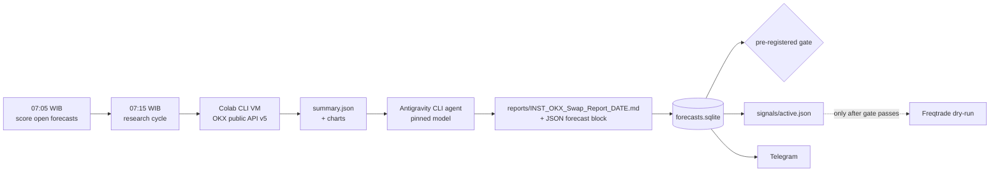

# vibe-trading-okx-futures


-4285F4)


> An AI analyst writes a daily trade thesis for BTC, ETH and SOL perpetual swaps on OKX.
> Every thesis is logged and scored against real prices under a **pre-registered gate**
> before a single dollar — or even a dry-run trade — is allowed to count.

Adapted from [wanghsinche/vibe-trading](https://github.com/wanghsinche/vibe-trading) (AI equity research) and rebuilt for crypto derivatives.

## Status

| | |
|---|---|
| Protocol | **v2 — daily trades**, BTC / ETH / SOL, 1-day horizon, counted from 2026-09-26 |
| Phase | **1 — forecast log** (no capital, no dry-run) |
| Gate | ≥ 30 directional forecasts **and** ≥ 20 distinct days, then expectancy ≥ +0.10 R net with both temporal halves positive |
| Live verdict | `python scripts/forecast_log.py gate` or `/gate` on Telegram |

The full plan, thresholds and every change to them are in [`research/GATES.md`](research/GATES.md).
"Gate failed" is a valid, publishable outcome.

## How a day runs



1. **Data** — `scripts/pipeline.py` runs on a Google Colab VM through the Colab CLI (falls back to the Jetson if Colab is unavailable): candles 1h/4h/1d, funding, open interest, long/short and taker ratios, liquidations, basis vs index, plus charts.
2. **Analyst** — the Antigravity CLI (`agy -p`, one pinned model for the whole sample) follows [`prompt.md`](prompt.md) and writes a report that starts with a machine-readable forecast: bias, entry zone, stop, target, horizon, invalidation.
3. **Scoring** — [`scripts/forecast_log.py`](scripts/forecast_log.py) scores each forecast pessimistically on OKX 1h candles: entry only if the zone trades within 12 h, stop wins same-candle ties, fees + slippage + realized funding deducted.
4. **Gate** — prints one verdict line: `NOT YET DECIDABLE`, `GATE PASSED` or `GATE FAILED`.
5. **Phase 2** — only after a pass: [`freqtrade/`](freqtrade/) executes `signals/active.json` mechanically in OKX futures dry-run (1×, stop / target1 / horizon).

## Telegram

| When | Message |
|---|---|
| Every morning | one message per report (bias, zone, stop, target, executive summary) and a cycle summary with the gate verdict |
| On close | one line per finished forecast, e.g. `BTC-USDT-SWAP LONG → target1 R_net=+1.69` |
| Any time | `/gate` `/open` `/last [INST]` `/signals` `/score` `/run` `/help` |

Freqtrade uses its own bot (Phase 2): `/status` `/profit` `/trades` …

## Setup (Jetson / any Linux, venv)

```bash
git clone https://github.com/crypmiy/vibe-trading-okx-futures && cd vibe-trading-okx-futures
python3 -m venv .venv && . .venv/bin/activate && pip install -r requirements.txt
uv tool install google-colab-cli                                 # data runtime (Colab)
curl -fsSL https://antigravity.google/cli/install.sh | bash      # analyst (agy) — then run `agy` once to sign in
cp .env.example .env && nano .env                                # Telegram, AGY_MODEL, VT_DATA

./run_research.sh BTC-USDT-SWAP                                  # one manual cycle
python scripts/forecast_log.py gate

sudo cp systemd/vibe-*.service systemd/vibe-*.timer /etc/systemd/system/ && sudo systemctl daemon-reload
sudo systemctl enable --now vibe-research.timer vibe-score.timer vibe-tgbot
```

The agent runs with auto-approved tools, so keep a deny-list (`rm`, `sudo`, `git push`, `systemctl`, …) in `~/.gemini/antigravity-cli/settings.json` and run it on a machine without exchange keys.

## Repository layout

```
prompt.md                  analyst workflow (Part 0–5) + forecast block contract
AGENTS.md                  instructions the agent reads (GEMINI.md points here)
run_research.sh            data → agent → ingest → score → signals → gate → Telegram
run_colab.sh, run_local.sh data pipeline on Colab VM / locally
scripts/okx_futures.py     OKX public API v5 client (no key)
scripts/analyze.py         indicators, positioning stats, charts
scripts/pipeline.py        one-shot data entry point (colab run / python)
scripts/agent.sh           agy wrapper: pinned model, timeout, retry round
scripts/forecast_log.py    ingest / evaluate / gate / export-signals (SQLite)
scripts/notify.py, tg_bot.py  Telegram notifications + command bot
research/                  GATES.md (pre-registration), gates.json, instruments.txt
reports/                   one Markdown report per instrument per day
freqtrade/                 dry-run config + VibeForecastStrategy (Phase 2)
systemd/                   timers and services
```

## Caveats

- OKX open-interest, long/short and taker stats are per currency (all BTC contracts), not per instrument; liquidations cover only the latest ~100 forced orders.
- Forecasts on the same day across BTC/ETH/SOL are highly correlated; that is why the gate also requires 20 distinct days.
- Research only. Nothing here gives investment advice, holds exchange keys or places live orders.

## License

MIT — see [`LICENSE`](LICENSE). Original concept © wanghsinche.
