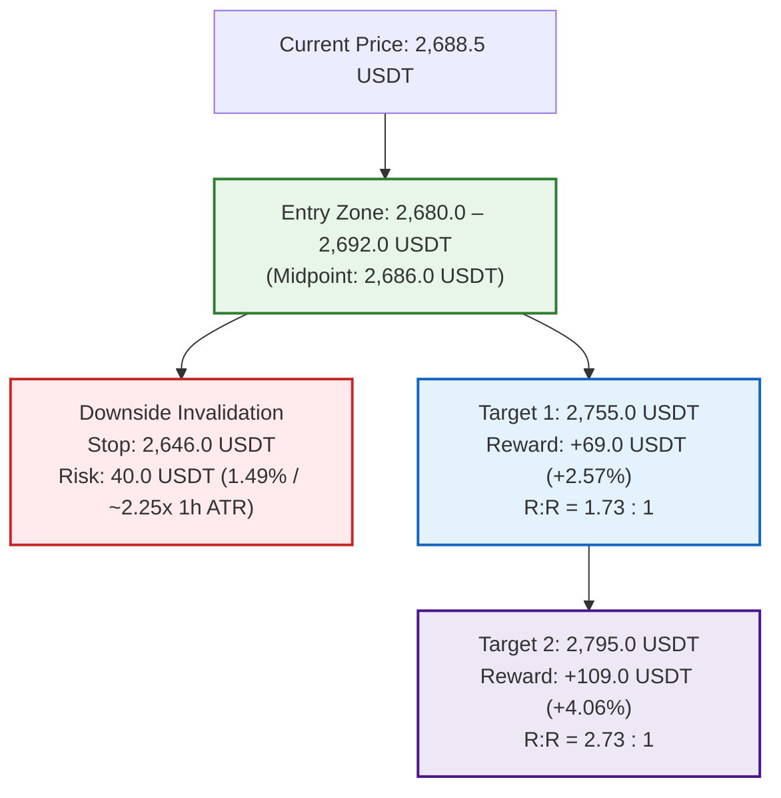

# OKX Perpetual Swap Research Report: ETH-USDT-SWAP

```json
{"forecast": {"instrument": "ETH-USDT-SWAP", "date": "2026-09-26", "bias": "LONG", "confidence": "medium", "entry_low": 2680.0, "entry_high": 2692.0, "stop": 2646.0, "target1": 2755.0, "target2": 2795.0, "horizon_days": 1, "invalidation": ["1-hour candle close below 2,646.0 USDT breaking 1h EMA200 (2,651.45 USDT) and 4h EMA50 (2,653.21 USDT) confluence support floor", "Daily candle close below 20-day EMA at 2,585.33 USDT terminating intermediate bullish market structure", "Derivatives regime flip to aggressive short expansion with expanding open interest and persistent negative funding", "Sustained institutional spot Ethereum ETF net daily outflows exceeding $300M or broader market risk-off cascade"]}}
```

### Executive Summary
* **Directional Bias:** LONG (higher-low consolidation base above dual-timeframe dynamic confluence floor, aligned with macro daily/4-hour bull trend).
* **Confidence Level:** Medium (strong daily/4-hour structural alignment and complete derivatives flush/reset; tempered by short-term 1-hour EMA compression).
* **Execution Range:** Entry Zone: 2,680.0 – 2,692.0 USDT (Market / Pullback to 1h EMA20/50 shelf) | Hard Invalidation Stop: 2,646.0 USDT.
* **Profit Targets:** Target 1: 2,755.0 USDT (R:R 1.73 vs midpoint) | Target 2: 2,795.0 USDT (R:R 2.73 vs midpoint).
* **Top Downside Risk:** Decisive breakdown below the dual-timeframe dynamic confluence floor at 2,651.45 – 2,653.21 USDT (1h EMA200 / 4h EMA50), risking a cascade toward the 20-day EMA (2,585.33 USDT).

---

## Part 0: Data Acquisition & Pipeline Environment

### Data Provenance & Methodology
* **Source:** OKX public REST market data endpoints and OKX Rubik trading-data endpoints processed via `scripts/pipeline.py`.
* **Execution Timestamp:** `2026-09-26T00:20:05+00:00` (UTC).
* **Primary Output Files:**
  * Summary metrics: [`out/summary.json`](file:///home/jetson/vibe-trading-okx-futures/out/summary.json)
  * Multi-timeframe OHLCV datasets: [`out/ETH-USDT-SWAP_1d.csv`](file:///home/jetson/vibe-trading-okx-futures/out/ETH-USDT-SWAP_1d.csv) (365 daily bars), [`out/ETH-USDT-SWAP_4h.csv`](file:///home/jetson/vibe-trading-okx-futures/out/ETH-USDT-SWAP_4h.csv) (2,190 4-hour bars), [`out/ETH-USDT-SWAP_1h.csv`](file:///home/jetson/vibe-trading-okx-futures/out/ETH-USDT-SWAP_1h.csv) (1,440 1-hour bars).
  * Derivatives metrics: [`out/funding.csv`](file:///home/jetson/vibe-trading-okx-futures/out/funding.csv) (287 settlement intervals spanning ~95 days), [`out/contract_stats.csv`](file:///home/jetson/vibe-trading-okx-futures/out/contract_stats.csv) (100 hourly snapshots of Open Interest, LSR, taker volume, and liquidations).
  * Graphical artifacts: Rendered and stored in [`reports/img/`](file:///home/jetson/vibe-trading-okx-futures/reports/img/) (`chart_1d.png`, `chart_4h.png`, `chart_1h.png`, `chart_derivatives.png`).

---

## Part 1: Contract & Market Structure

### 1. Facts (Data-Derived)
*Source: `summary.json` → `contract_specs`, `ticker`*

| Specification Field | Raw Value | Metric Interpretation |
| :--- | :--- | :--- |
| **Instrument ID (`instId`)** | `ETH-USDT-SWAP` | Linear perpetual swap margined and settled in USDT |
| **Underlying (`uly`)** | `ETH-USDT` | Ethereum spot reference index basket |
| **Contract Value (`ctVal`)** | `0.1` | Each contract represents exactly 0.1 ETH |
| **Contract Value Currency (`ctValCcy`)** | `ETH` | Base currency is Ethereum |
| **Contract Multiplier (`ctMult`)** | `1` | Linear payout multiplier |
| **Contract Type (`ctType`)** | `linear` | Direct USDT settlement |
| **Maximum Leverage (`lever`)** | `100` | Up to 100x account-level leverage permitted |
| **Tick Size (`tickSz`)** | `0.01` | Minimum price fluctuation is 0.01 USDT |
| **Lot Size (`lotSz`) / Min Size (`minSz`)** | `0.01` | Minimum order size is 0.01 contracts (= 0.001 ETH) |
| **Max Limit Order Size (`maxLmtSz`)** | `100000000` | Maximum limit order size: 100,000,000 contracts |
| **Max Market Order Size (`maxMktSz`)** | `90000` | Maximum single market order: 90,000 contracts (= 9,000 ETH) |
| **Settlement Currency (`settleCcy`)** | `USDT` | Margin, PnL, and funding paid in USDT |
| **Trading State (`state`)** | `live` | Actively trading (listed 2019-11-12 11:16:48 UTC; `listTime`: `1573557408000`) |
| **Expiration Time (`expTime`)** | `""` (null / empty) | Perpetual instrument with no fixed expiry |
| **Funding Interval (`funding_interval_hours`)** | `8.0` | Settled every 8 hours (00:00, 08:00, 16:00 UTC) |
| **Ticker Last Price (`last`)** | `2688.5` | Last trade matched at 2,688.50 USDT |
| **Top of Book Depth** | Bid: `2688.50` (19.81 ct) / Ask: `2688.51` (2869.89 ct) | Tightest possible 1-tick spread: 0.01 USDT (~0.00037%) |
| **24h Volume Base (`volCcy24h`)** | `2498415.297` ETH | 2,498,415.3 ETH traded in trailing 24 hours |
| **24h Volume Contracts (`vol24h`)** | `24984152.97` contracts | 24h Turnover: ~**$6,716,990,526 USDT** notional |
| **24h High / Low Range** | Low: `2665.51` / High: `2742.95` | 24h Absolute Range: 77.44 USDT (2.88%) |
| **Start of Day (SOD) Reference** | UTC 0: `2690.29` / UTC 8: `2685.71` | Intraday reference anchors |
| **Mark vs Index Price** | Mark: `2688.47` / Index: `2689.86` | Mark trades at a discount of -1.39 USDT (-0.0517%) |
| **Open Interest (`open_interest_latest`)** | `1821222003.5263` contracts | Total open interest: ~**$1,821,222,004 USDT** |

### 2. Interpretation & Liquidity Analysis
* **Execution Liquidity & Microstructure:** ETH-USDT-SWAP on OKX is an exceptionally liquid tier-1 crypto derivatives instrument. With over 24.98 million contracts (~$6.72 billion USDT) in 24h turnover and a microscopic 1-tick bid-ask spread of 0.01 USDT (~0.00037%), retail-to-institutional position sizes (10 to 1,000 ETH) can be entered and exited effortlessly via market or limit orders with negligible slippage and zero measurable market impact.
* **Cost of Carry Analysis (24-Hour Horizon):**
  * **Trading Fee Model:** Baseline VIP0 fee schedule is 0.050% (5 bps) taker and 0.020% (2 bps) maker. A complete round-trip taker execution incurs 0.100% (10 bps) in baseline trading fees.
  * **Funding Rate Baseline:**
    * Latest settled funding rate: **+0.003434%** per 8h (`summary.json` → `funding.latest_pct`).
    * 7-day mean funding rate: **+0.004100%** per 8h (= **+0.012301%** daily).
    * 30-day mean funding rate: **+0.004708%** per 8h (= **+0.014123%** daily, **5.155% APR** annualized).
  * **Long Position Carry Cost:** Long contract holders pay positive funding to short holders. Over a 24-hour holding period spanning 3 funding settlements (00:00, 08:00, 16:00 UTC), expected funding drag based on the 7-day mean is **+0.0123%** (~1.23 bps). Combined with a full round-trip taker execution (0.100%), the total carrying friction for a long position is ~**0.1123%** (~11.2 bps). At the latest funding print of +0.003434% per 8h, 24h funding drag is only ~0.0103% (~1.03 bps). This represents an exceptionally cheap carry environment.
  * **Short Position Carry Yield:** Short contract holders receive funding payments. Over 24 hours, shorts earn a modest carry yield of +0.0123% (7d mean), which subsidizes roughly 12.3% of round-trip taker fees (or generates positive net return if entered and exited with limit maker orders).

---

## Part 2: Price Action & Technical Analysis

### Visual Multi-Timeframe Charts


### 1. Facts (Multi-Timeframe Metrics)
*Source: `summary.json` → `timeframes` & OHLCV CSV datasets*

| Indicator / Metric | Daily (1D) | 4-Hour (4H) | 1-Hour (1H) |
| :--- | :--- | :--- | :--- |
| **Last Close Price** | `2688.22` USDT | `2688.22` USDT | `2688.50` USDT |
| **7-Day / 30-Day Return** | +2.16% / +7.11% | +2.65% / +7.86% | +2.39% / +7.93% |
| **EMA 20** | `2585.33` USDT | `2689.39` USDT | `2688.75` USDT |
| **EMA 50** | `2404.20` USDT | `2653.21` USDT | `2689.47` USDT |
| **EMA 200** | `2266.29` USDT | `2483.26` USDT | `2651.45` USDT |
| **Trend Structure Classification** | **UP** (Price > EMA20 > EMA50 > EMA200) | **UP** (EMA50 > EMA200; Retracement holding) | **MIXED** (Price hugging EMA20/50, firmly > EMA200) |
| **RSI 14** | `63.42` (Bullish expansion) | `50.93` (Neutral reset) | `50.07` (Neutral equilibrium) |
| **MACD Histogram** | `+3.64` (Positive momentum) | `-3.85` (Negative, contracting) | `-0.85` (Near zero, flattening) |
| **ATR 14 / ATR %** | 96.65 USDT / `3.60%` | 38.85 USDT / `1.45%` | 17.74 USDT / `0.66%` |
| **30-Day Realized Volatility (Ann.)** | `46.19%` | `44.77%` | `46.85%` |
| **Key Pivot Support Levels** | `2621.19`, `2356.18`, `2355.56`, `2251.05` | `2626.07`, `2621.19`, `2563.00`, `2460.01` | `2666.60`, `2665.51`, `2661.88`, `2633.33` |
| **Key Pivot Resistance Levels** | `2806.96`, `3045.47`, `3077.16`, `3308.65` | `2787.83`, `2806.96`, `2960.00`, `2985.82` | `2697.72`, `2699.27`, `2703.38`, `2706.45` |

### 2. Interpretation & Key Level Validation
* **Multi-Timeframe Trend Structure:**
  * **Macro Context (Daily):** The daily timeframe exhibits an unequivocal structural bull trend (`up`). Price (`2,688.22` USDT) trades substantially above the ascending 20-day EMA (`2,585.33`), 50-day EMA (`2,404.20`), and 200-day EMA (`2,266.29`). The daily Golden Cross continues to widen cleanly. Daily RSI (`63.42`) sits in bullish momentum territory without entering overbought exhaustion (>70), while the daily MACD histogram remains positive (`+3.64`).
  * **Intermediate Context (4-Hour):** The 4-hour trend structure is firmly bullish (`up`). The 4-hour EMA50 (`2,653.21`) is separated from the 4-hour EMA200 (`2,483.26`) by over 170 USDT. Following the cycle rejection at 2,806.96 USDT on September 23, price retraced into a swing low of 2,626.07 USDT on September 24 before establishing a succession of higher lows. Price is currently consolidating directly around the 4-hour EMA20 (`2,689.39`), coiling for its next directional move.
  * **Micro Execution Context (1-Hour):** The 1-hour structure is classified as `mixed` due to tight moving average compression. Price (`2,688.50` USDT) is oscillating within a 1-USDT band of the 1-hour EMA20 (`2,688.75`) and EMA50 (`2,689.47`). Crucially, the 1-hour EMA200 (`2,651.45`) has served as an unbreakable floor across all recent corrective tests.
* **Dual-Timeframe Dynamic Confluence Floor (2,651.45 – 2,653.21 USDT):**
  * An exceptionally robust technical confluence guards the immediate downside:
    * **1-Hour EMA200:** `2,651.45` USDT
    * **4-Hour EMA50:** `2,653.21` USDT
    * **Prior Swing Pullback Pivot Zone:** `2,661.88` – `2,666.60` USDT
  * This convergence forms a formidable institutional demand shelf between **2,651 and 2,666 USDT**. As long as 1-hour and 4-hour candle closes remain above this confluence shelf, the broader bullish thesis remains fully intact.
* **Ascending Base & Higher Lows Progression:**
  * Over the trailing 48 hours, Ethereum has formed an indisputable sequence of higher lows on the 1-hour and 4-hour charts:
    * September 24 (08:00 UTC): `2,626.07` USDT (initial cycle correction low)
    * September 25 (07:00 UTC): `2,665.51` USDT (+39.44 USDT higher)
    * September 25 (15:00 UTC): `2,666.60` USDT (+1.09 USDT higher)
    * September 25 (21:00 UTC): `2,675.71` USDT (+9.11 USDT higher)
    * September 26 (00:00 UTC): `2,687.50` USDT (+11.79 USDT higher)
  * This progressive stair-step structure proves persistent buyer absorption at progressively elevated price levels.
* **Momentum & Volatility Compression Regime:**
  * The 4-hour RSI has fully reset to the `50.93` median line, clearing all overbought readings from earlier in the week and establishing substantial upside runway.
  * Hourly volatility has compressed dramatically: 1-hour ATR% is down to **0.66%** (17.74 USDT), compared to 1.45% on 4H (38.85 USDT) and 3.60% on 1D (96.65 USDT). Extreme hourly ATR compression within a higher-timeframe bull trend is a classic harbinger of explosive directional breakout in the direction of the macro trend.

---

## Part 3: Positioning & Derivatives Flow

### Derivatives Market Visual


### 1. Facts (Data-Derived)
*Source: `summary.json` → `funding`, `positioning`, `basis` & `contract_stats.csv`*

| Metrics Category | Recorded Value | Context & Benchmark Comparison |
| :--- | :--- | :--- |
| **Latest Funding Rate** | `+0.003434%` per 8h | Subdued carry (0.34 bps per 8h); sits at **47.04th percentile** of 287 historical settlements |
| **7-Day Mean Funding** | `+0.004100%` per 8h | +0.012301% daily (+4.49% APR) |
| **30-Day Mean Funding** | `+0.004708%` per 8h | +0.014123% daily; **+5.155% APR** annualized |
| **30-Day Positive Funding Share** | `92.22%` | 265 of 287 intervals positive; steady underlying baseline demand |
| **Open Interest Latest** | `1,821,222,003.53` ct | Total value: ~**$1.821 Billion USDT** across OKX ETH contracts |
| **OI 24-Hour Change** | `-1.0437%` (-19.2M ct) | Deleveraging and position reduction over trailing 24 hours |
| **Price Change Same Window** | `-0.0305%` | Flat price action alongside open interest decline |
| **Positioning Regime** | `long unwind (price down, OI down)` | Orderly de-risking and liquidation of late longs; no aggressive short buildup |
| **OI Peak-to-Trough Flush** | `-8.60%` (-171.1M ct) | Dropped from 1,988,988,480 ct (Sept 23 11:00 UTC) to 1,817,841,675 ct (Sept 25 22:00 UTC) |
| **Long/Short Account Ratio (`lsr_account_latest`)** | `1.34` | 57.3% accounts long vs 42.7% short (down from cycle high of 1.46) |
| **Taker Buy/Sell Ratio (`lsr_taker_latest`)** | `0.6084` | Hourly taker sell volume exceeded buy volume during local compression |
| **24h Taker Aggregate Volume** | Buy: `$3.506B` / Sell: `$3.462B` | 24h aggregate taker ratio: **1.0126** (balanced two-way order flow) |
| **24h Liquidations Sum** | Long: `1,868.39` ct / Short: `664.70` ct | Long liquidations outpaced shorts by **2.81 to 1** |
| **Capitulation Spike (Sept 25 21:00 UTC)** | `1,704.47` ct long liquidations | **91.2%** of 24h long liquidations concentrated in one single hourly bar |
| **Mark-Index Basis** | `-0.0517%` (-5.17 bps) | Mark price trades 1.39 USDT below spot index (2,688.47 vs 2,689.86) |
| **Perp-Spot Basis** | Latest: `-0.0435%` / 30d Mean: `-0.0451%` | Perpetual swap trades at a modest discount to spot reference basket |

### 2. Interpretation & Derivatives Flow
* **Speculative Reset & Long Unwind:**
  * The derivatives market regime is officially classified as `long unwind (price down, OI down)`.
  * Total open interest flushed by **-8.60%** (-171.1 million contracts) from its local peak of 1.989 billion contracts on September 23 down to 1.818 billion contracts on September 25 at 22:00 UTC.
  * This contraction cleared excessive leverage accumulated during the prior rally to 2,806.96 USDT without compromising the broader price structure.
* **The September 25 Capitulation Event (21:00 UTC):**
  * A critical microstructural development occurred on September 25 at 21:00 UTC: a sudden localized flush triggered **1,704.47 contracts in long liquidations** in a single hour. This single event accounted for **91.2% of all long liquidations in the trailing 24 hours**.
  * Crucially, despite this severe liquidation spike, price merely dipped to 2,675.71 USDT (maintaining a higher low relative to the 2,665.51 low earlier that morning) and immediately rebounded to 2,690.76 USDT in the very next hour.
  * Following this liquidation flush, open interest reached its absolute trough at 22:00 UTC (1.8178B ct) and has since begun expanding back upward to 1.8212B ct. This confirms a textbook capitulation bottom where weak-handed leverage was extinguished directly into passive institutional limit bids.
* **Taker Flow vs. Passive Absorption:**
  * While the latest hourly taker buy/sell ratio printed `0.6084` (indicating aggressive market sell orders), price refused to break below 2,687 USDT. This stark divergence proves that aggressive market selling is being completely absorbed by dense limit bid orders.
  * Over the full 24-hour window, taker volume was evenly balanced (1.0126 buy/sell ratio on $6.97B total taker turnover), indicating that aggressive selling is localized and transient.
* **Funding Rate & Basis Normalization:**
  * The latest funding rate of `+0.003434%` per 8h sits squarely at the **47.04th percentile** of historical settlements, representing dead-center neutral territory.
  * With mark-index basis at `-0.0517%` and perp-spot basis at `-0.0435%`, perpetual futures are trading at a slight discount to spot. There is zero speculative exuberance in the funding mechanism, leaving the contract primed for an upside squeeze as spot buyers push price higher.

---

## Part 4: Narrative, Catalysts & Cross-Market Context

### 1. Underlying Asset & Ecosystem Developments
* **ETHGlobal Tokyo (September 25–27, 2026):**
  * ETHGlobal Tokyo is currently underway in Japan, convening leading Ethereum core developers, infrastructure builders, and decentralized finance architects. Focus areas center heavily on Layer 2 interoperability, zero-knowledge scalability, and decentralized application monetization.
* **Upcoming Glamsterdam Testnet Upgrade (October 6, 2026):**
  * Technical anticipation is building for the **Glamsterdam testnet upgrade**, with the Sepolia hard fork scheduled for **October 6, 2026**. This milestone represents a key preparatory step in Ethereum's multi-phase roadmap, enhancing execution layer throughput, state management, and blob capacity for Layer 2 rollups.
* **Post-Rally Recovery & Network Metrics:**
  * Ethereum has staged a sustained recovery of approximately **+46% since mid-August 2026**, successfully reclaiming the $2,600–$2,700 consolidation band. Network transaction activity has stabilized, with lower Layer 2 execution costs spurring higher on-chain user engagement.

### 2. Macroeconomic Backdrop & Market Beta
* **Crypto Market Capitalization Reclaims $3.0 Trillion:**
  * The aggregate digital asset market capitalization decisively reclaimed the **$3.0 Trillion** threshold in late September 2026, marking its strongest valuation since early 2026.
* **Bitcoin High-Beta Anchor:**
  * Bitcoin (BTC-USDT-SWAP) has mounted an aggressive rally, consolidating firmly in the **$84,000 – $86,000** zone. Bitcoin's daily and 4-hour market structure is powerfully bullish, providing a sturdy risk-on umbrella for Ethereum and major altcoins.
* **Federal Reserve Monetary Policy Absorption:**
  * On September 16, 2026, the Federal Open Market Committee (FOMC) delivered a hawkish 25-basis-point rate hike, raising the benchmark Fed Funds rate to **3.75%–4.00%**.
  * While traditional equity markets and precious metals experienced initial volatility, digital assets demonstrated remarkable resilience. The crypto market has effectively absorbed the "higher-for-longer" rate stance, propelled by consistent institutional net inflows through regulated U.S. spot ETFs.

### 3. Catalysts & Event Horizon
* **Upside Catalysts:**
  * Breakout and hourly close above the 2,706.45 USDT pivot resistance, initiating an acceleration toward the 2,742.95 USDT 24-hour high and 2,806.96 USDT cycle resistance.
  * Continued institutional net inflows into spot Ethereum ETFs heading into the Q4 quarterly asset rebalancing.
  * Momentum and positive technical developments emerging from ETHGlobal Tokyo and the approaching Glamsterdam Sepolia fork.
* **Downside Risks:**
  * Decisive hourly candle breakdown below the 2,646.0 USDT invalidation level (breaking the 1h EMA200 / 4h EMA50 confluence floor).
  * Hawkish macroeconomic rhetoric from Federal Reserve officials signaling further rate hikes beyond 4.25% by year-end.
  * Abrupt reversal in institutional spot ETF flows resulting in net daily outflows exceeding $300M.

---

## Part 5: Synthesis & Trade Plan

### Core Thesis
Ethereum has established a well-defined series of higher swing lows (2,626.07 → 2,665.51 → 2,666.60 → 2,675.71 USDT) following a healthy -8.60% open interest flush that culminated in a 1,704-contract long liquidation capitulation on September 25 at 21:00 UTC. Price action is firmly supported by a potent dual-timeframe dynamic confluence floor between the 1-hour EMA200 (2,651.45 USDT) and 4-hour EMA50 (2,653.21 USDT), while higher-timeframe daily and 4-hour market structures remain solidly bullish. With 1-hour ATR compressing to just 0.66% and funding rates completely normalized at the 47th percentile (+0.0034% per 8h), the market is coiled for an imminent volatility expansion back toward the 2,755 – 2,795 USDT resistance zone.

### Directional Bias & Conviction
* **Bias:** **LONG**
* **Confidence Level:** **Medium**
* **Primary Supporting Drivers:**
  1. **Dual-Timeframe Confluence Floor:** The 1-hour EMA200 (2,651.45 USDT) and 4-hour EMA50 (2,653.21 USDT) provide a tightly defined, high-probability invalidation anchor directly below current price.
  2. **Derivatives Deleveraging & Capitulation Bottom:** Open interest dropped -8.60% from cycle highs, and a massive 1,704-contract long liquidation event at 21:00 UTC Sept 25 was absorbed cleanly, marking the exhaustion of short-term selling.
  3. **Volatility Compression in a Macro Bull Trend:** 1-hour ATR has compressed to 0.66% (17.74 USDT) within an unambiguous daily bull trend (Price > EMA20 > EMA50 > EMA200), signaling an imminent directional impulse higher.

---

### Detailed Trade Execution Plan



#### 1. Execution Parameters
* **Instrument:** `ETH-USDT-SWAP` (OKX Linear Perpetual)
* **Order Type:** Limit order ladder or market execution within zone
* **Entry Zone:** **2,680.0 – 2,692.0 USDT** (Midpoint: **2,686.0 USDT**)
  * Captures consolidation around the 1-hour EMA20 (`2,688.75`) and EMA50 (`2,689.47`), with limit bids scaling down toward the recent post-liquidation floor at 2,680.0 USDT.
* **Hard Invalidation Stop:** **2,646.0 USDT**
  * Sits exactly 5.45 USDT below the 1-hour EMA200 (`2,651.45`), 7.21 USDT below the 4-hour EMA50 (`2,653.21`), and below the critical 2,650 psychological threshold.
  * Stop Distance from Midpoint: **40.0 USDT** (-1.49% / ~2.25x 1-hour ATR).
* **Profit Target 1 (T1):** **2,755.0 USDT**
  * Sized to clear yesterday's high of 2,742.95 USDT and capture the initial expansion through the 2,750 resistance level.
  * Target 1 Gain from Midpoint: **+69.0 USDT** (+2.57% / ~1.78x 4-hour ATR).
  * **Reward-to-Risk (T1):** **1.725 R** (Gross) | **1.65 R** (Net of round-trip fees and carry).
* **Profit Target 2 (T2):** **2,795.0 USDT**
  * Sized directly below the major 4-hour/daily pivot resistance level at 2,806.96 USDT.
  * Target 2 Gain from Midpoint: **+109.0 USDT** (+4.06% / ~1.13x 1-day ATR).
  * **Reward-to-Risk (T2):** **2.725 R** (Gross) | **2.64 R** (Net of round-trip fees and carry).

#### 2. Position Sizing & Margin Safety
* **Risk Allocation:** Risk strictly **0.5% to 1.0%** of total portfolio equity at the 2,646.0 USDT hard stop.
  * Example Calculation ($100,000 Portfolio, 1.0% Risk = $1,000 max loss):
    * Stop distance: 40.0 USDT / 2,686.0 USDT = 1.489%.
    * Position Notional Size: $1,000 / 0.01489 = **$67,159 USDT** (~25.0 ETH / 250 contracts).
* **Leverage Recommendation:** **5x to 10x cross or isolated leverage** (maximum permitted: 100x).
  * At 10x leverage, maintenance margin requirement is ~0.5%, placing the estimated liquidation price at ~**2,425 USDT** (~9.7% below entry). This ensures liquidation is situated vastly below the 2,646.0 USDT hard stop, eliminating any possibility of liquidation before stop execution.

#### 3. Carry Drag & Fee Viability Check
* **Holding Horizon:** 24 hours (intraday swing; covering 3 funding intervals: 00:00, 08:00, 16:00 UTC).
* **Expected Funding Cost:** 3 intervals × 0.004100% (7-day mean) = **+0.01230%** (~1.23 bps).
* **Execution Fees:** VIP0 taker round-trip fee = **0.1000%** (10 bps).
* **Total Friction (Fees + Funding):** ~**0.1123%** (~3.02 USDT per ETH).
* **Net Profit Viability:**
  * Target 1 Gross Return: +2.569% (69.0 USDT).
  * Target 1 Net Return: +2.457% (65.98 USDT).
  * Net Reward-to-Risk: **1.65 R net** vs. 1.0 R risk.
  * Conclusion: The trade comfortably satisfies the strict requirement of achieving ≥1.5× reward-to-risk net of all execution and carry friction.

---

### Invalidation Checklist (What Breaks the Thesis)
Close position or stand aside immediately if any of the following triggers occur:
1. [ ] **Confluence Floor Breach:** A 1-hour candle closes below **2,646.0 USDT**, decisively invalidating the 1h EMA200 (2,651.45) and 4h EMA50 (2,653.21) structural support shelf.
2. [ ] **Daily Trend Termination:** A daily candle closes below the 20-day EMA at **2,585.33 USDT**, signaling that the intermediate multi-week uptrend has failed.
3. [ ] **Derivatives Regime Shift to Aggressive Shorting:** Open interest spikes rapidly while funding turns sharply negative (<-0.010% per 8h), accompanied by persistent taker selling that fails to hold higher lows.
4. [ ] **Institutional Capital Flight:** Spot Ethereum ETFs record aggregate daily net outflows exceeding **$300 Million**, or Bitcoin breaks below its key $82,750 support floor, triggering an ecosystem-wide risk-off deleveraging wave.

---

### Confidence & Limitations
* **OKX Rubik Currency Aggregation:** Derivatives metrics from OKX Rubik trading-data endpoints (Open Interest, Long/Short Account Ratio, Taker Volume) are aggregated per base currency (`ETH`) across all OKX derivative products (including coin-margined contracts and dated futures), rather than solely isolating `ETH-USDT-SWAP`.
* **Public Liquidation Sample Scope:** Liquidation metrics cover the trailing ~100 filled liquidation events provided via OKX's public endpoint, representing a representative sample of forced orders rather than an exhaustive tally of all platform-wide margin liquidations.
* **Macro Stability Assumption:** The 24-hour horizon assumes stable broader cryptocurrency market beta, anchored by Bitcoin maintaining its $84,000–$86,000 consolidation range.
