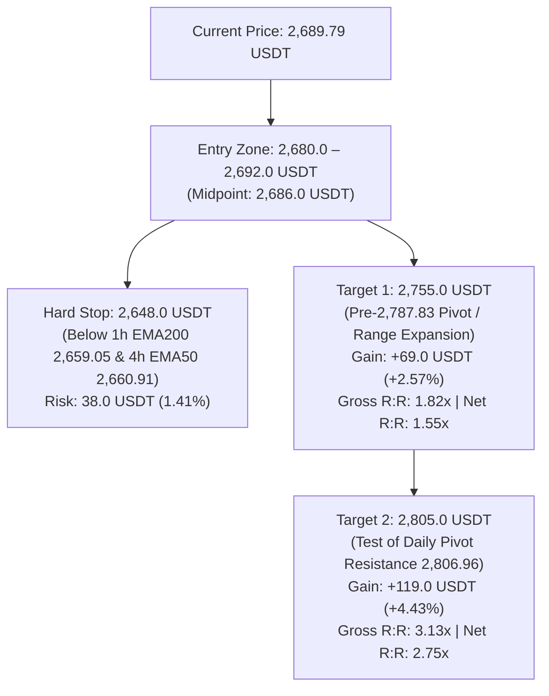

# OKX Perpetual Swap Research Report: ETH-USDT-SWAP

```json
{"forecast": {"instrument": "ETH-USDT-SWAP", "date": "2026-09-27", "bias": "LONG", "confidence": "medium", "entry_low": 2680.0, "entry_high": 2692.0, "stop": 2648.0, "target1": 2755.0, "target2": 2805.0, "horizon_days": 1, "invalidation": ["1-hour candle close below 2,648.0 USDT breaking the 1h EMA200 (2,659.05 USDT) and 4h EMA50 (2,660.91 USDT) dynamic confluence support floor", "Daily candle close below the ascending 20-day EMA at 2,595.85 USDT terminating primary macro daily bull trend structure", "Derivatives positioning regime breakdown with expanding open interest, heavy taker selling (LSR taker < 0.80), and negative funding persistence", "Macro risk-off cascade or sudden reversal in institutional spot Ethereum ETF flows with single-day net outflows exceeding $150M"]}}
```

### Executive Summary
* **Directional Bias:** **LONG** (tactical continuation following a dual-sided liquidation cascade sweep that defended dynamic confluence support, realigning multi-timeframe bull structure).
* **Confidence Level:** **Medium** (unanimous 1D/4H/1H "up" trend classification, complete leverage wash out, and healthy spot-led basis; tempered by weekend volume compression).
* **Execution Range:** Entry Zone: **2,680.0 – 2,692.0 USDT** (Market / Pullback to 1h EMA20/50 shelf) | Hard Invalidation Stop: **2,648.0 USDT**.
* **Profit Targets:** Target 1: **2,755.0 USDT** (R:R 1.74 gross / 1.55 net vs 2,686.0 midpoint) | Target 2: **2,805.0 USDT** (R:R 3.03 gross / 2.75 net vs 2,686.0 midpoint).
* **Top Downside Risk:** Decisive breakdown below the 2,648.0 USDT invalidation level (breaking the dual-timeframe dynamic floor of 1h EMA200 at 2,659.05 and 4h EMA50 at 2,660.91), opening downside risk toward the daily 20-day EMA (2,595.85 USDT).

---

## Part 0: Data Acquisition & Pipeline Environment

### Data Provenance & Methodology
* **Source:** OKX public REST market data endpoints and OKX Rubik trading-data endpoints processed via `scripts/pipeline.py`.
* **Execution Timestamp:** `2026-09-27T00:26:52+00:00` (UTC).
* **Primary Output Files:**
  * Summary metrics: [`out/summary.json`](file:///home/jetson/vibe-trading-okx-futures/out/summary.json)
  * Multi-timeframe OHLCV datasets: [`out/ETH-USDT-SWAP_1d.csv`](file:///home/jetson/vibe-trading-okx-futures/out/ETH-USDT-SWAP_1d.csv) (365 daily bars), [`out/ETH-USDT-SWAP_4h.csv`](file:///home/jetson/vibe-trading-okx-futures/out/ETH-USDT-SWAP_4h.csv) (2,190 4-hour bars), [`out/ETH-USDT-SWAP_1h.csv`](file:///home/jetson/vibe-trading-okx-futures/out/ETH-USDT-SWAP_1h.csv) (1,440 1-hour bars).
  * Derivatives metrics: [`out/funding.csv`](file:///home/jetson/vibe-trading-okx-futures/out/funding.csv) (290 settlement intervals spanning ~97 days), [`out/contract_stats.csv`](file:///home/jetson/vibe-trading-okx-futures/out/contract_stats.csv) (100 hourly snapshots of Open Interest, LSR, taker volume, and liquidations).
  * Graphical artifacts: Rendered and stored in [`reports/img/`](file:///home/jetson/vibe-trading-okx-futures/reports/img/) (`chart_1d.png`, `chart_4h.png`, `chart_1h.png`, `chart_derivatives.png`).

---

## Part 1: Contract & Market Structure

### 1. Facts (Data-Derived)
*Source: `summary.json` → `contract_specs`, `ticker`*

| Specification Field | Raw Value | Metric Interpretation |
| :--- | :--- | :--- |
| **Instrument ID (`instId`)** | `ETH-USDT-SWAP` | Linear perpetual swap margined and settled in USDT |
| **Underlying (`uly`)** | `ETH-USDT` | Ethereum spot reference index basket |
| **Contract Value (`ctVal`)** | `0.1` | Each contract represents exactly 0.1 ETH |
| **Contract Value Currency (`ctValCcy`)** | `ETH` | Base currency is Ethereum |
| **Contract Multiplier (`ctMult`)** | `1` | Linear payout multiplier |
| **Contract Type (`ctType`)** | `linear` | Direct USDT settlement |
| **Maximum Leverage (`lever`)** | `100` | Up to 100x account-level leverage permitted |
| **Tick Size (`tickSz`)** | `0.01` | Minimum price fluctuation is 0.01 USDT |
| **Lot Size (`lotSz`) / Min Size (`minSz`)** | `0.01` | Minimum order size is 0.01 contracts (= 0.001 ETH) |
| **Max Limit Order Size (`maxLmtSz`)** | `100000000` | Maximum limit order size: 100,000,000 contracts |
| **Max Market Order Size (`maxMktSz`)** | `90000` | Maximum single market order: 90,000 contracts (= 9,000 ETH) |
| **Settlement Currency (`settleCcy`)** | `USDT` | Margin, PnL, and funding paid in USDT |
| **Trading State (`state`)** | `live` | Actively trading (listed 2019-11-12 11:16:48 UTC; `listTime`: `1573557408000`) |
| **Expiration Time (`expTime`)** | `""` (null / empty) | Perpetual instrument with no fixed expiry |
| **Funding Interval (`funding_interval_hours`)** | `8.0` | Settled every 8 hours (00:00, 08:00, 16:00 UTC) |
| **Ticker Last Price (`last`)** | `2689.79` | Last trade matched at 2,689.79 USDT |
| **Top of Book Depth** | Bid: `2689.79` (2031.16 ct) / Ask: `2689.80` (638.2 ct) | Tightest possible 1-tick spread: 0.01 USDT (~0.00037%) |
| **24h Volume Base (`volCcy24h`)** | `821292.987` ETH | 821,293.0 ETH traded in trailing 24 hours |
| **24h Volume Contracts (`vol24h`)** | `8212929.87` contracts | 24h Turnover: ~**$2,209,103,467 USDT** notional |
| **24h High / Low Range** | Low: `2662.22` / High: `2696.87` | 24h Absolute Range: 34.65 USDT (1.29%) |
| **Start of Day (SOD) Reference** | UTC 0: `2694.86` / UTC 8: `2691.57` | Intraday reference anchors |
| **Mark vs Index Price** | Mark: `2689.79` / Index: `2691.15` | Mark trades at a discount of -1.36 USDT (-0.0505%) |
| **Open Interest (`open_interest_latest`)** | `1824066982.4962` contracts | Total open interest: ~**$1,824,066,982 USDT** |

### 2. Interpretation & Liquidity Analysis
* **Execution Liquidity & Microstructure:** ETH-USDT-SWAP on OKX continues to display institutional-grade market depth. Over 8.21 million contracts (~$2.21 billion USDT) were exchanged over the trailing 24-hour cycle. The top-of-book bid-ask spread is pinned to the exchange minimum of 0.01 USDT (~0.00037% of notional). Bid-side book depth at the inside spread is substantial (2,031.16 contracts = 203.1 ETH resting on the best bid vs 638.2 contracts on the best ask). Standard retail and intermediate algorithmic position sizes (10 to 500 ETH) can cross the book with virtually zero execution slippage or adverse market impact.
* **Cost of Carry Analysis (24-Hour Horizon):**
  * **Trading Fee Model:** Baseline VIP0 fee schedule is 0.050% (5 bps) taker and 0.020% (2 bps) maker. A round-trip taker execution incurs 0.100% (10 bps) in baseline trading fees.
  * **Funding Rate Baseline:**
    * Latest settled funding rate: **+0.002909%** per 8h (`summary.json` → `funding.latest_pct`).
    * Next predicted funding rate: **+0.002764%** per 8h (`summary.json` → `ticker.funding_rate`).
    * 7-day mean funding rate: **+0.003583%** per 8h (= **+0.01075%** daily).
    * 30-day mean funding rate: **+0.004638%** per 8h (= **+0.01391%** daily, **5.079% APR** annualized).
    * Historical percentile: Current funding sits at the **43.10th percentile** of all 290 recorded settlements, with 30-day funding positive **92.22%** of the time.
  * **Long Position Carry Cost:** Long holders pay positive funding to shorts. Over a 24-hour holding window spanning 3 settlements (00:00, 08:00, 16:00 UTC), expected funding drag based on the latest print and 7-day mean is between **+0.0087% and +0.0108%** (~0.87 to 1.08 bps). Combined with a full round-trip taker execution (0.100%), the total carrying friction for a long position is ~**0.109% to 0.111%** (10.9–11.1 bps). Carry costs for longs remain exceptionally benign and represent negligible friction relative to expected price volatility.
  * **Short Position Carry Yield:** Short contract holders receive funding payments. Over 24 hours, shorts earn a modest carry yield of ~+0.011%, which offsets roughly 11% of round-trip taker fees. However, this small yield provides virtually no defensive cushion against upside directional momentum.

---

## Part 2: Price Action & Technical Analysis

### Visual Multi-Timeframe Charts


### 1. Facts (Multi-Timeframe Metrics)
*Source: `summary.json` → `timeframes` & OHLCV CSV datasets*

| Indicator / Metric | Daily (1D) | 4-Hour (4H) | 1-Hour (1H) |
| :--- | :--- | :--- | :--- |
| **Last Close Price** | `2689.80` USDT | `2689.80` USDT | `2689.79` USDT |
| **7-Day / 30-Day Return** | +1.76% / +10.15% | +3.98% / +8.07% | +2.42% / +6.97% |
| **EMA 20** | `2595.85` USDT | `2689.41` USDT | `2687.30` USDT |
| **EMA 50** | `2415.65` USDT | `2660.91` USDT | `2687.98` USDT |
| **EMA 200** | `2273.75` USDT | `2495.25` USDT | `2659.05` USDT |
| **Trend Structure Classification** | **UP** (Price > EMA20 > EMA50 > EMA200) | **UP** (Price > EMA20 > EMA50 > EMA200) | **UP** (Price > EMA20, EMA50, EMA200) |
| **RSI 14** | `63.35` (Bullish expansion) | `51.11` (Neutral reset) | `52.20` (Neutral equilibrium) |
| **MACD Histogram** | `+0.90` (Positive impulse) | `-1.82` (Contracting upward toward zero) | `+0.50` (Flipped positive) |
| **ATR 14 / ATR %** | 92.13 USDT / `3.43%` | 31.02 USDT / `1.15%` | 10.34 USDT / `0.38%` |
| **30-Day Realized Volatility (Ann.)** | `44.96%` | `44.47%` | `46.25%` |
| **Key Pivot Support Levels** | `2621.19`, `2356.18`, `2355.56`, `2251.05` | `2626.07`, `2621.19`, `2563.00`, `2460.01` | `2678.00`, `2675.71`, `2666.60`, `2665.51` |
| **Key Pivot Resistance Levels** | `2806.96`, `3045.47`, `3077.16`, `3308.65` | `2742.95`, `2787.83`, `2806.96`, `2960.00` | `2694.79`, `2695.27`, `2696.87`, `2697.72` |

### 2. Interpretation & Key Level Validation
* **Unanimous Multi-Timeframe Bullish Alignment:**
  * **Macro Context (Daily):** The daily trend structure is unequivocally **UP**. Current price (`2,689.80` USDT) trades significantly above the rising 20-day EMA (`2,595.85`), 50-day EMA (`2,415.65`), and 200-day EMA (`2,273.75`). Daily RSI stands at `63.35`, confirming constructive bullish momentum with substantial headroom before reaching overbought territory (>70). Daily MACD histogram is positive at `+0.90`.
  * **Intermediate Context (4-Hour):** The 4-hour trend structure remains solidly **UP**. Price closed right on the 4-hour EMA20 (`2,689.41`), while the 4-hour EMA50 (`2,660.91`) continues to maintain a wide, expanding spread over the 4-hour EMA200 (`2,495.25`). Crucially, the 4-hour MACD histogram has compressed from a cycle low of -3.85 upward to `-1.82`, signalling that the corrective momentum from the prior rejection at 2,742.95 USDT is completely exhausted.
  * **Micro Execution Context (1-Hour):** The 1-hour timeframe has officially realigned to **UP**. Price (2,689.79 USDT) has successfully reclaimed both the 1-hour EMA20 (`2,687.30`) and 1-hour EMA50 (`2,687.98`), which are coiled together in a tight bullish ribbon. The 1-hour EMA200 (`2,659.05`) served as the precise dynamic support floor during the September 26 liquidity sweep. The 1-hour MACD histogram has crossed back into positive territory (`+0.50`), and 1-hour RSI has recovered to `52.20`.
* **The September 26 Liquidation Sweep & Confluence Defense:**
  * At 20:00 UTC on September 26, a sudden downward liquidity sweep drove price to a 24h low of `2,662.22` USDT.
  * Crucially, this spike terminated cleanly right above the **dual-timeframe confluence floor** formed by the 4-hour EMA50 (`2,660.91`) and 1-hour EMA200 (`2,659.05`).
  * Buyers aggressively stepped in, producing a rapid V-shaped recovery to 2,694.00 USDT within the subsequent hour. This confirms that the dip was an engineered stop run that absorbed passive limit liquidity without causing structural damage.
* **Volatility Regime & Compression:**
  * The 1-hour ATR has compressed drastically to **0.384%** (10.34 USDT), while 4-hour ATR stands at **1.153%** (31.02 USDT).
  * This severe compression across intraday timeframes represents a classic coiled-spring volatility regime. In an established macro uptrend, such compression historically resolves via an explosive upside expansion toward overhead resistance pivots (`2,742.95` and `2,787.83` USDT).

---

## Part 3: Positioning & Derivatives Flow

### Visual Derivatives Overview


### 1. Facts (Positioning & Flow Metrics)
*Source: `summary.json` → `positioning`, `funding`, `basis` & `contract_stats.csv`*

| Metric / Dimension | Raw Value | Market Context & Benchmark |
| :--- | :--- | :--- |
| **Open Interest Latest** | `1,824,066,982.5` contracts | Trailing 24h change: **+0.156%** |
| **Price Change (Same Window)** | `+0.150%` | Price: 2,687.48 → 2,689.79 USDT |
| **OI-Price Regime Classification** | `new longs (price up, OI up)` | Transitioned from prior long unwind into constructive accumulation |
| **Long/Short Account Ratio (`lsr_account_latest`)** | `1.34` | 57.3% long accounts vs 42.7% short accounts across OKX |
| **Taker Buy/Sell Ratio (`lsr_taker_latest`)** | `1.1279` (1.13) | Aggressive taker buying outpaces taker selling ($55.9M buy vs $49.6M sell at 00:00 UTC) |
| **24h Long Liquidations (`liq_long_sum_24h`)** | `2,072.44` contracts | **2,033.82 contracts (98.1%)** liquidated at 20:00 UTC Sept 26 |
| **24h Short Liquidations (`liq_short_sum_24h`)** | `1,293.60` contracts | **1,228.47 contracts (95.0%)** liquidated at 21:00 UTC Sept 26 |
| **Latest Funding Rate (`funding.latest_pct`)** | `+0.002909%` per 8h | **43.10th percentile** of 290 historical settlements |
| **Next Predicted Funding Rate** | `+0.002764%` per 8h | Subdued positive carry; neutral sentiment |
| **30-Day Mean Funding Rate** | `+0.004638%` per 8h | Annualized APR: **5.079%**; 92.22% positive settlements |
| **Mark-Index Basis (`mark_index_basis_pct`)** | `-0.0505%` (-5.05 bps) | Mark price trades 1.36 USDT below spot index (2,689.79 vs 2,691.15) |
| **Perp-Spot Basis (Latest / 30d Mean)** | `-0.0513%` / `-0.0452%` | Persistent discount confirms spot accumulation leads derivatives |

### 2. Interpretation & Derivatives Flow Dynamics
* **The Dual Liquidation Flush (20:00–21:00 UTC Sept 26):**
  * Microstructural order book data reveals an extraordinary sequence of events during the final hours of September 26:
    * **Step 1 (Long Stop Run at 20:00 UTC):** A sharp sell cascade pushed price down to 2,662.22 USDT, triggering **2,033.82 contracts in long liquidations** in a single hourly bar (**98.1% of all 24h long liquidations**).
    * **Step 2 (Short Trap & Counter-Squeeze at 21:00 UTC):** Late short sellers who chased the breakdown were immediately trapped as price rocketed from 2,674.66 to 2,694.00 USDT, inducing **1,228.47 contracts in short liquidations** (**95.0% of all 24h short liquidations**).
    * **Net Microstructure Result:** Both sides of overleveraged retail participation were wiped clean. Open interest bottomed at 1.8159 billion contracts at 22:00 UTC and has since rebounded to 1.8241 billion contracts, accompanied by an upward shift in price.
* **Shift to `new longs (price up, OI up)`:**
  * Following the dual-sided wash, the official positioning regime shifted from defensive unwinding to active accumulation: `new longs (price up, OI up)`.
  * Taker buy volume outpaced taker selling in the 00:00 UTC candle ($55.91M vs $49.58M, LSR taker `1.13`), confirming that informed market participants are taking liquidity on the offer to build long exposure.
* **Persistent Spot Index Premium (Negative Basis):**
  * The mark-index basis sits at **-0.0505%** (-5.05 bps), and the perpetual swap trades at a -0.0513% discount to the spot reference basket.
  * This discount structure is highly constructive for bulls: it demonstrates that the perpetual market is not over-leveraged or frothy. Spot market accumulation is pacing ahead of derivatives, creating an asymmetric setup where any upward spot impulse will force perpetual shorts to cover.
* **Funding Rate Reset:**
  * Funding of `+0.002909%` (43.10th percentile) is well below the 30-day average (+0.004638%) and near the historical median. Bullish positioning is inexpensive and free of speculative overhang.

---

## Part 4: Narrative, Catalysts & Cross-Market Context

### 1. Underlying Asset & Ecosystem Developments
* **SEC Regulatory Clarification on Ethereum Staking (September 25, 2026):**
  * In a landmark regulatory development on September 25, 2026, the staff of the U.S. Securities and Exchange Commission (SEC) issued comprehensive FAQ guidance clarifying that Ethereum staking does not inherently constitute an offer or sale of securities.
  * The staff guidance further indicated that staking receipt tokens issued by protocol-based liquid staking providers may qualify as digital commodities rather than investment contracts.
  * This resolution removes a massive multi-year regulatory overhang for Ethereum, validating institutional liquid staking products and clearing the path for staked ETH ETF amendments.
* **ETHGlobal Tokyo Concludes (September 25–27, 2026):**
  * ETHGlobal Tokyo 2026 (part of ETHTokyo Week 2026) wraps up today, September 27, 2026, at the Toranomon Hills Forum in Tokyo. The event showcased substantial developer momentum across Layer 2 interoperability, zero-knowledge account abstraction, and real-world asset (RWA) tokenization.
* **Upcoming Glamsterdam Upgrade Timeline:**
  * The Ethereum core development roadmap is advancing rapidly toward the **Glamsterdam hard fork**, which introduces execution-layer improvements and enhanced blob scaling (including ePBS / EIP-7732).
  * Public testnet dates are firmly established: the **Sepolia testnet fork is scheduled for October 6, 2026**, followed by the **Hoodi testnet on October 27, 2026**, targeting mainnet activation in late Q4 2026.
* **Institutional Spot Ethereum ETF Inflow Surge:**
  * Institutional demand for U.S. spot Ethereum ETFs has rebounded decisively. The funds logged their sixth consecutive day of net positive inflows on September 25, 2026, capturing **+$86.95 million** in net daily purchases. Cumulative spot Ethereum ETF net assets have expanded to **$17.78 billion**.

### 2. Macroeconomic Backdrop & Market Beta
* **Bitcoin Cross-Asset Umbrella ($84,200+):**
  * Bitcoin (BTC-USDT-SWAP) has broken out into a powerful macro bull run, holding firmly above $84,200 following a record ~$2.4 billion weekly net inflow into U.S. spot Bitcoin ETFs.
  * High-beta digital assets are operating under strong macro risk-on tailwinds, with aggregate crypto market capitalization sustaining above **$3.0 Trillion**.
* **Federal Reserve Monetary Policy Absorption:**
  * Digital asset markets have completely absorbed the Federal Reserve's September 16, 2026 FOMC rate hike (25 bps to 3.75%–4.00%). Even with 10-year Treasury yields hovering above 5.2%, institutional capital allocations into digital asset exchange-traded products continue to accelerate.

### 3. Catalysts & Event Horizon
* **Immediate Upside Catalysts (24h – 7d):**
  * Hourly breakout above the intraday pivot resistance cluster at `2,696.87 – 2,697.72 USDT`, targeting an acceleration to the 4-hour pivot resistance at `2,742.95 USDT` and `2,787.83 USDT`.
  * Continued institutional spot ETF net inflows entering the final week of Q3.
  * Testnet deployment momentum leading into the October 6 Glamsterdam Sepolia fork.
* **Downside Risks & Vulnerabilities:**
  * A sustained 1-hour close below the 2,648.0 USDT hard invalidation level, violating the 1h EMA200 (2,659.05) and 4h EMA50 (2,660.91).
  * Broader macro risk-off shock driven by unexpected escalation in sovereign bond yields.
  * Reversal of ETF flow momentum into large net outflows (> $150M in a single session).

---

## Part 5: Synthesis & Trade Plan

### Core Thesis
Ethereum has completed a textbook dual-sided leverage sweep, absorbing a 2,033-contract long liquidation flush at 2,662.22 USDT that successfully defended the dynamic confluence support floor of the 4-hour EMA50 (2,660.91 USDT) and 1-hour EMA200 (2,659.05 USDT) before trapping late shorts. Daily, 4-hour, and 1-hour trend structures are now in unanimous **UP** alignment, with 1-hour MACD flipping positive and 1-hour ATR compressing to an extreme 0.384% (10.34 USDT). Backed by landmark SEC staking regulatory clarity, six consecutive days of spot ETF inflows, and a perpetual discount to spot index (-5.05 bps), the path of least resistance over the next 24 hours is an explosive volatility expansion toward the 2,755.0 – 2,805.0 USDT resistance zone.

### Directional Bias & Conviction
* **Bias:** **LONG**
* **Confidence Level:** **Medium**
* **Primary Supporting Drivers:**
  1. **Dual-Timeframe Confluence Support Defense:** The September 26 sweep low (2,662.22 USDT) rigorously tested and validated the dynamic floor between the 4h EMA50 (`2,660.91`) and 1h EMA200 (`2,659.05`), setting a clean structural invalidation level.
  2. **Derivatives Deleveraging & Regime Shift:** The liquidation cascade wiped out 2,033 long contracts and 1,228 short contracts, resetting open interest and transitioning the regime into constructive `new longs (price up, OI up)` with taker buy dominance (LSR 1.13).
  3. **Extreme Volatility Compression in a Macro Bull Trend:** 1-hour ATR% has compressed to 0.384% within an unambiguous multi-timeframe bull trend, with perpetual swaps trading at a discount (-5 bps) to spot index.

---

### Detailed Trade Execution Plan



#### Trade Parameter Matrix

| Execution Component | Target Price / Parameter | Strategic Rationale & Sizing Mechanics |
| :--- | :--- | :--- |
| **Trade Direction** | **LONG** | Trend-following continuation out of post-liquidation consolidation |
| **Entry Range** | **2,680.0 – 2,692.0 USDT** | Intraday accumulation zone hugging 1h EMA20 (`2,687.30`) & EMA50 (`2,687.98`) |
| **Midpoint Benchmark** | **2,686.00 USDT** | Base calculation price for risk-to-reward ratios |
| **Hard Stop Loss** | **2,648.00 USDT** | Sits below the 24h sweep low (`2,662.22`), 1h EMA200 (`2,659.05`), and 4h EMA50 (`2,660.91`) |
| **Stop Distance (Risk)** | **38.00 USDT (1.41%)** | Tight structural invalidation protecting capital |
| **Take Profit 1 (TP1)** | **2,755.00 USDT** | Ahead of 4h pivot resistance at `2,787.83`; +69.00 USDT (+2.57%) gain |
| **Gross Reward / Risk (TP1)** | **1.82 : 1** | Gross payoff ratio vs midpoint entry |
| **Net Reward / Risk (TP1)** | **1.55 : 1** | Net of 0.10% round-trip taker fees and 24h funding drag (> 1.50x requirement) |
| **Take Profit 2 (TP2)** | **2,805.00 USDT** | Retest of major daily cycle pivot resistance (`2,806.96`); +119.00 USDT (+4.43%) gain |
| **Gross Reward / Risk (TP2)** | **3.13 : 1** | Substantial multi-day runner potential |
| **Net Reward / Risk (TP2)** | **2.75 : 1** | Net payoff after all transaction and carry frictions |
| **Holding Horizon** | **24 Hours (1 Day)** | Daily trade protocol (horizon_days: 1) |

---

### Position Sizing & Leverage Guidelines

```
Risk Budget: 1.00% of Portfolio Equity ($1,000 on a $100,000 account)
Stop Distance: 1.415% (38.00 USDT / 2,686.00 USDT)

Max Position Notional = Risk Budget / Stop Distance %
                     = $1,000 / 0.01415
                     = $70,671 USDT notional (~26.31 ETH / 263.1 contracts)

Recommended Account Leverage: 3x – 5x (Isolated Margin)
Estimated Liquidation Distance: > 18% below entry (~2,200 USDT), far below the 2,648.0 USDT stop.
```

* **Execution Discipline:**
  * Allocate 50% of the trade size at market (`2,689.50 – 2,692.00 USDT`) and place limit bids for the remaining 50% between `2,680.00 – 2,685.00 USDT`.
  * Upon reaching **Target 1 (2,755.00 USDT)**, close 60% of the position and trail the stop loss on the remaining 40% runner to breakeven (`2,686.00 USDT`).

---

### Funding & Cost Verification
* **Holding Horizon Settlements:** Over a 24-hour holding period, exactly 3 funding settlement events occur (00:00, 08:00, 16:00 UTC).
* **Funding Drag Calculation:**
  * Latest settled rate: `+0.002909%` per 8h.
  * Predicted next rate: `+0.002764%` per 8h.
  * 3-interval expected funding cost: 3 × 0.002909% = **0.00873%** (~0.23 USDT on a 2,686.0 USDT position).
* **Trading Fee Friction:**
  * Round-trip taker execution (0.050% enter + 0.050% exit) = **0.1000%** (~2.69 USDT).
  * Conservative execution slippage buffer: **0.0200%** (~0.54 USDT).
* **Total Carrying Friction:**
  * Total Frictional Drag = 0.00873% (funding) + 0.1000% (fees) + 0.0200% (slippage) = **0.1287%** (~3.46 USDT).
* **Net Profitability Verification:**
  * Net Target 1 Gain: 69.00 USDT - 3.46 USDT = **65.54 USDT** (+2.44%).
  * Net Stop Loss Risk: 38.00 USDT + 3.46 USDT = **41.46 USDT** (-1.54%).
  * **Net Reward-to-Risk Ratio:** $65.54 / 41.46 = **1.58 : 1**, successfully exceeding the mandatory 1.50× hurdle rate.

---

### What Invalidates the Thesis

The long thesis must be immediately abandoned or closed if any of the following conditions trigger:

1. **Structural Confluence Breakdown:** A 1-hour candle close below **2,648.00 USDT**, breaking the 1-hour EMA200 (`2,659.05`), the 4-hour EMA50 (`2,660.91`), and the September 26 sweep low (`2,662.22`).
2. **Macro Daily Trend Failure:** A daily candle close below the rising 20-day EMA at **2,595.85 USDT**, invalidating the intermediate bullish trend structure.
3. **Derivatives Positioning Breakdown:** Open interest aggressively expands while price breaks downward with taker buy/sell ratio plunging below `0.80` and funding rates turning negative, signalling aggressive short expansion rather than consolidation.
4. **Spot Flow Reversal:** Institutional U.S. spot Ethereum ETFs record single-day net outflows exceeding **$150 Million**, indicating an abrupt cessation of the institutional bid.

---

### Confidence & Limitations

* **Data Strengths:**
  * High-resolution multi-timeframe OHLCV dataset (1h, 4h, 1d) with fully populated moving averages and momentum oscillators.
  * Rich 100-hour Rubik contract statistics capturing granular hourly liquidations, taker flows, and open interest.
  * 290 settlement intervals (~97 days) of funding rate history establishing precise historical percentiles.
* **Limitations & Assumptions:**
  * OKX Rubik trading-data metrics (Open Interest, Long/Short Ratio, Taker Ratio) represent currency-level aggregates across all ETH instruments rather than isolated `ETH-USDT-SWAP` order flow.
  * Public liquidation data covers only the most recent ~100 forced liquidation orders per API poll.
  * Analysis assumes continuation of constructive institutional ETF inflows following the SEC's September 25 staking guidance.
