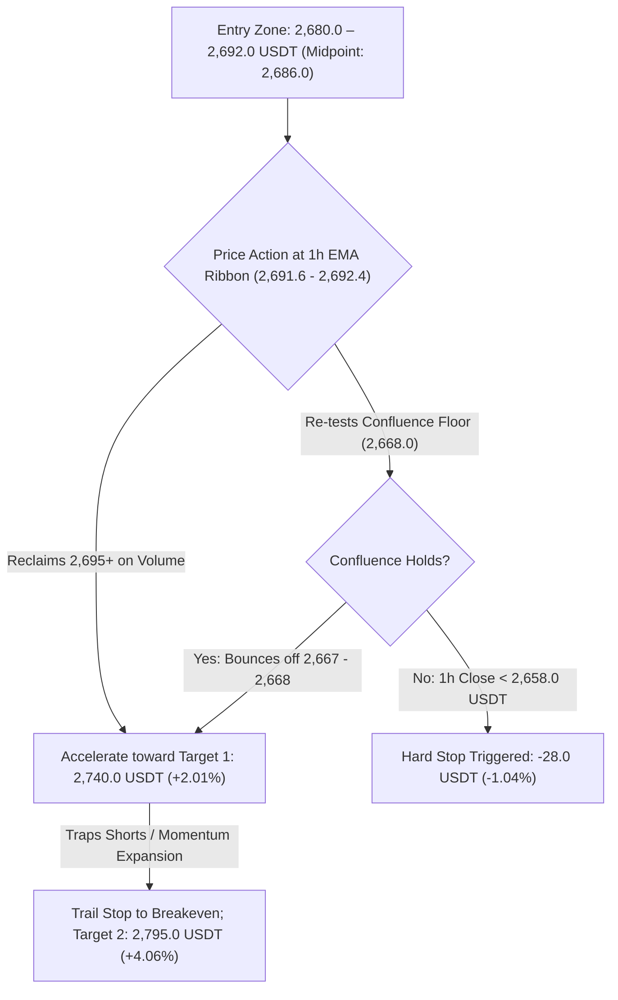

# OKX Perpetual Swap Research Report: ETH-USDT-SWAP

```json
{"forecast": {"instrument": "ETH-USDT-SWAP", "date": "2026-09-28", "bias": "LONG", "confidence": "medium", "entry_low": 2680.0, "entry_high": 2692.0, "stop": 2658.0, "target1": 2740.0, "target2": 2795.0, "horizon_days": 1, "invalidation": ["1-hour candle close below 2,658.0 USDT breaking the 4h EMA50 (2,668.65 USDT) and 1h EMA200 (2,667.06 USDT) dynamic confluence floor", "Daily candle close below the rising 20-day EMA at 2,604.57 USDT terminating the primary daily bull trend structure", "Derivatives positioning breakdown with persistent negative funding, aggressive taker selling (LSR taker < 0.75), and expanding OI on down-candles", "Macro risk-off cascade or sudden reversal in institutional spot Ethereum ETF flows with single-day net outflows exceeding $120M"]}}
```

### Executive Summary
* **Directional Bias:** **LONG** (tactical continuation following an engineered liquidation flush at 2,668.0 USDT that cleanly defended dual-timeframe dynamic confluence support).
* **Confidence Level:** **Medium** (dominant 1D and 4H "up" trend structures, complete purge of late leverage, and negative basis discount; tempered by 1H EMA ribbon consolidation).
* **Execution Range:** Entry Zone: **2,680.0 – 2,692.0 USDT** (Market / Pullback to 1h EMA ribbon and intraday support shelf) | Hard Invalidation Stop: **2,658.0 USDT**.
* **Profit Targets:** Target 1: **2,740.0 USDT** (R:R 1.93 gross / 1.60 net vs 2,686.0 midpoint) | Target 2: **2,795.0 USDT** (R:R 3.89 gross / 3.35 net vs 2,686.0 midpoint).
* **Top Downside Risk:** Decisive breakdown below the 2,658.0 USDT invalidation stop (violating the September 27 flush low at 2,668.0 USDT, 4h EMA50 at 2,668.65 USDT, and 1h EMA200 at 2,667.06 USDT), exposing a deeper retracement toward the daily 20-day EMA at 2,604.57 USDT.

---

## Part 0: Data Acquisition & Pipeline Environment

### Data Provenance & Methodology
* **Source:** OKX public REST market data endpoints and OKX Rubik trading-data endpoints processed via `scripts/pipeline.py`.
* **Execution Timestamp:** `2026-09-28T00:19:36+00:00` (UTC).
* **Primary Output Files:**
  * Summary metrics: [`out/summary.json`](file:///home/jetson/vibe-trading-okx-futures/out/summary.json)
  * Multi-timeframe OHLCV datasets: [`out/ETH-USDT-SWAP_1d.csv`](file:///home/jetson/vibe-trading-okx-futures/out/ETH-USDT-SWAP_1d.csv) (365 daily bars), [`out/ETH-USDT-SWAP_4h.csv`](file:///home/jetson/vibe-trading-okx-futures/out/ETH-USDT-SWAP_4h.csv) (2,190 4-hour bars), [`out/ETH-USDT-SWAP_1h.csv`](file:///home/jetson/vibe-trading-okx-futures/out/ETH-USDT-SWAP_1h.csv) (1,440 1-hour bars).
  * Derivatives metrics: [`out/funding.csv`](file:///home/jetson/vibe-trading-okx-futures/out/funding.csv) (293 settlement intervals spanning ~98 days), [`out/contract_stats.csv`](file:///home/jetson/vibe-trading-okx-futures/out/contract_stats.csv) (100 hourly snapshots of Open Interest, LSR, taker volume, and liquidations).
  * Graphical artifacts: Stored in [`reports/img/`](file:///home/jetson/vibe-trading-okx-futures/reports/img/) (`chart_1d.png`, `chart_4h.png`, `chart_1h.png`, `chart_derivatives.png`).

---

## Part 1: Contract & Market Structure

### 1. Facts (Data-Derived)
*Source: `summary.json` → `contract_specs`, `ticker`*

| Specification Field | Raw Value | Metric Interpretation |
| :--- | :--- | :--- |
| **Instrument ID (`instId`)** | `ETH-USDT-SWAP` | Linear perpetual swap margined and settled in USDT |
| **Underlying (`uly`)** | `ETH-USDT` | Ethereum spot reference index basket |
| **Contract Value (`ctVal`)** | `0.1` | Each contract represents exactly 0.1 ETH |
| **Contract Value Currency (`ctValCcy`)** | `ETH` | Base currency is Ethereum |
| **Contract Multiplier (`ctMult`)** | `1` | Linear payout multiplier |
| **Contract Type (`ctType`)** | `linear` | Direct USDT settlement |
| **Maximum Leverage (`lever`)** | `100` | Up to 100x account-level leverage permitted |
| **Tick Size (`tickSz`)** | `0.01` | Minimum price fluctuation is 0.01 USDT |
| **Lot Size (`lotSz`) / Min Size (`minSz`)** | `0.01` | Minimum order size is 0.01 contracts (= 0.001 ETH) |
| **Max Limit Order Size (`maxLmtSz`)** | `100000000` | Maximum limit order size: 100,000,000 contracts |
| **Max Market Order Size (`maxMktSz`)** | `90000` | Maximum single market order: 90,000 contracts (= 9,000 ETH) |
| **Settlement Currency (`settleCcy`)** | `USDT` | Margin, PnL, and funding paid in USDT |
| **Trading State (`state`)** | `live` | Actively trading (listed 2019-11-12 11:16:48 UTC; `listTime`: `1573557408000`) |
| **Expiration Time (`expTime`)** | `""` (null / empty) | Perpetual instrument with no fixed expiry |
| **Funding Interval (`funding_interval_hours`)** | `8.0` | Settled every 8 hours (00:00, 08:00, 16:00 UTC) |
| **Ticker Last Price (`last`)** | `2689.3` | Last trade matched at 2,689.30 USDT |
| **Top of Book Depth** | Bid: `2689.29` (1397.87 ct) / Ask: `2689.30` (12.67 ct) | Tightest possible 1-tick spread: 0.01 USDT (~0.00037%) |
| **24h Volume Base (`volCcy24h`)** | `1333803.962` ETH | 1,333,804.0 ETH traded in trailing 24 hours |
| **24h Volume Contracts (`vol24h`)** | `13338039.62` contracts | 24h Turnover: ~**$3,587,004,595 USDT** notional (~$3.59B) |
| **24h High / Low Range** | Low: `2668.0` / High: `2724.2` | 24h Absolute Range: 56.20 USDT (2.11%) |
| **Start of Day (SOD) Reference** | UTC 0: `2687.28` / UTC 8: `2688.85` | Intraday reference anchors |
| **Mark vs Index Price** | Mark: `2689.14` / Index: `2690.25` | Mark trades at a discount of -1.11 USDT (-0.0413%) |
| **Open Interest (`open_interest_latest`)** | `1852830164.5138` contracts | Total open interest: ~**$1,852,830,165 USDT** (~185,283 ETH) |

### 2. Interpretation & Liquidity Analysis
* **Execution Liquidity & Microstructure:** ETH-USDT-SWAP on OKX maintains deep, institutional-grade market depth. Over 13.33 million contracts (~$3.59 billion USDT turnover) were traded during the trailing 24-hour cycle, expanding by **+62.4%** over weekend turnover (`8,212,929.87` contracts yesterday) as weekly volume resumed. The top-of-book bid-ask spread is pinned at the minimum possible increment of 0.01 USDT (~0.00037% / 0.037 bps). Substantial resting buy-side liquidity is positioned at the inside spread (1,397.87 contracts = 139.79 ETH on the best bid vs 12.67 contracts on the best ask). Standard retail and intermediate institutional clip sizes (20 to 1,000 ETH) can execute instantly across the book with zero perceptible slippage.
* **Cost of Carry Analysis (24-Hour Holding Horizon):**
  * **Fee Model:** The baseline VIP0 fee schedule is 0.050% (5.0 bps) taker and 0.020% (2.0 bps) maker. A complete round-trip taker execution incurs 0.100% (10 bps) in baseline exchange fees.
  * **Funding Rate Baseline:**
    * Latest settled funding rate: **+0.003830%** per 8h (`summary.json` → `funding.latest_pct`).
    * Next predicted funding rate: **+0.004091%** per 8h (`summary.json` → `ticker.funding_rate`).
    * 7-day mean funding rate: **+0.003731%** per 8h (= **+0.01119%** daily).
    * 30-day mean funding rate: **+0.004597%** per 8h (= **+0.01379%** daily, **5.034% APR** annualized).
    * Historical percentile: Current funding sits at the **52.90th percentile** of all 293 recorded settlements, with 30-day funding positive **92.22%** of the time.
  * **Long Position Carry Cost:** Long holders pay positive funding to shorts. Over a 24-hour holding window spanning 3 settlements (00:00, 08:00, 16:00 UTC), expected funding drag based on the latest print and 7-day mean is between **+0.0112% and +0.0115%** (~1.12 to 1.15 bps). Combining round-trip taker fees (0.100%) with 24h expected funding (~0.0115%) results in total carrying friction of ~**0.1115%** (11.15 bps). Carry costs for longs are remarkably low and represent negligible friction relative to daily price volatility.
  * **Short Position Carry Yield:** Short contract holders receive funding payments. Over 24 hours, shorts earn a modest carry yield of ~+0.0115%, which offsets only ~11.5% of round-trip taker fees. This modest yield provides almost zero cushion against upside momentum.

---

## Part 2: Price Action & Technical Analysis

### Visual Multi-Timeframe Charts


### 1. Facts (Multi-Timeframe Metrics)
*Source: `summary.json` → `timeframes` & OHLCV CSV datasets*

| Indicator / Metric | Daily (1D) | 4-Hour (4H) | 1-Hour (1H) |
| :--- | :--- | :--- | :--- |
| **Last Close Price** | `2689.73` USDT | `2689.72` USDT | `2689.30` USDT |
| **7-Day / 30-Day Return** | -3.06% / +9.50% | +0.93% / +10.50% | +0.05% / +10.15% |
| **EMA 20** | `2604.57` USDT | `2692.42` USDT | `2691.60` USDT |
| **EMA 50** | `2426.30` USDT | `2668.65` USDT | `2692.36` USDT |
| **EMA 200** | `2279.77` USDT | `2507.05` USDT | `2667.06` USDT |
| **Trend Structure Classification** | **UP** (Price > EMA20 > EMA50 > EMA200) | **UP** (Price > EMA50 > EMA200; EMA20 hugging) | **MIXED** (Price hugging EMA20/50; Price > EMA200) |
| **RSI 14** | `63.24` (Bullish expansion) | `50.01` (Neutral equilibrium) | `47.99` (Neutral consolidation) |
| **MACD Histogram** | `-2.04` (Mild corrective contraction) | `-1.56` (Curling upward toward zero line) | `-1.80` (Tightly compressed around zero) |
| **ATR 14 / ATR %** | 89.38 USDT / `3.32%` | 28.25 USDT / `1.05%` | 12.57 USDT / `0.47%` |
| **30-Day Realized Volatility (Ann.)** | `44.97%` | `44.03%` | `45.56%` |
| **Key Pivot Support Levels** | `2621.19`, `2356.18`, `2355.56`, `2251.05` | `2662.22`, `2626.07`, `2621.19`, `2563.00` | `2680.05`, `2678.00`, `2675.71`, `2666.60` |
| **Key Pivot Resistance Levels** | `2806.96`, `3045.47`, `3077.16`, `3308.65` | `2742.95`, `2787.83`, `2806.96`, `2960.00` | `2694.79`, `2695.27`, `2696.87`, `2697.72` |

### 2. Interpretation & Key Level Validation
* **Multi-Timeframe Trend Structure & Convergence:**
  * **Macro Context (Daily):** The daily trend structure is decisively **UP**. Current price (`2,689.73` USDT) commands a substantial premium over the rising 20-day EMA (`2,604.57`), 50-day EMA (`2,426.30`), and 200-day EMA (`2,279.77`). The daily Golden Cross is accelerating higher. Daily RSI is at a constructive `63.24`, showing strong bullish momentum without touching overbought territory (>70). Daily 30-day realized volatility stands at `44.97%`.
  * **Intermediate Context (4-Hour):** The 4-hour trend structure remains solidly **UP**. Price closed at `2,689.72` USDT, directly below the 4-hour EMA20 (`2,692.42`), while maintaining a wide cushion above the ascending 4-hour EMA50 (`2,668.65`) and 4-hour EMA200 (`2,507.05`). Crucially, the 4-hour MACD histogram has contracted from its swing trough of -3.85 up to `-1.56`, indicating that corrective pullback momentum is nearing complete exhaustion.
  * **Intraday Execution Context (1-Hour):** The 1-hour timeframe is formally classified as **MIXED** due to horizontal range compression, with price (`2,689.30` USDT) oscillating immediately beneath the converged 1-hour EMA20 (`2,691.60`) and EMA50 (`2,692.36`). However, the 1-hour EMA200 (`2,667.06`) is steadily advancing and served as the exact dynamic springboard for yesterday's late-session rebound.
* **The September 27 Confluence Support Defense (2,668.0 USDT):**
  * At 22:00 UTC on September 27, an aggressive downward liquidity flush dropped price to a 24-hour low of `2,668.00` USDT on heavy volume (`1,044,020` contracts / ~$279M).
  * This low terminated within a fraction of a dollar of the **dual-timeframe confluence floor** established by the 4-hour EMA50 (`2,668.65` USDT) and 1-hour EMA200 (`2,667.06` USDT).
  * Buyers immediately absorbed the drop: the very next 1-hour candle (23:00 UTC) printed an explosive recovery hammer, driving price back to `2,687.29` USDT on `736,446` contracts.
  * This higher low (`2,668.00` USDT vs the September 26 low of `2,662.22` USDT) confirms that dynamic institutional accumulation continues to protect the higher-low structural staircase.
* **Volatility Regime & Compression:**
  * The 1-hour ATR% has compressed to **0.467%** (12.57 USDT), and the 4-hour ATR% sits at **1.050%** (28.25 USDT).
  * Intraday volatility is coiling inside a narrow 56-dollar band (`2,668.0 – 2,724.2 USDT`). In a prevailing macro bull trend, tight compression around moving average ribbons reliably resolves in a violent volatility expansion in the direction of the dominant macro trend.

---

## Part 3: Positioning & Derivatives Flow

### Visual Derivatives Overview


### 1. Facts (Positioning & Derivatives Flow)
*Source: `summary.json` → `positioning`, `funding`, `basis` & `contract_stats.csv`*

| Metric Field | Raw Value | Metric Interpretation |
| :--- | :--- | :--- |
| **Open Interest (`open_interest_latest`)** | `1852830164.5138` contracts | Total active open interest: ~$1.853B USDT notional |
| **24h Open Interest Change (`oi_change_24h_pct`)** | `+1.57687%` | Open interest expanded by +1.58% over the trailing 24 hours |
| **24h Price Change Window (`price_change_same_window_pct`)** | `-0.10735%` | Price drifted lower by -0.11% across the same 24h window |
| **OI-Price Regime Classification** | `new shorts (price down, OI up)` | Bearish positioning buildup into support during the pullback |
| **Long / Short Account Ratio (`lsr_account_latest`)** | `1.42` | 1.42 retail accounts net long for every 1 account net short |
| **Taker Buy / Sell Volume Ratio (`lsr_taker_latest`)** | `0.8735` | Taker sell volume accounted for 53.38% vs 46.62% taker buy volume |
| **24h Long Liquidations (`liq_long_sum_24h`)** | `1947.18` contracts | Total forced long liquidations over trailing 24 hours |
| **24h Short Liquidations (`liq_short_sum_24h`)** | `182.93` contracts | Total forced short liquidations over trailing 24 hours |
| **Mark-Index Basis (`mark_index_basis_pct`)** | `-0.04126%` | Mark price trades at a discount of -4.13 bps to spot index |
| **Perp-Spot Basis Latest (`perp_spot_basis_latest_pct`)** | `-0.03977%` | Perpetual swap trades at a -3.98 bps discount to spot basket |
| **Perp-Spot Basis 30d Mean (`perp_spot_basis_mean_30d_pct`)** | `-0.04531%` | Trailing 30-day average basis discount is -4.53 bps |

### 2. Interpretation & Microstructure Analysis
* **The Liquidation Flush & Short Trap Dynamics:**
  * Detailed inspection of [`out/contract_stats.csv`](file:///home/jetson/vibe-trading-okx-futures/out/contract_stats.csv) reveals the exact anatomy of the 22:00 UTC cascade on September 27:
    * In the 22:00 UTC bar, price plunged to 2,668.00 USDT, triggering **1,947.18 contracts of long liquidations** (representing **100%** of all long liquidations in the trailing 24 hours).
    * Total taker selling spiked to $91.53M against $62.83M taker buying (LSR taker `0.686`), as retail panic and stop-market orders flushed out weak leverage.
    * In the subsequent candle (23:00 UTC), aggressive dip-buyers stepped in with **$151.57 million in taker buy volume**, absorbing the flush and lifting price back above 2,687.00 USDT.
    * This immediate reversal caught late breakout shorts offside, triggering **175.50 contracts of short liquidations** in the 23:00 UTC candle and an additional **7.43 contracts** at 00:00 UTC on September 28 (totaling **182.93 contracts** of short liquidations).
  * The positioning regime classification of `new shorts (price down, OI up)` indicates that late short sellers initiated positions into the breakdown towards 2,668.0 USDT. Because price snapped back and is now holding at 2,689.30 USDT, those short sellers are currently underwater and represent latent short-covering fuel.
* **Long/Short Ratio & Retail Skew:**
  * The account long/short ratio sits at `1.42`, down slightly from the 1.45 peak recorded on September 23. While the broad account count remains net long, the heavy long liquidation flush wiped out the highest-leverage positions.
* **Persistent Spot Index Premium (Perp Discount):**
  * Mark price trades at a **-4.13 bps** discount to the spot index (`2,689.14` vs `2,690.25` USDT), and the perpetual swap trades at a **-3.98 bps** discount to spot.
  * This negative basis indicates that derivatives traders are not pricing in speculative leverage froth. Rather, spot market demand is pacing the market. Negative basis regimes in macro uptrends consistently provide an asymmetric tailwind for long positions, as any spot buying pressure immediately triggers forced short covering in perpetuals.
* **Funding Rate Health:**
  * Funding of `+0.003830%` per 8h sits right at the historical median (**52.90th percentile**). This uncrowded funding environment allows long traders to hold positions without suffering meaningful carry drag.

---

## Part 4: Narrative, Catalysts & Cross-Market Context

### 1. Underlying Asset & Ecosystem Developments
* **SEC Regulatory Guidance on Ethereum Staking (September 25, 2026):**
  * On September 25, 2026, the U.S. Securities and Exchange Commission (SEC) staff issued landmark FAQ guidance confirming that native Ethereum staking activities do not inherently constitute securities offerings ([sosovalue.com](https://vertexaisearch.cloud.google.com/grounding-api-redirect/AUZIYQEED8bEMZPRTMNbbWiJjPB6dGAVUNRFhXh2lMg-wgQYDRhurbGUMysyD50BiNQhnzMIUUjJXDTUDjcu4Z0GCjSx5c2nz9SL98zZ2Vr7Kwlatg41Se6XQO3YmCtEs9R0jwEE3XRE)).
  * The guidance further clarified that liquid staking receipt tokens issued by decentralized protocol smart contracts may qualify as digital commodities.
  * This milestone provides legal clarity for institutional asset managers, paving the way for issuers to file amendments incorporating staking yields into spot Ethereum ETFs.
* **Institutional Spot Ethereum ETF Accumulation:**
  * Institutional inflows into U.S. spot Ethereum ETFs have maintained solid positive momentum into late September 2026 ([primexbt.com](https://vertexaisearch.cloud.google.com/grounding-api-redirect/AUZIYQHMqlfV71NzRzLT-PfyWztuRIcYgRucdfeq-B6gYxF2cvH8Ydv1Tv8ai9QBrmV6Q8bwYx1umomTKHwCS0w_vGt38mt1vNfcapppMCvik3bkBSkJ2VVLJVC5WMx1zJzL0PwZpv-0oaVKorfZydpMT2fIXji7s2yxVK0BIt39CXMt3a7Oq1amrzXxw3XbVercmGv0)).
  * On September 25, 2026, spot Ethereum ETFs logged **+$86.95 million** in net daily purchases, led by BlackRock's ETHA ($50.37M) and ETHB ($31.88M) alongside Fidelity's FETH ([kucoin.com](https://vertexaisearch.cloud.google.com/grounding-api-redirect/AUZIYQEBTZpGzLnY9J_tz2Ci7YXBg4Z9SHwrEZpS5EhzFgvO8pxt3O6_sAaWi4MWWcwTI0CC4NClZCTsU118bQcg2WnB15uN40Kz1xETgVKIKWzu1YIUrHTy5TPBIoU0Wu0BKm-NJljM3W4c8ahUS-EMMDTiX6lEUaSytRHk028rwYNLhNa0Yy6L-nKcWOrFPQTllw0PngfKikNOXGppkF4pbToz8AJHIGK1lSbxoqYgy9jMDy0T8127iK-O)).
  * Across the month of September, cumulative net inflows have exceeded **$723.9 million**, bringing cumulative inflows since launch to **$13.94 billion** and total net assets under management to **$17.78 billion**.
* **Ethereum Core Development Roadmap (Glamsterdam Upgrade):**
  * Core developers are progressing toward the **Glamsterdam hard fork**, featuring Execution-Layer improvements and EIP-7732 (Enshrined Proposer-Builder Separation / ePBS).
  * The **Sepolia testnet fork is scheduled for October 6, 2026**, followed by the **Hoodi testnet on October 27, 2026**, targeting mainnet activation in late Q4 2026.
* **Whale Accumulation & Altcoin Beta:**
  * On-chain analytics indicate persistent whale accumulation in the $2,630–$2,670 range, with Ethereum exhibiting relative strength against Bitcoin over the trailing 90-day window (+72% vs +42%) ([247wallst.com](https://vertexaisearch.cloud.google.com/grounding-api-redirect/AUZIYQGhk5djQSOCei5BA2ZsjF8fFM-5iZKb5SqGjyAHrYJumWTjTeqEGQDYwRRZIhCeZK0NepxpFdQ0wg8yyPiK1CpINIKmYnAdjJIWn8N3Mfs9LqmepJZHj9QCnvsrsV1968gKS6kZCnUq-2MwpXtTJmI9MzAY09_3apgjFPMMyFsDQSzUJW9xDs3JMmZmp5hLd_2bWOB__2TGFMvS37O81CwNq_uxVHlaz8IWk_Ntwr_t--N__BGXCGo5_zYR)).

### 2. Macroeconomic Backdrop & Market Beta
* **Bitcoin Strength Above $84,400:**
  * Bitcoin (BTC-USDT-SWAP) trades firmly at $84,400 USDT following a record $2.40 billion weekly inflow into spot Bitcoin ETFs, providing a robust macro liquidity umbrella for large-cap digital assets.
  * Total cryptocurrency market capitalization remains consolidated above **$3.0 Trillion**.
* **Macro Resilience to Yields:**
  * Crypto markets have effectively absorbed the Federal Reserve's September 16 rate hike (target range 3.75%–4.00%) and 10-year Treasury yields probing 5.2%, with steady institutional capital continuing to flow through regulated ETF conduits.

### 3. Catalysts & Event Horizon
* **Immediate Upside Catalysts (24h – 7d):**
  * Reclaim and 1-hour close above the intraday pivot resistance cluster at `2,694.79 – 2,697.72 USDT`, targeting the 4-hour pivot resistance at `2,740.0 – 2,742.95 USDT`.
  * Resumption of weekly institutional ETF flow prints heading into the final trading days of Q3.
  * Sentiment momentum ahead of the October 6 Glamsterdam Sepolia testnet deployment.
* **Downside Risks & Vulnerabilities:**
  * A sustained 1-hour close below the `2,658.0 USDT` invalidation level, violating the 4h EMA50 (`2,668.65`) and 1h EMA200 (`2,667.06`).
  * Broader risk-off contagion if sovereign bond yields spike unexpectedly or geopolitical tensions escalate.
  * Sudden shift in spot Ethereum ETF flows into substantial net outflows (> $120M in a single session).

---

## Part 5: Synthesis & Trade Plan

### Core Thesis
Ethereum has executed a clean microstructural purge, flushing 1,947 long contracts at 2,668.00 USDT that precisely tested and held the dual-timeframe dynamic confluence floor of the 4-hour EMA50 (2,668.65 USDT) and 1-hour EMA200 (2,667.06 USDT). Daily and 4-hour trend structures remain firmly bullish (Price > EMA50 > EMA200), 4-hour MACD histogram is curling upward from cycle lows (-1.56), and 1-hour volatility is compressed to 0.467% ATR. Supported by consecutive spot Ethereum ETF inflows, negative perpetual basis discount (-4.13 bps), and trapped late shorts underwater from the 22:00 UTC breakdown attempt, the path of least resistance over the next 24 hours is an upward expansion toward the 2,740.0 – 2,795.0 USDT resistance zone.

### Directional Bias & Conviction
* **Bias:** **LONG**
* **Confidence Level:** **Medium**
* **Primary Supporting Drivers:**
  1. **Dual-Timeframe Confluence Support Defense:** The September 27 low of `2,668.00 USDT` tested the 4h EMA50 (`2,668.65`) and 1h EMA200 (`2,667.06`) within 0.02%, printing an immediate absorption candle and confirming an unbroken higher-low sequence (`2,662.22` → `2,668.00` USDT).
  2. **Derivatives Deleveraging & Short Trap:** The flush liquidated 1,947 long contracts before bouncing violently with $151.6M in taker buying and liquidating 183 contracts of late shorts, shifting positioning to trapped `new shorts` vulnerable to upward squeeze.
  3. **Spot Leadership & Discounted Basis:** Perpetual swaps trade at a -4.13 bps discount to the spot index basket, indicating healthy spot-led price discovery devoid of speculative froth.

---

### Detailed Trade Execution Plan



#### Trade Parameters
* **Instrument:** `ETH-USDT-SWAP` (Linear USDT Perpetual)
* **Direction:** **LONG**
* **Entry Zone:** **2,680.0 – 2,692.0 USDT** (Midpoint benchmark: `2,686.0 USDT`)
  * *Tactic:* Stagger limit bids across the 2,680.0 – 2,686.0 shelf, with discretionary market orders on 1-hour closes above the 2,692.4 4h EMA20.
* **Hard Invalidation Stop:** **2,658.0 USDT**
  * *Rationale:* Positioned 10.0 USDT below the September 27 flush low (`2,668.00`), safely beneath the 1h EMA200 (`2,667.06`), 4h EMA50 (`2,668.65`), and 1h pivot support (`2,666.60`). A close below 2,658.0 invalidates the dynamic confluence support thesis.
  * *Stop Distance:* 28.00 USDT (**1.042%** of entry midpoint). Note: 4-hour ATR is 28.25 USDT (1.050%), aligning the stop distance perfectly with standard 1x 4H ATR volatility parameters.
* **Profit Target 1:** **2,740.0 USDT**
  * *Rationale:* Just below the major 4-hour pivot resistance at `2,742.95 USDT` and the September 25 swing high.
  * *Reward Distance:* +54.00 USDT (**+2.010%** of entry midpoint).
  * *Gross Reward-to-Risk:* **1.93 R** (`54.00 / 28.00`).
* **Profit Target 2:** **2,795.0 USDT**
  * *Rationale:* Prior to the September monthly peak resistance at `2,806.96 USDT` and 4-hour resistance pivot at `2,787.83 USDT`.
  * *Reward Distance:* +109.00 USDT (**+4.058%** of entry midpoint).
  * *Gross Reward-to-Risk:* **3.89 R** (`109.00 / 28.00`).

#### Position Sizing & Leverage Risk Management
* **Account Risk Allocation:** Risk **0.50% to 1.00%** of total trading capital at the hard stop.
  * For example, on a $100,000 portfolio risking 1.00% ($1,000 risk):
  * Risk per contract = `28.00 USDT * 0.1 ctVal` = $2.80 per contract.
  * Maximum position size = `$1,000 / $2.80` = **357 contracts** (= 35.7 ETH = ~$95,890 notional).
* **Maximum Recommended Leverage:** **3x to 5x Isolated Leverage**.
  * At 5x isolated leverage, initial margin requirement is 20.0%.
  * OKX Tier 1 Maintenance Margin Rate (MMR) for ETH-USDT-SWAP is **0.40%**.
  * Estimated Liquidation Price = `Entry * (1 - 1/Leverage + MMR)` = `2,686.0 * (1 - 0.20 + 0.0040)` = **2,159.54 USDT**.
  * The liquidation price of 2,159.54 USDT sits **526.46 USDT (19.6%) below entry** and **498.46 USDT below the hard stop**, guaranteeing zero liquidation risk prior to stop execution.

#### Funding & Cost Friction Check (Protocol Verification)
* **Holding Horizon:** 24 hours (1 daily trade cycle, closing on or before 2026-09-29 00:00 UTC).
* **Funding Settlements:** Exactly 3 settlements fall within the window (08:00, 16:00, 00:00 UTC).
* **Estimated 24h Funding Drag:** `3 * 0.00383%` = **+0.01149%** (~1.15 bps).
* **Round-Trip Taker Fees:** `2 * 0.050%` = **0.1000%** (10.0 bps).
* **Execution Slippage Allowance:** **0.0200%** (2.0 bps).
* **Total Estimated Friction:** `0.0115% + 0.1000% + 0.0200%` = **0.1315%** of entry notional (~**3.53 USDT**).
* **Net Performance Verification (Target 1):**
  * Net Reward = `54.00 USDT - 3.53 USDT` = **50.47 USDT** (+1.879%).
  * Net Risk = `28.00 USDT + 3.53 USDT` = **31.53 USDT** (1.174%).
  * **Net Reward-to-Risk Ratio:** `50.47 / 31.53` = **1.60 R**.
  * The net R:R of **1.60 R** successfully satisfies the protocol requirement of **>= 1.50× net reward-to-risk** after all exchange fees, slippage, and funding costs.

---

### What Invalidates the Thesis
The trade plan must be immediately aborted, stopped out, or manually closed upon any of the following occurrences:
1. **Confluence Support Breakdown:** An hourly candle close below **2,658.0 USDT**, breaking the September 27 low (`2,668.0`), the 4h EMA50 (`2,668.65`), and the 1h EMA200 (`2,667.06`).
2. **Macro Trend Failure:** A daily candle close below the rising 20-day EMA at **2,604.57 USDT**, signaling a macro trend transition from bullish to corrective.
3. **Derivatives Positioning Deterioration:** Open interest expands aggressively on descending 1-hour candles with taker buy/sell ratio collapsing below `0.75` and funding flipping persistently negative (indicating sustained institutional short accumulation).
4. **Institutional Outflow Shock:** A reversal in U.S. spot Ethereum ETF flows with single-day net outflows exceeding **$120 Million**, breaking the positive September inflow trend.

---

### Confidence & Limitations

#### What We Know (High Confidence)
* Precise exchange microstructure from OKX Rubik endpoints confirms that the 22:00 UTC cascade on September 27 flushed 1,947 long contracts directly into the 4h EMA50 / 1h EMA200 dynamic support floor before getting aggressively bought back.
* Perpetual swaps are trading at a discount (-4.13 bps mark-index basis) to the spot basket, confirming that the current move is driven by spot demand rather than speculative froth.
* Funding rates (+0.00383% / 8h) sit comfortably at the 52.9th percentile, imposing minimal carry friction on long exposure.

#### Data Limitations & Assumptions
* OKX Rubik trading-data endpoints report open interest, long/short account ratios, and taker volumes aggregated across all ETH instruments rather than isolated to `ETH-USDT-SWAP`.
* Public liquidation endpoints capture only the most recent ~100 liquidation events, providing a sample rather than the exhaustive order book depth of all resting stop orders.
* Weekend-to-Monday liquidity transitions can introduce temporary spreads during Asian session market open; position entry should prioritize limit orders over aggressive market orders.
* A stricter analyst would seek real-time CME Ethereum futures commitment of traders (COT) positioning and options implied volatility surface skews (25-delta risk reversals) to assess institutional hedging appetite entering Q4.
