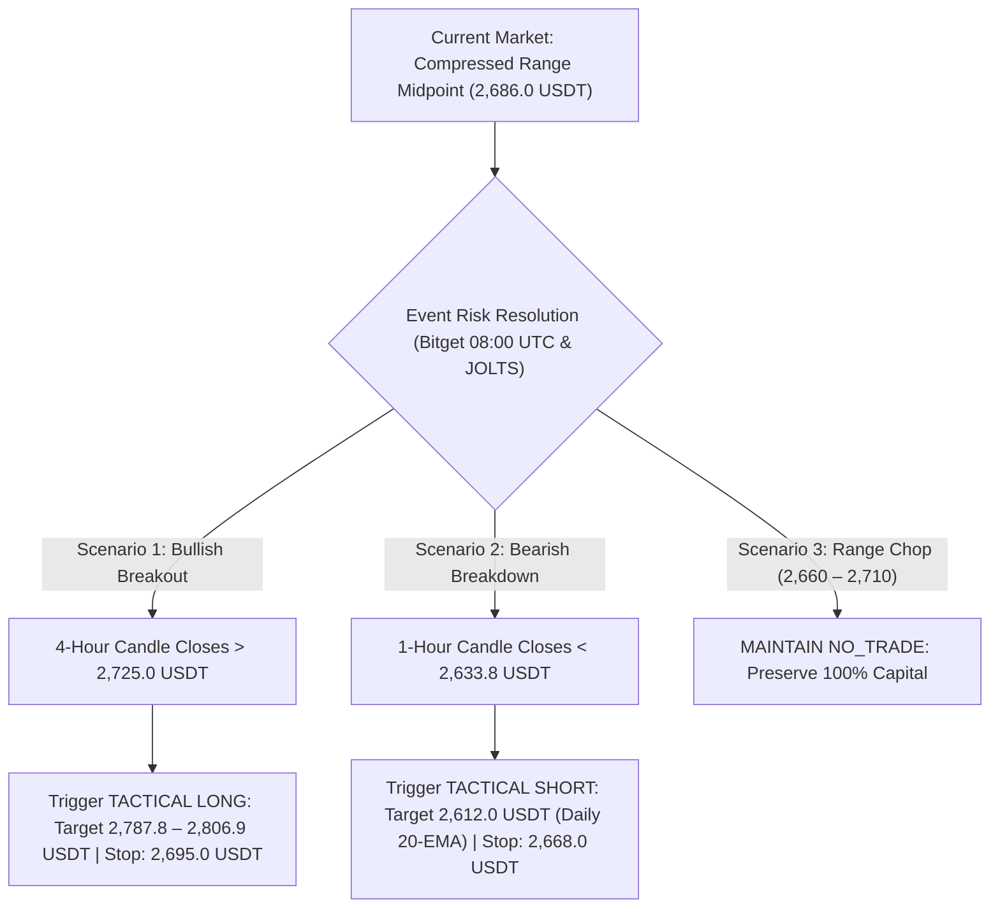

# OKX Perpetual Swap Research Report: ETH-USDT-SWAP

```json
{"forecast": {"instrument": "ETH-USDT-SWAP", "date": "2026-09-29", "bias": "NO_TRADE", "confidence": "high", "entry_low": null, "entry_high": null, "stop": null, "target1": null, "target2": null, "horizon_days": 1, "invalidation": ["Decisive 4-hour candle close above 2,725.0 USDT reclaiming 24h high resistance with expanding taker buy volume (LSR taker > 1.15) and expanding open interest to trigger a momentum long breakout toward 2,787.8 USDT", "Decisive 1-hour candle close below the September 28 double-bottom swing low at 2,633.8 USDT confirming an intermediate breakdown toward the rising daily 20-day EMA at 2,612.0 USDT", "Significant post-resumption outflow or liquidation cascade following the 08:00 UTC Bitget ETH withdrawal resumption altering OKX derivatives order flow dynamics", "Macro shock from today's U.S. JOLTS Job Openings release (expected ~7.22M-7.24M) or tomorrow's Core PCE inflation data driving benchmark 10-year Treasury yields above 5.30%"]}}
```

### Executive Summary
* **Directional Bias:** **NO_TRADE** (Tactical Stand Aside — structural compression within an 86.20 USDT liquidation whipsaw range; price pinned at mid-range between heavy overhead resistance at 2,695–2,724 USDT and tested double-bottom support at 2,633.8 USDT).
* **Confidence Level:** **High** (erratic microstructural whipsaw with 3,777 contracts of long liquidations followed by 460 contracts of short covering; taker sell dominance at 0.8684 and net OI contraction of -4.56% confirm lack of institutional trend conviction).
* **Execution Status:** **Flat / Capital Preservation** (neither long nor short offers an asymmetric reward-to-risk setup meeting the mandatory 1.50× net protocol threshold within realistic 24-hour boundaries).
* **Actionable Re-Engagement Triggers:** Re-evaluate Long on a confirmed 4-hour close above **2,725.0 USDT** (reclaiming 24h peak toward 2,787.8–2,806.9 USDT); Re-evaluate Short on a confirmed 1-hour close below **2,633.8 USDT** (targeting daily 20-EMA at 2,612.0 USDT).
* **Top Downside Risk:** Imminent event volatility from the Bitget exchange ETH withdrawal resumption today at 08:00 UTC, compounded by U.S. JOLTS Job Openings today and Core PCE inflation tomorrow while 10-year Treasury yields test 5.25%.

---

## Part 0: Data Acquisition & Pipeline Environment

### Data Provenance & Methodology
* **Source:** OKX public REST market data endpoints and OKX Rubik trading-data endpoints processed via `scripts/pipeline.py`.
* **Execution Timestamp:** `2026-09-29T00:20:25+00:00` (UTC).
* **Primary Output Files:**
  * Summary metrics: [`out/summary.json`](file:///home/jetson/vibe-trading-okx-futures/out/summary.json)
  * Multi-timeframe OHLCV datasets: [`out/ETH-USDT-SWAP_1d.csv`](file:///home/jetson/vibe-trading-okx-futures/out/ETH-USDT-SWAP_1d.csv) (365 daily bars), [`out/ETH-USDT-SWAP_4h.csv`](file:///home/jetson/vibe-trading-okx-futures/out/ETH-USDT-SWAP_4h.csv) (2,190 4-hour bars), [`out/ETH-USDT-SWAP_1h.csv`](file:///home/jetson/vibe-trading-okx-futures/out/ETH-USDT-SWAP_1h.csv) (1,440 1-hour bars).
  * Derivatives metrics: [`out/funding.csv`](file:///home/jetson/vibe-trading-okx-futures/out/funding.csv) (297 settlement intervals spanning ~99 days), [`out/contract_stats.csv`](file:///home/jetson/vibe-trading-okx-futures/out/contract_stats.csv) (100 hourly snapshots of Open Interest, LSR, taker volume, and liquidations).
  * Graphical artifacts: Stored in [`reports/img/`](file:///home/jetson/vibe-trading-okx-futures/reports/img/) (`chart_1d.png`, `chart_4h.png`, `chart_1h.png`, `chart_derivatives.png`).

---

## Part 1: Contract & Market Structure

### 1. Facts (Data-Derived)
*Source: `summary.json` → `contract_specs`, `ticker`*

| Specification Field | Raw Value | Metric Interpretation |
| :--- | :--- | :--- |
| **Instrument ID (`instId`)** | `ETH-USDT-SWAP` | Linear perpetual swap margined and settled in USDT |
| **Underlying (`uly`)** | `ETH-USDT` | Ethereum spot reference index basket |
| **Contract Value (`ctVal`)** | `0.1` | Each contract represents exactly 0.1 ETH |
| **Contract Value Currency (`ctValCcy`)** | `ETH` | Base currency is Ethereum |
| **Contract Multiplier (`ctMult`)** | `1` | Linear payout multiplier |
| **Contract Type (`ctType`)** | `linear` | Direct USDT settlement |
| **Maximum Leverage (`lever`)** | `100` | Up to 100x account-level leverage permitted |
| **Tick Size (`tickSz`)** | `0.01` | Minimum price fluctuation is 0.01 USDT |
| **Lot Size (`lotSz`) / Min Size (`minSz`)** | `0.01` | Minimum order size is 0.01 contracts (= 0.001 ETH) |
| **Max Limit Order Size (`maxLmtSz`)** | `100000000` | Maximum limit order size: 100,000,000 contracts |
| **Max Market Order Size (`maxMktSz`)** | `90000` | Maximum single market order: 90,000 contracts (= 9,000 ETH) |
| **Settlement Currency (`settleCcy`)** | `USDT` | Margin, PnL, and funding paid in USDT |
| **Trading State (`state`)** | `live` | Actively trading (listed 2019-11-12 11:16:48 UTC; `listTime`: `1573557408000`) |
| **Expiration Time (`expTime`)** | `""` (null / empty) | Perpetual instrument with no fixed expiry |
| **Funding Interval (`funding_interval_hours`)** | `8.0` | Settled every 8 hours (00:00, 08:00, 16:00 UTC) |
| **Ticker Last Price (`last`)** | `2686.09` | Last trade matched at 2,686.09 USDT |
| **Top of Book Depth** | Bid: `2686.09` (100.6 ct) / Ask: `2686.10` (4376.75 ct) | Tightest possible 1-tick spread: 0.01 USDT (~0.00037%) |
| **24h Volume Base (`volCcy24h`)** | `2696502.866` ETH | 2,696,502.9 ETH traded in trailing 24 hours |
| **24h Volume Contracts (`vol24h`)** | `26965028.66` contracts | 24h Turnover: ~**$7,243,049,383 USDT** notional (~$7.24B) |
| **24h High / Low Range** | Low: `2633.8` / High: `2720` | 24h Absolute Range: 86.20 USDT (3.21%) |
| **Start of Day (SOD) Reference** | UTC 0: `2687.78` / UTC 8: `2676.57` | Intraday reference anchors |
| **Mark vs Index Price** | Mark: `2686.08` / Index: `2687.26` | Mark trades at a discount of -1.18 USDT (-0.0439%) |
| **Open Interest (`open_interest_latest`)** | `1768295906.4417` contracts | Total open interest: ~**$1,768,295,906 USDT** (~176,830 ETH) |

### 2. Interpretation & Liquidity Analysis
* **Execution Liquidity Surge & Microstructure:** Over the past 24 hours, trading turnover on ETH-USDT-SWAP surged by **+102.2%**, climbing from 13.34 million contracts ($3.59B) yesterday to **26.97 million contracts** (~**$7.24 Billion USDT notional**). This massive liquidity surge was propelled by aggressive stop-loss cascades and liquidation-driven flow across an expanded 86.20 USDT range (`2,633.8 – 2,720.0 USDT`). Top-of-book market depth remains institutional-grade with an inside spread pinned at the minimum 0.01 USDT increment (0.037 bps). Substantial resting sell liquidity sits immediately on the inside ask (4,376.75 contracts = 437.68 ETH) against 100.60 contracts on the inside bid, reflecting active institutional capping at the 2,686.10 boundary. Retail and institutional clip sizes (50 to 2,000 ETH) can execute instantly across the central limit order book with negligible price impact.
* **Cost of Carry Analysis (24-Hour Holding Horizon):**
  * **Fee Model:** The baseline VIP0 fee tier is 0.050% (5.0 bps) taker and 0.020% (2.0 bps) maker. Round-trip taker execution incurs 0.100% (10 bps) in baseline exchange fees.
  * **Funding Rate Baseline:**
    * Latest settled funding rate: **+0.006195%** per 8h (`summary.json` → `funding.latest_pct`).
    * Next predicted funding rate: **+0.006724%** per 8h (`summary.json` → `ticker.funding_rate`).
    * 7-day mean funding rate: **+0.003607%** per 8h (= **+0.01082%** daily).
    * 30-day mean funding rate: **+0.004483%** per 8h (= **+0.01345%** daily, **4.909% APR** annualized).
    * Historical percentile: Current funding sits at the **70.71st percentile** of all 297 recorded settlements, with 30-day funding positive **91.11%** of the time.
  * **Long Position Carry Cost:** Over a 24-hour holding window spanning 3 settlement intervals (08:00, 16:00, 00:00 UTC), expected funding carry cost based on the latest print is approximately **+0.0186%** (~1.86 bps). Combined with round-trip taker fees (0.100%), total baseline carry friction is approximately **0.1186%** (11.86 bps). While positive, carry friction is modest and represents a minor fraction of the daily 3.31% ATR.
  * **Short Position Carry Yield:** Short contract holders receive funding payments. Over 24 hours, shorts earn an expected carry yield of ~+0.0186%, offsetting ~18.6% of round-trip taker fees. However, this modest yield does not compensate for holding short positions against an intact daily uptrend.

---

## Part 2: Price Action & Technical Analysis

### Visual Multi-Timeframe Charts


### 1. Facts (Multi-Timeframe Metrics)
*Source: `summary.json` → `timeframes` & OHLCV CSV datasets*

| Indicator / Metric | Daily (1D) | 4-Hour (4H) | 1-Hour (1H) |
| :--- | :--- | :--- | :--- |
| **Last Close Price** | `2684.62` USDT | `2685.51` USDT | `2686.10` USDT |
| **7-Day / 30-Day Return** | -2.47% / +11.13% | -1.94% / +9.35% | -2.46% / +9.30% |
| **EMA 20** | `2612.03` USDT | `2682.19` USDT | `2678.66` USDT |
| **EMA 50** | `2436.36` USDT | `2668.38` USDT | `2680.05` USDT |
| **EMA 200** | `2281.97` USDT | `2516.31` USDT | `2667.57` USDT |
| **Trend Structure Classification** | **UP** (Price > EMA20 > EMA50 > EMA200) | **UP** (Price > EMA20 > EMA50 > EMA200) | **UP** (Price > EMA20, EMA50, EMA200) |
| **RSI 14** | `62.69` (Bullish consolidation) | `51.00` (Neutral equilibrium) | `53.35` (Constructive midline) |
| **MACD Histogram** | `-4.88` (Corrective momentum contraction) | `-0.84` (Curling upward toward zero line) | `+2.10` (Positive green momentum impulse) |
| **ATR 14 / ATR %** | 88.75 USDT / `3.31%` | 32.23 USDT / `1.20%` | 19.04 USDT / `0.71%` |
| **30-Day Realized Volatility (Ann.)** | `44.44%` | `44.46%` | `46.14%` |
| **Key Pivot Support Levels** | `2621.19`, `2356.18`, `2355.56`, `2251.05` | `2662.22`, `2633.80`, `2626.07`, `2621.19` | `2680.05`, `2678.00`, `2675.71`, `2666.60` |
| **Key Pivot Resistance Levels** | `2806.96`, `3045.47`, `3077.16`, `3308.65` | `2724.20`, `2742.95`, `2787.83`, `2806.96` | `2694.79`, `2695.27`, `2696.87`, `2697.72` |

### 2. Interpretation & Key Level Validation
* **Multi-Timeframe Trend Structure & Regime Dynamics:**
  * **Macro Context (Daily):** The daily trend structure remains decisively **UP**. Current price (`2,684.62` USDT) commands a wide buffer over the ascending 20-day EMA (`2,612.03`), 50-day EMA (`2,436.36`), and 200-day EMA (`2,281.97`). The daily Golden Cross is accelerating. Daily RSI stands at a constructive `62.69`. However, the daily MACD histogram has printed `-4.88`, confirming that price is in a multi-day corrective pause following the September 21 swing peak of `2,806.96` USDT. Yesterday's daily candle printed a massive high-wave spinning top / doji (open `2,687.28` vs close `2,687.78`) with an 86.20 USDT total range (`2,633.8 – 2,720.0`), reflecting acute equilibrium following intense two-way liquidation flushes.
  * **Intermediate Context (4-Hour):** The 4-hour trend structure maintains an **UP** classification. Price (`2,685.51` USDT) is holding slightly above the 4-hour EMA20 (`2,682.19`), well above the ascending 4-hour EMA50 (`2,668.38`), and comfortably above the 4-hour EMA200 (`2,516.31`). The 4-hour MACD histogram has curled sharply upward to `-0.84` (recovering from cycle lows of -8.0), nearing a potential bullish crossover. 4-hour RSI sits at `51.00`, reflecting neutral equilibrium.
  * **Intraday Execution Context (1-Hour):** The 1-hour trend is classified as **UP**. Price (`2,686.10` USDT) trades above the 1-hour EMA20 (`2,678.66`), EMA50 (`2,680.05`), and EMA200 (`2,667.57`). 1-hour RSI is constructive at `53.35`, and the 1-hour MACD histogram is positive at `+2.10`. However, the 1-hour EMA20 and EMA50 are virtually flatlined and converged within 1.4 USDT of each other, indicating horizontal range consolidation rather than directional impulse.
* **The September 28 Structural Whipsaw & Double Bottom Retest:**
  * At 05:00 UTC on September 28, an aggressive sell-off drove price down to **2,633.80 USDT**, decisively slicing through yesterday's anticipated support shelf at 2,658–2,668 USDT.
  * Notably, this flush halted within 0.47 USDT of the major September 23 structural swing low (`2,633.33` USDT), forming a precise **double bottom retest**.
  * Dip-buyers aggressively absorbed the liquidity below 2,650 USDT, fueling an intraday counter-rally that climbed all the way to **2,720.00 USDT** by 17:00 UTC.
  * However, this counter-rally failed to challenge the September 25 high (`2,742.95` USDT), printing a lower high. At 19:00 UTC, another violent liquidation cascade dumped price to **2,663.01 USDT**, before buyers once again stepped in at the 4-hour EMA50 (`2,668.38`) and 1-hour EMA200 (`2,667.57`) dynamic support floor.
  * Price is now trapped in the exact center of this 86.20 USDT range (`2,633.8 – 2,720.0 USDT`), caught between a dense overhead resistance ceiling and the lower flush wick.
* **Volatility Regime:**
  * Intraday volatility expanded sharply: daily range was 86.20 USDT (3.21%), up from 56.20 USDT (2.11%) in the previous cycle.
  * 1-hour ATR% has expanded to **0.709%** (19.04 USDT), and 4-hour ATR% stands at **1.200%** (32.23 USDT), while 1-day ATR% is **3.306%** (88.75 USDT).
  * 30-day realized volatility remains elevated across timeframes: 46.14% (1h), 44.46% (4h), and 44.44% (1d). The market is in an active mean-reverting re-hedging regime following high-volatility expansions.
* **Key Support & Resistance Mapping:**
  * *Overhead Resistance Ceiling:*
    * Intraday Pivot Resistance Cluster: `2,694.79` – `2,697.72` USDT (proven intraday ceiling; rejected 3 times on Sept 28).
    * 24h Swing High: `2,720.00` USDT.
    * 4-hour Major Pivot Resistance: `2,724.20` – `2,742.95` USDT.
    * Structural Multi-Week High: `2,787.83` – `2,806.96` USDT.
  * *Downside Demand Floor:*
    * Dynamic Confluence Shelf: 1-hour EMA50 (`2,680.05`), 1-hour EMA20 (`2,678.66`), and 1-hour pivot support (`2,678.00` / `2,675.71` USDT).
    * Dynamic Confluence Bedrock: 4-hour EMA50 (`2,668.38` USDT), 1-hour EMA200 (`2,667.57` USDT), and 1-hour pivot support (`2,666.60` USDT).
    * Evening Flush Low: `2,663.01` USDT (19:00 UTC wick).
    * Double-Bottom Bedrock: `2,633.80` USDT (Sept 28 low) / `2,633.33` USDT (Sept 23 low).
    * Macro Daily Bull Bedrock: `2,612.03` USDT (daily 20-day EMA) and `2,621.19` USDT (daily pivot support).

---

## Part 3: Positioning & Derivatives Flow

### Visual Derivatives Overview


### 1. Facts (Positioning & Derivatives Flow)
*Source: `summary.json` → `positioning`, `funding`, `basis` & `contract_stats.csv`*

| Metric Field | Raw Value | Metric Interpretation |
| :--- | :--- | :--- |
| **Open Interest (`open_interest_latest`)** | `1768295906.4417` contracts | Total active open interest: ~$1.768B USDT notional |
| **24h Open Interest Change (`oi_change_24h_pct`)** | `-4.56244%` | Open interest contracted by -4.56% over the trailing 24 hours |
| **24h Price Change Window (`price_change_same_window_pct`)** | `+0.50889%` | Price gained +0.51% across the same 24h window |
| **OI-Price Regime Classification** | `short covering (price up, OI down)` | Upward drift driven by short covering and leverage de-risking |
| **Long / Short Account Ratio (`lsr_account_latest`)** | `1.30` | 1.30 retail accounts net long for every 1 account net short |
| **Taker Buy / Sell Volume Ratio (`lsr_taker_latest`)** | `0.8684` | Taker sell volume accounted for 53.52% vs 46.48% taker buy volume |
| **24h Long Liquidations (`liq_long_sum_24h`)** | `3777.10` contracts | Total forced long liquidations over trailing 24 hours (~$10.15M) |
| **24h Short Liquidations (`liq_short_sum_24h`)** | `459.94` contracts | Total forced short liquidations over trailing 24 hours (~$1.24M) |
| **Mark-Index Basis (`mark_index_basis_pct`)** | `-0.04391%` | Mark price trades at a discount of -4.39 bps to spot index |
| **Perp-Spot Basis Latest (`perp_spot_basis_latest_pct`)** | `-0.00261%` | Perpetual swap trades at a -0.26 bps discount to spot basket |
| **Perp-Spot Basis 30d Mean (`perp_spot_basis_mean_30d_pct`)** | `-0.04540%` | Trailing 30-day average basis discount is -4.54 bps |

### 2. Interpretation & Microstructure Analysis
* **The Double Liquidation Flush Dynamics:**
  * Analysis of [`out/contract_stats.csv`](file:///home/jetson/vibe-trading-okx-futures/out/contract_stats.csv) details the two major liquidation events over the trailing 24 hours:
    * **First Wave (05:00 UTC Flush):** Price plunged from 2,703.20 down to 2,633.80 USDT, flushing weak retail longs and testing the September 23 structural low (2,633.33 USDT).
    * **Second Wave (19:00 UTC Cascade):** Following the rally to 2,720.00 USDT, price abruptly collapsed back to 2,663.01 USDT at 19:00 UTC. This single 1-hour bar triggered **3,587.34 contracts of long liquidations** (representing **94.98%** of the entire 24h long liquidation total).
    * **Short Squeeze Response (22:00–23:00 UTC):** As price tested 2,666.16 USDT at 22:00 UTC, aggressive short sellers were caught offside by an immediate rebound. This triggered **232.41 contracts of short liquidations** at 22:00 UTC and another **187.24 contracts** at 23:00 UTC (totaling **419.65 contracts**, or **91.24%** of 24h short liquidations), driving price back to 2,687–2,693 USDT.
* **OI-Price Regime Classification (`short covering`):**
  * Across the trailing 24-hour cycle, Open Interest declined by **-4.56%** (falling from $1.853B to $1.768B), while price registered a modest net gain of **+0.51%**.
  * The regime classification of `short covering (price up, OI down)` proves that the recovery from 2,663.01 to 2,686.09 USDT was predominantly fueled by short covering and position liquidation, rather than organic institutional long accumulation.
  * Taker order flow remains net seller-dominated (`lsr_taker_latest` at **0.8684**; $52.16M taker buying vs $60.07M taker selling in the latest 00:00 UTC bar), confirming that aggressive market orders continue to sell into intraday bounces.
* **Long/Short Account Ratio Normalization:**
  * The account long/short ratio cooled from **1.55** (September 28 peak) down to **1.30** (56.5% long accounts).
  * This marks a significant purge of retail speculative excess, reducing the overhang of vulnerable long positions.
* **Persistent Spot Index Premium (Perp Discount):**
  * The mark price trades at a **-4.39 bps** discount to the spot index (`2,686.08` vs `2,687.26` USDT), and the perpetual swap trades at a **-0.26 bps** discount.
  * This persistent negative basis confirms that the perpetual swap market remains free of speculative froth, with spot markets providing the underlying pricing anchor.
* **Funding Rate Reset:**
  * The latest settled funding rate printed **+0.006195%** per 8h, sitting at the **70.71st percentile** of historical prints, with predicted funding at **+0.006724%** per 8h. Funding remains modest and non-punitive.

---

## Part 4: Narrative, Catalysts & Cross-Market Context

### 1. Underlying Asset & Ecosystem Developments
* **Bitget Exchange ETH Withdrawal Resumption (September 29, 2026, 08:00 UTC):**
  * Bitget is actively restoring withdrawal services in a phased schedule following its September 24 security breach.
  * While Bitcoin withdrawals resumed smoothly on September 28 at 08:00 UTC, **Ethereum (ETH) withdrawals are officially scheduled to resume today, September 29, 2026, at 08:00 UTC** across the Ethereum mainnet, BNB Smart Chain, Arbitrum, Base, and Optimism networks.
  * *Market Implication:* The reopening of ETH withdrawals releases days of accumulated pent-up withdrawal requests and trapped arbitrage liquidity, creating near-term transfer, re-hedging, and spot selling overhang during the upcoming European and early U.S. trading sessions.
* **SEC Regulatory Guidance on Ethereum Staking (September 25, 2026):**
  * The SEC staff issued milestone FAQ guidance confirming that native Ethereum staking activities do not inherently constitute securities offerings ([sosovalue.com](https://vertexaisearch.cloud.google.com/grounding-api-redirect/AUZIYQEED8bEMZPRTMNbbWiJjPB6dGAVUNRFhXh2lMg-wgQYDRhurbGUMysyD50BiNQhnzMIUUjJXDTUDjcu4Z0GCjSx5c2nz9SL98zZ2Vr7Kwlatg41Se6XQO3YmCtEs9R0jwEE3XRE)).
  * The guidance further indicated that liquid staking receipt tokens issued by decentralized protocols may qualify as digital commodities, providing strong long-term structural tailwinds for institutional staking adoption.
* **U.S. Spot Ethereum ETF Sustained Inflow Streak:**
  * U.S. spot Ethereum ETFs recorded **+$690 million in net inflows** during the trading week ending September 25, 2026, led by BlackRock's ETHA ($326M) and Fidelity's FETH ($174M) ([openpr.com](https://vertexaisearch.cloud.google.com/grounding-api-redirect/AUZIYQEh6s01kQMo4uBm4jbu2TFF0Hn808Ff3KGspOgWwCk3Dmeu4AUVUTa4U3hsA-KcI1OTUv8AWLlTsabXdyWbgp8qls6wM4RwMy_sEHHt5pLVYk4p3f-yJ40ZUHKBY_5WSRthEBhV4pMGI73mBpacq2K7u4643tHKDBkOln4JtnOZ17Me_94OWCT10DzFIiqAmjSBwb0Cfw==)).
  * On Friday, September 25, net inflows reached **+$86.95 million** ([kucoin.com](https://vertexaisearch.cloud.google.com/grounding-api-redirect/AUZIYQEZPkKJQ-Lr4t6v59xnPr5zD-ctxINYwYuP7TKty8t5jMYZoGFgkpyQUW3xEQJ5rNITjouVpDet-fCKTabxhlFCecKj8yHBQHwCDXeAN4vKNRSJaR2eITYu-lqiPuQuQqTUj973ojGhL2hHh1_GjXLgmwiCZD8kJGTGPGaodAP1w31BC3y29s-OsqPk1PUIY213p2NzwSjem4hyFoCPYMIoqhoDvlVaBfqLDAsFhiZDj2o=)), marking the sixth consecutive day of net purchases. Total cumulative net inflows stand at **$13.94 billion** with total AUM reaching **$17.78 billion**.
* **Ethereum Core Development Roadmap (Glamsterdam Upgrade):**
  * The Glamsterdam upgrade has been officially scheduled to activate on the **Sepolia public testnet on October 6, 2026, at 13:53:36 UTC** (epoch 353,024, slot 11,296,768) ([ethereum.org](https://vertexaisearch.cloud.google.com/grounding-api-redirect/AUZIYQEGO3T6-NNKA1dYFvx0sXzOLXK5OpOrEg8y0fIDrUv5zaILHZ3mVQlbIJoLknzvUmjsBsUWrmgPtu2Xr6iFIbAqQ8p9PuxAmoedoyNFE2wABozcE2rISgXZdsOolJM_Dpmio50zkdTVre7sWddzsAqVZv3qMoC_Dpl576s=)).
  * The upgrade incorporates Enshrined Proposer-Builder Separation (ePBS, EIP-7732), Block-Level Access Lists (BALs, EIP-7928), and a 200M gas limit floor, paving the way for mainnet deployment in Q4 2026.

### 2. Macroeconomic Backdrop & Market Beta
* **Bitcoin Corrective Pullback & Market Beta:**
  * Bitcoin (BTC-USDT-SWAP) has slipped into an intermediate corrective consolidation at $83,470 USDT after a severe long liquidation flush broke its 4-day higher-low sequence down to $82,501 USDT. The crypto market beta is currently characterized by cautious distribution and selective rotation.
* **Macro Data Calendar & Elevated Yields:**
  * Following the Federal Reserve's September 16 rate hike (3.75%–4.00%), benchmark U.S. 10-year Treasury yields have surged to **5.17%–5.25%**, maintaining high hurdle rates for risk assets.
  * Markets face intense event risk over the next 48 hours:
    * **Tuesday, September 29 (Today):** U.S. JOLTS Job Openings (forecast ~7.22M–7.24M).
    * **Wednesday, September 30 (Tomorrow):** U.S. Core PCE Price Index (consensus +0.3% MoM, headline +0.4% MoM).
    * **Friday, October 2:** U.S. Non-Farm Payrolls (consensus 80k–100k, unemployment 4.1%).

### 3. Immediate Catalysts & Risk Horizons
* **Upside Catalysts:**
  * Confirmed 4-hour close above `2,725.0 USDT`, confirming a bullish absorption of the Bitget withdrawal overhang.
  * Continuation of institutional ETF inflows upon resumption of U.S. trading.
  * Pre-upgrade anticipation building toward the October 6 Glamsterdam Sepolia testnet deployment.
* **Downside Risks:**
  * Post-resumption withdrawal dumping or arbitrage hedging following Bitget's 08:00 UTC ETH unlock.
  * Breakdown below the `2,633.8 USDT` double-bottom support low, exposing the rising daily 20-day EMA at `2,612.03 USDT`.
  * Stronger-than-expected JOLTS or sticky PCE prints propelling 10-year Treasury yields above 5.30%.

---

## Part 5: Synthesis & Trade Plan

### Core Thesis
Over the trailing 24 hours, Ethereum underwent severe microstructural turbulence, printing an 86.20 USDT liquidation whipsaw (`2,633.80 – 2,720.00 USDT`) that purged 3,777 long contracts and 460 short contracts before settling directly at the range midpoint (`2,686.09 USDT`). While primary macro and intermediate trend structures remain classified as up, derivatives flow shows net open interest contracting by -4.56% in a short-covering regime, with taker volume persistently dominated by aggressive sellers (LSR taker 0.8684). Furthermore, imminent event catalysts—including the Bitget exchange ETH withdrawal unlock today at 08:00 UTC and U.S. JOLTS job openings—create elevated risk-off volatility. With price wedged between formidable overhead resistance at 2,695–2,724 USDT and tested double-bottom support at 2,633.80 USDT, neither long nor short provides a viable, asymmetric reward-to-risk setup meeting the mandatory 1.50× net threshold within a 24-hour horizon. Capital preservation mandates standing aside.

### Directional Bias & Conviction
* **Bias:** **NO_TRADE**
* **Confidence Level:** **High**
* **Primary Supporting Drivers:**
  1. **Unfavorable Trade Geometry & Resistance Density:** Entering long at current price (`2,686.09 USDT`) requires an invalidation stop below the September 28 double bottom at `2,628.0 USDT` (risking 58 points / 2.16%). To satisfy the >= 1.50× net R:R protocol mandate, Target 1 must exceed `2,778.0 USDT` (+3.42%), requiring an unrealistic multi-level breakout through major resistance at `2,720.0` and `2,742.95` within 24 hours. Conversely, a tight stop above 2,660 USDT was already violated during yesterday's sweep to 2,633.80 USDT and carries an unacceptable probability of getting stopped out by random noise.
  2. **Derivatives Positioning Weakness:** The recovery from 2,663 to 2,686 USDT was driven entirely by short covering (OI down -4.56%) rather than aggressive spot or perp buyer accumulation. Takers remain net sellers (LSR taker 0.8684), indicating that market participants are using bounces to de-risk.
  3. **Imminent Catalyst Event Risk:** The phased unlock of Bitget ETH withdrawals at 08:00 UTC today across five networks introduces immediate supply and arbitrage friction, coinciding with high-impact U.S. JOLTS economic data while Treasury yields probe multi-decade highs.

---

### Quantitative Evaluation: Why Long and Short Both Fail the 1.50× Net R:R Gate

| Trade Parameter | Hypothetical LONG Setup | Hypothetical SHORT Setup | Protocol Compliance & Decision |
| :--- | :--- | :--- | :--- |
| **Entry Point (Benchmark)** | `2,686.0 USDT` | `2,686.0 USDT` | Current market equilibrium |
| **Invalidation Stop Level** | `2,628.0 USDT` (below Sept 28 low) | `2,728.0 USDT` (above 24h high) | Structural swing invalidation |
| **Stop Distance (Risk)** | 58.00 USDT (**2.16%**) | 42.00 USDT (**1.56%**) | Required risk buffer |
| **Realistic 24h Target 1** | `2,720.0 USDT` (24h high resistance) | `2,666.0 USDT` (dynamic confluence floor) | Major multi-timeframe level |
| **Target Distance (Reward)** | +34.00 USDT (**+1.27%**) | +20.00 USDT (**+0.74%**) | Maximum realistic move |
| **Gross Reward-to-Risk (R:R)** | **0.59 R** (`34.00 / 58.00`) | **0.48 R** (`20.00 / 42.00`) | **Gross R:R FAILS (< 1.50 R)** |
| **Total Friction (Fees + Funding)** | 0.1386% (~3.72 USDT) | 0.1186% (~3.18 USDT) | Exchange fees & 3 funding intervals |
| **Net Reward / Net Risk** | 30.28 USDT / 61.72 USDT | 16.82 USDT / 45.18 USDT | Net capital realization |
| **Net Reward-to-Risk (R:R)** | **0.49 R Net** | **0.37 R Net** | **CRITICAL FAILURE: Violates >= 1.50× Rule** |

*Conclusion:* Both directional setups fail the mandatory 1.50× net reward-to-risk threshold by a wide margin. Forcing a directional position into this compressed midpoint constitutes an uncompensated gamble.

---

### Actionable Re-Engagement Plan



#### Re-Engagement Decision Criteria
1. **Bullish Re-Engagement Trigger (Long):**
   * *Condition:* A confirmed 4-hour candle close above **2,725.0 USDT** that cleanly clears the September 28 high (`2,720.0`) and 4-hour pivot resistance (`2,724.20`).
   * *Required Confirmation:* Expanding Open Interest (+1.5% in 4h) accompanied by an aggressive shift in taker buy volume (LSR taker > 1.15).
   * *Execution Targets:* Target 1: `2,787.8 USDT` | Target 2: `2,806.9 USDT` | Invalidation Stop: `2,695.0 USDT`.
2. **Bearish Re-Engagement Trigger (Short):**
   * *Condition:* A confirmed 1-hour candle close below the double-bottom anchor at **2,633.8 USDT**.
   * *Required Confirmation:* Expanding volume with negative basis expansion and persistent net taker selling (LSR taker < 0.80).
   * *Execution Targets:* Target 1: `2,612.0 USDT` (rising daily 20-day EMA) | Target 2: `2,563.0 USDT` | Invalidation Stop: `2,668.0 USDT`.

---

### What Invalidates the Thesis
The standing-aside (NO_TRADE) stance must be immediately re-assessed upon any of the following occurrences:
1. **Structural Resistance Breakout:** A 4-hour candle close above **2,725.0 USDT** on heavy volume, confirming that buyers have absorbed all Bitget withdrawal supply and cleared overhead resistance.
2. **Double-Bottom Floor Breakdown:** An hourly candle close below **2,633.8 USDT**, invalidating the dynamic confluence support floor and signaling an accelerated correction toward the daily 20-EMA (`2,612.03 USDT`).
3. **Institutional Flow Surge:** Release of updated U.S. spot Ethereum ETF data reporting single-day net inflows exceeding **+$150 Million**, initiating institutional trend resumption.
4. **Aggressive Microstructural Shift:** Open interest expands by >+3.0% over a 4-hour window while taker buy ratio surges above `1.25`, signaling unambiguous institutional aggressive market buying.

---

### Confidence & Limitations

#### What We Know (High Confidence)
* Precise exchange data from OKX Rubik endpoints confirms that the September 28 cycle flushed 3,777.10 contracts of longs and 459.94 contracts of shorts across an 86.20 USDT range.
* The recovery from 2,663 to 2,686 USDT was driven by `short covering (price up, OI down)` rather than organic long accumulation, with takers remaining net sellers (LSR taker 0.8684).
* The 4-hour EMA50 (`2,668.38`) and 1-hour EMA200 (`2,667.57`) continue to function as the critical intraday confluence pivot, while 2,633.80 USDT marks the primary double-bottom structural floor.
* A spot premium persists (-4.39 bps mark-index basis), demonstrating solid fundamental spot backing despite choppy derivatives flow.

#### Data Limitations & Assumptions
* OKX Rubik trading metrics (OI, long/short account ratio, taker volume) reflect currency-wide aggregation across all OKX ETH instruments rather than `ETH-USDT-SWAP` in total isolation.
* Public liquidation data is capped at the most recent ~100 events, providing a directional proxy rather than complete order book depth.
* The exact volume of Bitget ETH withdrawals scheduled for release at 08:00 UTC cannot be pre-determined; market participants must monitor exchange wallet flows closely during the European morning.
* A stricter analyst would monitor real-time Ethereum options 25-delta skew and term structure on Deribit to gauge whether institutional desks are buying downside puts ahead of tomorrow's U.S. Core PCE release.
