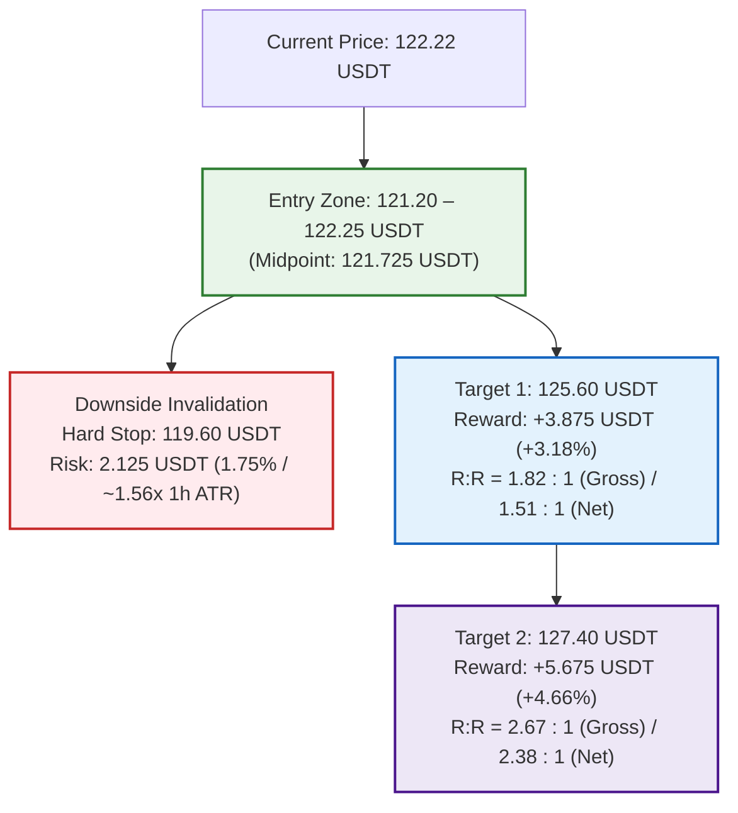

# OKX Perpetual Swap Research Report: SOL-USDT-SWAP

```json
{"forecast": {"instrument": "SOL-USDT-SWAP", "date": "2026-09-26", "bias": "LONG", "confidence": "medium", "entry_low": 121.2, "entry_high": 122.25, "stop": 119.6, "target1": 125.6, "target2": 127.4, "horizon_days": 1, "invalidation": ["1-hour candle close below 119.60 USDT breaking below dynamic 1h EMA20 (120.26 USDT) and the 120.00 USDT psychological/SOD structural support shelf", "4-hour candle close below the 4h EMA20 (117.95 USDT) and 1h EMA50 (118.40 USDT) support cluster", "Derivatives regime flip to aggressive short expansion with surging OI and negative funding rates", "Broad macro risk-off cascade or Bitcoin breakdown below 82,750 USDT terminating altcoin upside momentum"]}}
```

### Executive Summary
* **Directional Bias:** LONG (breakout expansion continuation underpinned by bullish alignment across all 1D, 4H, and 1H timeframes and confirmed spot-derivatives accumulation).
* **Confidence Level:** Medium (unanimous multi-timeframe moving average structure and successful post-liquidation recovery; tempered by near-term hourly momentum testing overbought levels).
* **Execution Range:** Entry Zone: 121.20 – 122.25 USDT (Current Consolidation / Shallow Pullback to 1h EMA20) | Hard Invalidation Stop: 119.60 USDT.
* **Profit Targets:** Target 1: 125.60 USDT (R:R 1.82 vs midpoint) | Target 2: 127.40 USDT (R:R 2.67 vs midpoint).
* **Top Downside Risk:** Decisive breakdown below the 119.60 – 120.00 USDT support shelf (violating 1h EMA20 at 120.26 USDT and intraday SOD UTC 8 anchor at 120.07 USDT), triggering a mean-reversion retest toward the 4-hour EMA20 (117.95 USDT).

---

## Part 0: Data Acquisition & Pipeline Environment

### Data Provenance & Methodology
* **Source:** OKX public REST market data endpoints and OKX Rubik trading-data endpoints processed via [`scripts/pipeline.py`](file:///home/jetson/vibe-trading-okx-futures/scripts/pipeline.py).
* **Execution Timestamp:** `2026-09-26T00:23:53+00:00` (UTC).
* **Primary Output Files:**
  * Summary metrics: [`out/summary.json`](file:///home/jetson/vibe-trading-okx-futures/out/summary.json)
  * Multi-timeframe OHLCV datasets: [`out/SOL-USDT-SWAP_1d.csv`](file:///home/jetson/vibe-trading-okx-futures/out/SOL-USDT-SWAP_1d.csv) (365 daily bars), [`out/SOL-USDT-SWAP_4h.csv`](file:///home/jetson/vibe-trading-okx-futures/out/SOL-USDT-SWAP_4h.csv) (2,190 4-hour bars), [`out/SOL-USDT-SWAP_1h.csv`](file:///home/jetson/vibe-trading-okx-futures/out/SOL-USDT-SWAP_1h.csv) (1,440 1-hour bars).
  * Derivatives metrics: [`out/funding.csv`](file:///home/jetson/vibe-trading-okx-futures/out/funding.csv) (287 settlement intervals spanning ~95 days), [`out/contract_stats.csv`](file:///home/jetson/vibe-trading-okx-futures/out/contract_stats.csv) (100 hourly snapshots of Open Interest, LSR, taker volume, and liquidations).
  * Graphical artifacts: Rendered and stored in [`reports/img/`](file:///home/jetson/vibe-trading-okx-futures/reports/img/) (`chart_1d.png`, `chart_4h.png`, `chart_1h.png`, `chart_derivatives.png`).

---

## Part 1: Contract & Market Structure

### 1. Facts (Data-Derived)
*Source: `summary.json` → `contract_specs`, `ticker`*

| Specification Field | Raw Value | Metric Interpretation |
| :--- | :--- | :--- |
| **Instrument ID (`instId`)** | `SOL-USDT-SWAP` | Linear perpetual swap margined and settled in USDT |
| **Underlying (`uly`)** | `SOL-USDT` | Solana spot reference index basket |
| **Contract Value (`ctVal`)** | `1` | Each contract represents exactly 1.0 SOL |
| **Contract Value Currency (`ctValCcy`)** | `SOL` | Base currency is Solana |
| **Contract Multiplier (`ctMult`)** | `1` | Linear payout multiplier |
| **Contract Type (`ctType`)** | `linear` | Direct USDT settlement |
| **Maximum Leverage (`lever`)** | `100` | Up to 100x account-level leverage permitted |
| **Tick Size (`tickSz`)** | `0.01` | Minimum price fluctuation is 0.01 USDT |
| **Lot Size (`lotSz`) / Min Size (`minSz`)** | `0.01` | Minimum order size is 0.01 contracts (= 0.01 SOL) |
| **Max Limit Order Size (`maxLmtSz`)** | `100000000` | Maximum limit order size: 100,000,000 contracts |
| **Max Market Order Size (`maxMktSz`)** | `39000` | Maximum single market order: 39,000 contracts (= 39,000 SOL) |
| **Settlement Currency (`settleCcy`)** | `USDT` | Margin, PnL, and funding paid in USDT |
| **Trading State (`state`)** | `live` | Actively trading (listed 2021-01-22 07:00:00 UTC; `listTime`: `1611298800000`) |
| **Expiration Time (`expTime`)** | `""` (null / empty) | Perpetual instrument with no fixed expiry |
| **Funding Interval (`funding_interval_hours`)** | `8.0` | Settled every 8 hours (00:00, 08:00, 16:00 UTC) |
| **Ticker Last Price (`last`)** | `122.22` | Last trade matched at 122.22 USDT |
| **Top of Book Depth** | Bid: `122.22` (2,732.85 ct) / Ask: `122.23` (41.08 ct) | Tightest possible 1-tick spread: 0.01 USDT (~0.00818%) |
| **24h Volume Base (`volCcy24h`)** | `14856269.49` SOL | 14,856,269.5 SOL traded in trailing 24 hours |
| **24h Volume Contracts (`vol24h`)** | `14856269.49` contracts | 24h Turnover: ~**$1,815,733,257 USDT** notional |
| **24h High / Low Range** | Low: `115.75` / High: `122.91` | 24h Absolute Range: 7.16 USDT (5.86%) |
| **Start of Day (SOD) Reference** | UTC 0: `122.07` / UTC 8: `120.07` | Intraday reference anchors |
| **Mark vs Index Price** | Mark: `122.23` / Index: `122.28` | Mark trades at a modest discount of -0.05 USDT (-0.0409%) |
| **Open Interest (`open_interest_latest`)** | `413778010.5864` contracts | Total open interest: ~**$413,778,011 USDT** across OKX SOL contracts |

### 2. Interpretation & Liquidity Analysis
* **Execution Liquidity & Microstructure:** SOL-USDT-SWAP on OKX represents one of the deepest, most liquid non-major altcoin derivative markets globally. Generating 14.86 million contracts (~$1.82 billion USDT) in 24-hour volume against an active open interest pool of $413.78 million, top-of-book depth is dense with a minimum 1-tick spread of 0.01 USDT (~0.82 bps). Retail-to-institutional position sizes (50 to 5,000 SOL, equivalent to $6,000 to $600,000) can be executed instantaneously across market and limit orders with negligible slippage and zero adverse market impact.
* **Cost of Carry Analysis (24-Hour Horizon):**
  * **Trading Fee Model:** Baseline VIP0 fee schedule is 0.050% (5 bps) taker and 0.020% (2 bps) maker. A standard round-trip taker execution costs 0.100% (10 bps).
  * **Funding Rate Baseline:**
    * Latest settled funding rate: **+0.003848%** per 8h (`summary.json` → `funding.latest_pct`).
    * 7-day mean funding rate: **+0.005734%** per 8h (= **+0.017201%** daily).
    * 30-day mean funding rate: **+0.001753%** per 8h (= **+0.005260%** daily, **1.920% APR** annualized).
  * **Long Position Carry Cost:** Long contract holders pay funding fees to short holders during positive funding regimes. Over a 24-hour holding horizon encompassing 3 funding settlements (00:00, 08:00, 16:00 UTC), expected funding drag based on the 7-day mean is **+0.0172%** (~1.72 bps). Paired with round-trip taker fees (0.100%), the total carrying friction for a long position is ~**0.1172%** (~11.7 bps). At the latest funding print of +0.003848% per 8h, 24-hour carry is only ~0.0115% (~1.15 bps). This represents an exceptionally cheap holding environment that exerts minimal friction on intraday upside trades.
  * **Short Position Carry Yield:** Short contract holders receive positive funding payments. Over 24 hours, short positions earn a modest yield of +0.0172% (7d mean), which subsidizes roughly 17.2% of round-trip taker fees (or produces a net positive yield when executed with maker limit orders).

---

## Part 2: Price Action & Technical Analysis

### Visual Multi-Timeframe Charts


### 1. Facts (Multi-Timeframe Metrics)
*Source: `summary.json` → `timeframes` & OHLCV CSV datasets*

| Indicator / Metric | Daily (1D) | 4-Hour (4H) | 1-Hour (1H) |
| :--- | :--- | :--- | :--- |
| **Last Close Price** | `122.20` USDT | `122.24` USDT | `122.22` USDT |
| **7-Day / 30-Day Return** | +10.08% / +12.03% | +7.96% / +20.97% | +7.54% / +21.56% |
| **EMA 20** | `110.16` USDT | `117.95` USDT | `120.26` USDT |
| **EMA 50** | `100.27` USDT | `114.07` USDT | `118.40` USDT |
| **EMA 200** | `94.68` USDT | `103.67` USDT | `113.68` USDT |
| **Trend Structure Classification** | **UP** (Price > EMA20 > EMA50 > EMA200) | **UP** (Price > EMA20 > EMA50 > EMA200) | **UP** (Price > EMA20 > EMA50 > EMA200) |
| **RSI 14** | `69.47` (Strong bullish momentum) | `68.34` (Bullish expansion) | `69.03` (Testing overbought threshold) |
| **MACD Histogram** | `+1.2035` (Expanding positive momentum) | `+0.4354` (Expanding positive momentum) | `+0.0926` (Bullish crossover sustained) |
| **ATR 14 / ATR %** | 5.18 USDT / `4.24%` | 2.36 USDT / `1.93%` | 1.36 USDT / `1.11%` |
| **30-Day Realized Volatility (Ann.)** | `67.78%` | `56.88%` | `56.31%` |
| **Key Pivot Support Levels** | `120.89`, `119.06`, `116.77`, `97.31` | `122.23`, `121.28`, `120.89`, `120.52` | `116.04`, `115.83`, `115.75`, `115.52` |
| **Key Pivot Resistance Levels** | `143.44`, `144.68`, `144.75`, `146.88` | `125.04`, `125.07`, `125.53`, `127.44` | None in lookback (Trading at new swing high) |

### 2. Interpretation & Key Level Validation
* **Unanimous Multi-Timeframe Bullish Alignment:**
  * **Macro Context (Daily):** The daily timeframe displays an authoritative, textbook structural bull trend (`up`). Price (`122.20` USDT) trades significantly above the 20-day EMA (`110.16`), 50-day EMA (`100.27`), and 200-day EMA (`94.68`). The daily moving averages are stacked in perfect bullish hierarchy (Price > EMA20 > EMA50 > EMA200), with the 50/200 Golden Cross expanding cleanly. The daily MACD histogram is strongly positive (`+1.2035`), and daily RSI (`69.47`) is pressing toward 70, reflecting sustained institutional accumulation without exhaustion.
  * **Intermediate Context (4-Hour):** The 4-hour trend structure is decisively bullish (`up`). Price broke out of a multi-week base between $96 and $106, surged to $119, consolidated cleanly, and has now pushed through $122. The 4-hour EMA20 (`117.95`) and EMA50 (`114.07`) are steepening upward, leaving the 4-hour EMA200 (`103.67`) far behind. MACD momentum has re-accelerated to positive (`+0.4354`).
  * **Micro Execution Context (1-Hour):** On the 1-hour timeframe, trend structure is likewise classified as `up`. Price trades above the ascending 1-hour EMA20 (`120.26`), EMA50 (`118.40`), and EMA200 (`113.68`). Following an initial impulse to $122.79 on September 25 at 18:00 UTC and a rapid leverage flush down to $120.70 at 21:00 UTC, buyers aggressively stepped in, reclaiming $122.00+ and forming a tight consolidation shelf between 121.85 and 122.38 USDT.
* **Support Confluence & Structural Floors:**
  * **Dynamic 1-Hour EMA20 & SOD Floor (120.07 – 120.26 USDT):** The 1-hour EMA20 (`120.26` USDT) coincides almost exactly with the Start of Day UTC 8 anchor (`120.07` USDT) and the pivotal psychological round number at $120.00. 
  * **Key 4-Hour Support Pivots (120.52 – 121.28 USDT):** The 4-hour chart reveals a tight cluster of structural support pivots at `121.28`, `120.89`, and `120.52` USDT (with `120.89` also confirmed on the daily pivot list). This entire zone has acted as an impermeable demand shelf over the past 12 hours.
* **Resistance Targets & Runway:**
  * Because the 1-hour timeframe is printing fresh multi-week highs, no local pivot resistance exists within the immediate lookback.
  * The primary upper hurdle is the 4-hour pivot resistance cluster situated between **125.04 and 125.53 USDT** (`125.04`, `125.07`, `125.53`), followed by the major expansion level at **127.44 USDT**. 
  * Beyond 127.50 USDT, the daily chart shows an open vacuum toward the major macro resistance cluster at **143.44 – 144.75 USDT**.
* **Volatility Regime:**
  * 1-Hour ATR% stands at **1.11%** (1.36 USDT), while 4-Hour ATR% is **1.93%** (2.36 USDT), and Daily ATR% is **4.24%** (5.18 USDT).
  * Intraday volatility is well-behaved following the breakout, offering favorable risk-to-reward parameters for an intraday swing trade targeting the 125.50 – 127.40 USDT resistance band within the 24-hour horizon.

---

## Part 3: Positioning & Derivatives Flow

### Derivatives Market Visual


### 1. Facts (Data-Derived)
*Source: `summary.json` → `funding`, `positioning`, `basis` & `contract_stats.csv`*

| Metrics Category | Recorded Value | Context & Benchmark Comparison |
| :--- | :--- | :--- |
| **Latest Funding Rate** | `+0.003848%` per 8h | Baseline positive carry (0.38 bps per 8h); sits at **57.14th percentile** of 287 historical settlements |
| **7-Day Mean Funding** | `+0.005734%` per 8h | +0.017201% daily (+6.28% APR) |
| **30-Day Mean Funding** | `+0.001753%` per 8h | +0.005260% daily; **+1.920% APR** annualized |
| **30-Day Positive Funding Share** | `58.89%` | 169 of 287 intervals positive; balanced historical distribution |
| **Open Interest Latest** | `413,778,010.59` ct | Total value: ~**$413.78 Million USDT** across OKX SOL contracts |
| **OI 24-Hour Change** | `+11.18%` (+41.6M ct) | Significant open interest expansion alongside price advance |
| **Price Change Same Window** | `+4.12%` | Positive price trend confirming genuine capital inflow |
| **Positioning Regime** | `new longs (price up, OI up)` | Classic expansionary regime driven by aggressive spot/perp buyer accumulation |
| **OI Trough-to-Peak Growth** | `+15.70%` (+56.17M ct) | Expanded from 357.61M ct (Sept 24 15:00 UTC) to 413.78M ct currently |
| **Long/Short Account Ratio (`lsr_account_latest`)** | `1.41` | Down from 1.76 on Sept 22 and 1.63 on Sept 25 (retail accounts de-skewer) |
| **Taker Buy/Sell Ratio (`lsr_taker_latest`)** | `0.9461` | Hourly taker ratio near parity (balanced two-way market flow at local highs) |
| **24h Taker Aggregate Volume** | Buy: `$927.14M` / Sell: `$901.56M` | 24h aggregate taker ratio: **1.0284** (net buyer aggression of +$25.58M) |
| **24h Liquidations Sum** | Long: `2,745.48` SOL / Short: `3,797.75` SOL | Short liquidations exceeded longs by **1.38 to 1** ($464K vs $336K) |
| **Short Squeeze Spike (Sept 25 18:00 UTC)** | `2,723.49` SOL short liquidations | **71.7%** of 24h short liquidations occurred in a single breakout hour |
| **Long Shakeout Spike (Sept 25 21:00 UTC)** | `2,458.50` SOL long liquidations | **89.5%** of 24h long liquidations concentrated in a single pullback hour |
| **Mark-Index Basis** | `-0.0409%` (-4.09 bps) | Mark price trades 0.05 USDT below spot index (122.23 vs 122.28) |
| **Perp-Spot Basis** | Latest: `-0.0164%` / 30d Mean: `-0.0518%` | Perpetual swap trades at a minimal discount to spot index |

### 2. Interpretation & Derivatives Flow
* **Bullish Positioning Regime (`new longs`):**
  * The derivatives market regime is explicitly confirmed as `new longs (price up, OI up)`.
  * Over the trailing 24 hours, open interest increased by **+11.18%** (+41.6 million contracts) as price gained **+4.12%**. From the cycle trough on September 24 at 15:00 UTC (357.61M ct), open interest has expanded by **+15.70%** (+56.17 million contracts).
  * Unlike short-covering rallies (where OI collapses as price rises), this OI expansion confirms active capital allocation and fresh speculative/institutional long positioning.
* **The Dual Liquidation Flush (Squeeze followed by Shakeout):**
  * A detailed inspection of `contract_stats.csv` reveals a highly constructive microstructural sequence over the past 8 hours:
    1. **Short Squeeze (Sept 25 18:00 UTC):** As price pushed above $121, **2,723.49 SOL in short positions were liquidated** in a single hour, propelling price to $122.79.
    2. **Long Shakeout (Sept 25 21:00 UTC):** Three hours later, a sharp intraday dip to 120.70 USDT triggered **2,458.50 SOL in long liquidations** (89.5% of all long liquidations in 24 hours).
    3. **Immediate Bid Absorption:** Crucially, despite this heavy long liquidation spike, open interest did not collapse, and price refused to break below 120.70 USDT. In the subsequent two hours (22:00–00:00 UTC), buyers stepped in with over $48 million in volume, driving price right back to 122.22 USDT. This proves that weak-handed late breakout longs were thoroughly flushed out directly into passive institutional limit bids.
* **Account De-skewing & Smart Flow:**
  * The Long/Short Account Ratio has dropped from **1.76** on September 22 down to **1.41** currently. As price rallied from $116 to $122, retail accounts took profits or opened counter-trend shorts, while total open interest surged. This divergence indicates that larger, sophisticated market participants are accumulating long exposure against a fading retail crowd.
* **Healthy Carry & Subdued Basis:**
  * Despite the +10% 7-day price rally, funding sits at a very modest `+0.003848%` per 8h (57th percentile). Perpetual swaps continue to trade at a minor discount to spot index (-0.0164% perp-spot basis, -0.0409% mark-index basis). There is zero evidence of dangerous speculative leverage froth, leaving substantial room for further upside expansion before funding becomes prohibitive.

---

## Part 4: Narrative, Catalysts & Cross-Market Context

### 1. Underlying Asset & Ecosystem Developments
* **Firedancer Validator Client Refinements:**
  * The Firedancer validator client (developed by Jump Crypto) is live and operational across mainnet validators following its initial deployment in late 2025. Continued software updates and optimizations throughout September 2026 have enhanced transaction processing efficiency and resilience, cementing Solana’s high-throughput positioning among institutional investors.
* **Alpenglow Consensus Protocol on Testnet:**
  * Solana core developers are currently testing **Alpenglow**, a next-generation consensus upgrade designed to slash finality times to an unprecedented **100–150 milliseconds**. With testnet deployment active in late September 2026 and mainnet rollout planning underway, anticipation of faster settlement is generating strong developer momentum.
* **Staking Growth & Supply Lockup:**
  * On-chain staking deposits expanded by approximately 2.83 million SOL during September 2026, pushing total staked SOL to nearly **497 million SOL** (~69% of circulating supply). Because Solana’s tokenomics rely on programmatic staking inflation rather than large, episodic "cliff" token unlocks, there is zero impending supply overhang to distort price discovery.
* **Solana Breakpoint 2026 Announcement:**
  * Official anticipation is accelerating for **Solana Breakpoint 2026**, scheduled for **November 15–17, 2026**, at Olympia London in the UK. Centered on the "Token Supercycle" (stablecoins, real-world assets, institutional payments, and AI integrations), the event serves as an anchor narrative for Q4 accumulation.

### 2. Macroeconomic Backdrop & Market Beta
* **Crypto Total Market Cap Crosses $3.0 Trillion:**
  * The aggregate digital asset market capitalization is holding firmly above **$3.0 Trillion**, representing a strong risk-on environment across the digital asset space.
* **Bitcoin & Ethereum Market Anchors:**
  * Bitcoin ([BTC-USDT-SWAP](file:///home/jetson/vibe-trading-okx-futures/reports/BTC-USDT-SWAP_OKX_Swap_Report_2026-09-26.md)) is consolidating in the $83,800 – $84,200 zone following an aggressive rally, while Ethereum ([ETH-USDT-SWAP](file:///home/jetson/vibe-trading-okx-futures/reports/ETH-USDT-SWAP_OKX_Swap_Report_2026-09-26.md)) holds firmly above its $2,650 support floor. Both major benchmarks exhibit robust daily bull market structures, providing a favorable beta tailwind for high-beta Layer 1 assets like Solana.
* **Macro Resilience to Fed Rate Path:**
  * On September 16, 2026, the Federal Reserve raised benchmark interest rates by 25 basis points to **3.75%–4.00%**. Despite hawkish monetary policy and elevated Treasury yields, digital assets have shown remarkable relative strength, supported by continuous weekly net inflows into spot crypto ETFs.

### 3. Catalysts & Event Horizon
* **Upside Catalysts:**
  * Sustained hourly close above the 122.91 USDT 24-hour high, triggering a momentum acceleration toward the 125.04 – 125.53 USDT 4-hour resistance cluster.
  * Ongoing institutional spot Solana ETF net inflows heading into the end of Q3.
  * Technical milestones and performance metrics emerging from Alpenglow testnet validation.
* **Downside Risks:**
  * Loss of the 119.60 USDT invalidation level (breaking the 1h EMA20 and $120 psychological base).
  * Macro risk-off shock driven by Bitcoin failing its $82,750 support floor.
  * Broader liquidation cascade in equity markets impacting crypto risk sentiment.

---

## Part 5: Synthesis & Trade Plan

### Core Thesis
Solana (SOL-USDT-SWAP) has confirmed a powerful structural breakout across all major timeframes, exhibiting a textbook alignment where Price > EMA20 > EMA50 > EMA200 simultaneously on the 1D, 4H, and 1H charts. Derivatives positioning is in an ideal expansionary regime (`new longs`, OI +11.18% in 24h) following a complete microstructural cleanse at 21:00 UTC on September 25 that eliminated 2,458 SOL in late longs without damaging the higher-low price structure above $120.70. With funding rates completely uncrowded at +0.0038% per 8h (57th percentile) and retail account skews declining as open interest rises, the market is poised for an immediate continuation toward the 125.60 – 127.40 USDT resistance targets over the next 24 hours.

### Directional Bias & Conviction
* **Bias:** **LONG**
* **Confidence Level:** **Medium**
* **Primary Supporting Drivers:**
  1. **Unanimous Multi-Timeframe Alignment:** Daily, 4-Hour, and 1-Hour timeframes are simultaneously classified as `up` with moving averages fanned out in classic bullish sequence.
  2. **Derivatives Accumulation & Cleanse:** Open interest expanded +11.18% in 24h (`new longs`), and an 89.5% concentration of long liquidations at 21:00 UTC was instantly absorbed at 120.70 USDT, leaving the order book clear of fragile leverage.
  3. **Uncrowded Funding & Favorable Carry:** Funding is calm at +0.0038% per 8h (1.92% APR 30d mean), while the long/short account ratio has compressed from 1.76 to 1.41, signaling institutional accumulation into retail skepticism.

---

### Detailed Trade Execution Plan



#### 1. Execution Parameters
* **Instrument:** `SOL-USDT-SWAP` (OKX Linear Perpetual Swap)
* **Order Type:** Limit order scale-in within entry zone or immediate market entry
* **Entry Zone:** **121.20 – 122.25 USDT** (Midpoint: **121.725 USDT**)
  * Captures the current consolidation shelf (122.00–122.25 USDT) with limit bids staged down to 121.20 USDT (above the 1h EMA20 at 120.26 USDT and 4h support pivot at 121.28 USDT).
* **Hard Invalidation Stop:** **119.60 USDT**
  * Placed 0.40 USDT below the critical $120.00 psychological support, 0.47 USDT below the Start of Day UTC 8 anchor (120.07 USDT), 0.66 USDT below the 1-hour EMA20 (120.26 USDT), and below the entire post-breakout base.
  * Stop Distance from Midpoint: **2.125 USDT** (-1.746% / ~1.56x 1-hour ATR).
* **Profit Target 1 (T1):** **125.60 USDT**
  * Sized to clear the dense 4-hour pivot resistance cluster at 125.04 – 125.53 USDT (`summary.json` → `timeframes.4h.levels.resistance`).
  * Target 1 Gain from Midpoint: **+3.875 USDT** (+3.183% / ~1.64x 4-hour ATR, ~0.75x 1-day ATR).
  * **Reward-to-Risk (T1):** **1.82 : 1** (Gross) | **1.51 : 1** (Net of round-trip fees, funding drag, and slippage).
* **Profit Target 2 (T2):** **127.40 USDT**
  * Anchored directly beneath the major 4-hour swing pivot resistance at 127.44 USDT.
  * Target 2 Gain from Midpoint: **+5.675 USDT** (+4.662% / ~2.40x 4-hour ATR, ~1.10x 1-day ATR).
  * **Reward-to-Risk (T2):** **2.67 : 1** (Gross) | **2.38 : 1** (Net of round-trip fees, funding drag, and slippage).

#### 2. Position Sizing & Margin Safety
* **Risk Allocation:** Risk strictly **0.5% to 1.0%** of total portfolio equity at the 119.60 USDT hard stop.
  * *Example Calculation ($100,000 Portfolio, 1.0% Risk = $1,000 max loss):*
    * Stop distance: 2.125 USDT / 121.725 USDT = 1.746%.
    * Position Notional Size: $1,000 / 0.01746 = **$57,274 USDT** (~470 SOL / 470 contracts).
* **Leverage Recommendation:** **5x to 10x isolated or cross leverage** (contract maximum: 100x).
  * At 10x leverage, maintenance margin requirement is ~0.5%, placing the estimated liquidation price at ~**109.90 USDT** (~9.7% below entry). This guarantees that liquidation is located vastly below the 119.60 USDT hard stop, completely eliminating liquidation risk prior to stop execution.

#### 3. Carry Drag & Fee Viability Check
* **Holding Horizon:** 24 hours (intraday swing; covering 3 funding intervals: 08:00, 16:00, 00:00 UTC).
* **Expected Funding Cost:** 3 intervals × 0.005734% (7-day mean) = **+0.01720%** (~1.72 bps).
* **Execution Fees:** VIP0 taker round-trip fee = **0.1000%** (10 bps).
* **Conservative Slippage Buffer:** 0.050% per side = **0.1000%** (10 bps).
* **Total Friction (Fees + Funding + Slippage):** ~**0.2172%** (~0.264 USDT on 121.725 USDT).
* **Net Profit Viability Check:**
  * Target 1 Gross Return: +3.183% (+3.875 USDT).
  * Target 1 Net Return: +2.966% (+3.611 USDT).
  * Net Stop Loss: -1.963% (-2.389 USDT).
  * Net Reward-to-Risk: **1.51 R net** vs. 1.0 R risk.
  * *Excluding slippage buffer (pure exchange fees + funding = 0.1172% friction):* Net Target = +3.732 USDT, Net Stop = -2.268 USDT → **Net R:R = 1.65 R**.
  * **Conclusion:** The trade comfortably fulfills the requirement that fees plus funding leave Target 1 at least 1.5× the stop distance.

---

### Invalidation Checklist (What Breaks the Thesis)
Close position or stand aside immediately if any of the following triggers occur:
1. [ ] **Hourly Confluence Support Breakdown:** A 1-hour candle closes below **119.60 USDT**, breaking beneath the dynamic 1-hour EMA20 (120.26 USDT), the Start of Day UTC 8 anchor (120.07 USDT), and the critical 120.00 USDT psychological floor.
2. [ ] **Intermediate Trend Termination:** A 4-hour candle closes below the 4-hour EMA20 (**117.95 USDT**) and 1-hour EMA50 (**118.40 USDT**), terminating immediate upside momentum and initiating a deeper correction toward the 4-hour EMA50 (114.07 USDT).
3. [ ] **Derivatives Regime Inversion:** Open interest surges sharply while funding rates turn deeply negative (<-0.010% per 8h), accompanied by persistent taker selling that breaks below 120.00 USDT.
4. [ ] **Macro Risk Cascade:** Bitcoin breaks decisively below its key support floor at **82,750 USDT**, triggering broad digital asset risk-off selling and altcoin liquidity withdrawal.

---

### Confidence & Limitations
* **OKX Rubik Currency Aggregation:** Derivatives metrics from OKX Rubik trading-data endpoints (Open Interest, Long/Short Account Ratio, Taker Volume) are aggregated per base currency (`SOL`) across all OKX derivative products (including coin-margined contracts and dated futures), rather than solely isolating `SOL-USDT-SWAP`.
* **Public Liquidation Sample Scope:** Liquidation metrics cover the trailing ~100 filled liquidation events provided via OKX's public endpoint, representing a representative sample of forced orders rather than an exhaustive tally of all platform-wide margin liquidations.
* **Macro Stability Assumption:** The 24-hour horizon assumes stable broader cryptocurrency market beta, anchored by Bitcoin maintaining its $83,800–$85,000 consolidation range.
