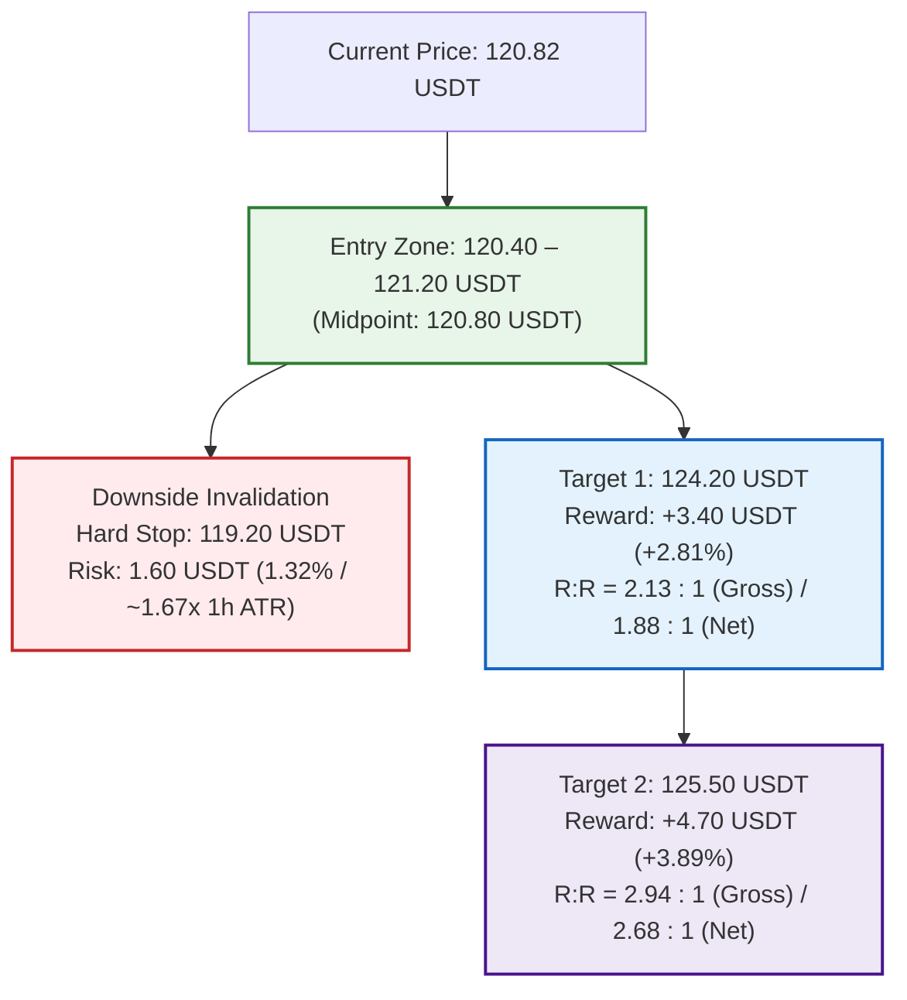

# OKX Perpetual Swap Research Report: SOL-USDT-SWAP

```json
{"forecast": {"instrument": "SOL-USDT-SWAP", "date": "2026-09-27", "bias": "LONG", "confidence": "medium", "entry_low": 120.4, "entry_high": 121.2, "stop": 119.2, "target1": 124.2, "target2": 125.5, "horizon_days": 1, "invalidation": ["1-hour candle close below 119.20 USDT breaking below the 1h EMA50 (119.98 USDT), the 120.00 USDT psychological floor, and the 24-hour swing low (119.76 USDT)", "4-hour candle close below the dynamic 4h EMA20 (119.31 USDT) and structural pivot support at 119.06 USDT", "Derivatives positioning regime breakdown with aggressive short expansion breaking through 119.00 USDT and taker sell dominance (LSR taker < 0.80)", "Macro risk-off cascade triggered by Bitcoin breaking below 83,650 USDT or broader market liquidity shocks"]}}
```

### Executive Summary
* **Directional Bias:** LONG (tactical continuation out of ascending consolidation above 120.00 USDT following dual liquidation sweeps and short-trapping dynamics).
* **Confidence Level:** Medium (unanimous 1D/4H/1H "up" trend alignment, benign funding at 40.69th percentile, and spot-led basis discount; tempered by weekend volume compression).
* **Execution Range:** Entry Zone: 120.40 – 121.20 USDT (Current Market: 120.82 USDT / 1h EMA20 test) | Hard Invalidation Stop: 119.20 USDT.
* **Profit Targets:** Target 1: 124.20 USDT (R:R 2.13 gross / 1.88 net vs midpoint) | Target 2: 125.50 USDT (R:R 2.94 gross / 2.68 net vs midpoint).
* **Top Downside Risk:** Sustained 1-hour breakdown below the 119.76 USDT 24-hour low and 119.20 USDT hard stop (breaking 1h EMA50 at 119.98 USDT and 120.00 psychological support), exposing the 4-hour EMA20 (119.31 USDT) and 119.06 USDT structural pivot floor.

---

## Part 0: Data Acquisition & Pipeline Environment

### Data Provenance & Methodology
* **Source:** OKX public REST market data endpoints and OKX Rubik trading-data endpoints processed via [`scripts/pipeline.py`](file:///home/jetson/vibe-trading-okx-futures/scripts/pipeline.py).
* **Execution Timestamp:** `2026-09-27T00:29:54+00:00` (UTC).
* **Primary Output Files:**
  * Summary metrics: [`out/summary.json`](file:///home/jetson/vibe-trading-okx-futures/out/summary.json)
  * Multi-timeframe OHLCV datasets: [`out/SOL-USDT-SWAP_1d.csv`](file:///home/jetson/vibe-trading-okx-futures/out/SOL-USDT-SWAP_1d.csv) (365 daily bars), [`out/SOL-USDT-SWAP_4h.csv`](file:///home/jetson/vibe-trading-okx-futures/out/SOL-USDT-SWAP_4h.csv) (2,190 4-hour bars), [`out/SOL-USDT-SWAP_1h.csv`](file:///home/jetson/vibe-trading-okx-futures/out/SOL-USDT-SWAP_1h.csv) (1,440 1-hour bars).
  * Derivatives metrics: [`out/funding.csv`](file:///home/jetson/vibe-trading-okx-futures/out/funding.csv) (290 settlement intervals spanning ~96 days), [`out/contract_stats.csv`](file:///home/jetson/vibe-trading-okx-futures/out/contract_stats.csv) (100 hourly snapshots of Open Interest, LSR, taker volume, and liquidations).
  * Graphical artifacts: Copied to and stored in [`reports/img/`](file:///home/jetson/vibe-trading-okx-futures/reports/img/) (`chart_1d.png`, `chart_4h.png`, `chart_1h.png`, `chart_derivatives.png`).

---

## Part 1: Contract & Market Structure

### 1. Facts (Data-Derived)
*Source: `summary.json` → `contract_specs`, `ticker`*

| Specification Field | Raw Value | Metric Interpretation |
| :--- | :--- | :--- |
| **Instrument ID (`instId`)** | `SOL-USDT-SWAP` | Linear perpetual swap margined and settled in USDT |
| **Underlying (`uly`)** | `SOL-USDT` | Solana spot reference index basket |
| **Contract Value (`ctVal`)** | `1` | Each contract represents exactly 1.0 SOL |
| **Contract Value Currency (`ctValCcy`)** | `SOL` | Base currency is Solana |
| **Contract Multiplier (`ctMult`)** | `1` | Linear payout multiplier |
| **Contract Type (`ctType`)** | `linear` | Direct USDT settlement |
| **Maximum Leverage (`lever`)** | `100` | Up to 100x account-level leverage permitted |
| **Tick Size (`tickSz`)** | `0.01` | Minimum price fluctuation is 0.01 USDT |
| **Lot Size (`lotSz`) / Min Size (`minSz`)** | `0.01` | Minimum order size is 0.01 contracts (= 0.01 SOL) |
| **Max Limit Order Size (`maxLmtSz`)** | `100000000` | Maximum limit order size: 100,000,000 contracts |
| **Max Market Order Size (`maxMktSz`)** | `39000` | Maximum single market order: 39,000 contracts (= 39,000 SOL) |
| **Settlement Currency (`settleCcy`)** | `USDT` | Margin, PnL, and funding paid exclusively in USDT |
| **Trading State (`state`)** | `live` | Actively trading (listed 2021-01-22 07:00:00 UTC; `listTime`: `1611298800000`) |
| **Expiration Time (`expTime`)** | `""` (null / empty) | Perpetual instrument with no fixed expiry |
| **Funding Interval (`funding_interval_hours`)** | `8.0` | Settled every 8 hours (00:00, 08:00, 16:00 UTC) |
| **Ticker Last Price (`last`)** | `120.82` | Last trade matched at 120.82 USDT |
| **Top of Book Depth** | Bid: `120.81` (347.42 ct) / Ask: `120.82` (568.10 ct) | Tightest possible 1-tick spread: 0.01 USDT (~0.00828% / 0.83 bps) |
| **24h Volume Base (`volCcy24h`)** | `6016929.7` SOL | 6,016,929.7 SOL traded in trailing 24 hours |
| **24h Volume Contracts (`vol24h`)** | `6016929.7` contracts | 24h Turnover: ~**$726,965,446 USDT** notional (~$727M) |
| **24h High / Low Range** | Low: `119.76` / High: `122.23` | 24h Absolute Range: 2.47 USDT (2.05% consolidation) |
| **Start of Day (SOD) Reference** | UTC 0: `121.33` / UTC 8: `121.82` | Intraday reference anchors |
| **Mark vs Index Price** | Mark: `120.80` / Index: `120.87` | Mark trades at a modest discount of -0.07 USDT (-0.0579%) |
| **Open Interest (`open_interest_latest`)** | `416891948.3808` contracts | Total open interest: ~**$416,891,948 USDT** across OKX SOL contracts |

### 2. Interpretation & Liquidity Analysis
* **Execution Liquidity & Microstructure:** SOL-USDT-SWAP on OKX maintains deep, continuous liquidity. Generating over 6.01 million contracts (~$727 million USDT) in 24-hour volume against an active open interest pool of $416.89 million, top-of-book depth is dense with a minimum 1-tick spread of 0.01 USDT (~0.83 bps). Retail-to-intermediate institutional position sizes (50 to 5,000 SOL, equivalent to $6,000 to $600,000) can be entered and exited instantaneously across market and limit orders with negligible slippage and zero adverse price impact.
* **Cost of Carry Analysis (24-Hour Horizon):**
  * **Trading Fee Model:** Baseline VIP0 fee schedule is 0.050% (5 bps) taker and 0.020% (2 bps) maker. A standard round-trip taker execution costs 0.100% (10 bps).
  * **Funding Rate Baseline:**
    * Latest settled funding rate: **+0.001630%** per 8h (`summary.json` → `funding.latest_pct`).
    * Next predicted funding rate: **+0.001940%** per 8h (`summary.json` → `ticker.funding_rate`).
    * 7-day mean funding rate: **+0.004829%** per 8h (= **+0.014487%** daily).
    * 30-day mean funding rate: **+0.001794%** per 8h (= **+0.005383%** daily, **1.965% APR** annualized).
  * **Long Position Carry Cost:** Long contract holders pay funding fees to short holders during positive funding regimes. Over a 24-hour holding horizon encompassing 3 funding settlements (00:00, 08:00, 16:00 UTC), expected funding drag based on the 7-day mean is **+0.0145%** (~1.45 bps). Paired with round-trip taker fees (0.100%), the total carrying friction for a long position is ~**0.1145%** (~11.5 bps). At the latest funding print of +0.001630% per 8h, 24-hour carry is only ~0.0049% (~0.49 bps), yielding total friction of ~0.1049%. This represents an exceptionally cheap holding environment that exerts virtually no drag on intraday upside trades.
  * **Short Position Carry Yield:** Short contract holders receive positive funding payments. Over 24 hours, short positions earn a modest yield of +0.0145% (7d mean), which subsidizes roughly 14.5% of round-trip taker fees (or produces a net positive yield when executed with maker limit orders).

---

## Part 2: Price Action & Technical Analysis

### Visual Multi-Timeframe Charts


### 1. Facts (Multi-Timeframe Metrics)
*Source: `summary.json` → `timeframes` & OHLCV CSV datasets*

| Indicator / Metric | Daily (1D) | 4-Hour (4H) | 1-Hour (1H) |
| :--- | :--- | :--- | :--- |
| **Last Close Price** | `120.85` USDT | `120.82` USDT | `120.82` USDT |
| **7-Day / 30-Day Return** | +8.76% / +16.10% | +10.99% / +13.15% | +8.94% / +10.80% |
| **EMA 20** | `111.10` USDT | `119.31` USDT | `120.93` USDT |
| **EMA 50** | `101.04` USDT | `115.54` USDT | `119.98` USDT |
| **EMA 200** | `95.12` USDT | `104.68` USDT | `115.23` USDT |
| **Trend Structure Classification** | **UP** (Price > EMA20 > EMA50 > EMA200) | **UP** (Price > EMA20 > EMA50 > EMA200) | **UP** (Price > EMA50 > EMA200; testing EMA20) |
| **RSI 14** | `67.29` (Bullish expansion) | `59.94` (Healthy reset from overbought) | `50.57` (Neutral centerline reset) |
| **MACD Histogram** | `+0.9896` (Expanding positive momentum) | `-0.0252` (Neutral consolidation) | `-0.0950` (Mild consolidation pull) |
| **ATR 14 / ATR %** | 5.00 USDT / `4.14%` | 2.06 USDT / `1.70%` | 0.96 USDT / `0.795%` |
| **30-Day Realized Volatility (Ann.)** | `65.53%` | `54.73%` | `54.86%` |
| **Key Pivot Support Levels** | `119.06`, `116.77`, `97.31`, `95.66` | `120.52`, `119.06`, `117.03`, `116.77` | `119.76`, `116.04`, `115.83`, `115.75` |
| **Key Pivot Resistance Levels** | `143.44`, `144.68`, `144.75`, `146.88` | `122.91`, `125.04`, `125.07`, `125.53` | `122.12`, `122.20`, `122.91` |

### 2. Interpretation & Key Level Validation
* **Unanimous Multi-Timeframe Trend Alignment:**
  * **Macro Context (Daily):** The daily timeframe displays a textbook structural bull trend (`up`). Price (`120.85` USDT) trades far above the 20-day EMA (`111.10`), 50-day EMA (`101.04`), and 200-day EMA (`95.12`). The moving averages are fanned out in perfect bullish order (Price > EMA20 > EMA50 > EMA200). The daily MACD histogram is strongly positive (`+0.9896`), and the daily RSI (`67.29`) demonstrates robust institutional accumulation without entering extreme overbought exhaustion.
  * **Intermediate Context (4-Hour):** The 4-hour trend structure is firmly bullish (`up`). Price rallied out of its multi-week base, surged to a high of 122.91 USDT, and has been consolidating above the upward-sloping 4-hour EMA20 (`119.31`) and EMA50 (`115.54`). The 4-hour RSI has cooled from over 68 down to `59.94`, representing a healthy mid-trend reset, while the MACD histogram is nearly flat (`-0.0252`), signaling consolidation rather than distribution.
  * **Micro Execution Context (1-Hour):** On the 1-hour timeframe, trend structure is classified as `up`. Price (`120.82` USDT) is consolidating directly along the 1-hour EMA20 (`120.93` USDT) and holding cleanly above the ascending 1-hour EMA50 (`119.98` USDT) and EMA200 (`115.23` USDT). The 1-hour RSI has reset cleanly to `50.57`, testing the 50 centerline support.
* **Support Confluence & Structural Floors:**
  * **1-Hour EMA50 & Psychological Base (119.76 – 120.00 USDT):** Over the trailing 24 hours, price twice tested the 120.00 zone—dipping to 119.76 USDT at 09:00 UTC and 119.97 USDT at 20:00 UTC on September 26. In both instances, aggressive buyers absorbed the selling and drove price back above 121.20–121.80 USDT. The 1-hour EMA50 sits directly at `119.98` USDT, aligning with the 119.76 pivot support to form a formidable structural floor.
  * **4-Hour Dynamic EMA20 & Pivot Confluence (119.06 – 119.31 USDT):** Below 119.76 USDT lies the 4-hour EMA20 at `119.31` USDT and the major 4-hour / 1-day shared structural support pivot at `119.06` USDT. This secondary zone acts as the ultimate bull-market defense.
* **Overhead Resistance Targets:**
  * **Immediate Intraday Hurdle (122.12 – 122.23 USDT):** 1-hour pivot resistance at `122.12` and `122.20` USDT, coinciding with the 24-hour high at `122.23` USDT.
  * **Multi-Day Swing High (122.91 USDT):** Tested on September 25/26; a breakout above 122.91 USDT opens clear runway.
  * **4-Hour Major Resistance Band (125.04 – 125.53 USDT):** A dense cluster of 4-hour resistance pivots (`125.04`, `125.07`, `125.53` USDT) representing the primary 24-hour target zone.
* **Volatility Regime & Compression:**
  * 1-Hour ATR% has compressed down to **0.795%** (0.96 USDT), compared to 1.11% yesterday. 4-Hour ATR% is **1.70%** (2.06 USDT), and Daily ATR% is **4.14%** (5.00 USDT).
  * This volatility compression indicates that the market has transitioned from post-breakout expansion into an energy-coiling consolidation phase, creating favorable conditions for a clean directional continuation.

---

## Part 3: Positioning & Derivatives Flow

### Derivatives Market Visual


### 1. Facts (Data-Derived)
*Source: `summary.json` → `funding`, `positioning`, `basis` & `contract_stats.csv`*

| Metrics Category | Recorded Value | Context & Benchmark Comparison |
| :--- | :--- | :--- |
| **Latest Funding Rate** | `+0.001630%` per 8h | Low positive carry (0.16 bps per 8h); sits in the **40.69th percentile** of 290 historical settlements |
| **Next Predicted Funding** | `+0.001940%` per 8h | Subdued rate (`summary.json` → `ticker.funding_rate`) |
| **7-Day Mean Funding** | `+0.004829%` per 8h | +0.014487% daily (+5.29% APR) |
| **30-Day Mean Funding** | `+0.001794%` per 8h | +0.005383% daily; **+1.965% APR** annualized |
| **30-Day Positive Funding Share** | `61.11%` | 177 of 290 intervals positive; historically balanced carry |
| **Open Interest Latest** | `416,891,948.38` ct | Total value: ~**$416.89 Million USDT** across OKX SOL contracts |
| **OI 24-Hour Change** | `+0.7526%` (+3.11M ct) | Open interest expanded slightly over trailing 24 hours |
| **Price Change Same Window** | `-0.5433%` | Moderate consolidation pullback during OI growth |
| **Positioning Regime** | `new shorts (price down, OI up)` | Fading participants opening short exposure into support |
| **Long/Short Account Ratio (`lsr_account_latest`)** | `1.45` | 59.2% accounts long vs 40.8% short (moderate retail long bias) |
| **Taker Buy/Sell Ratio (`lsr_taker_latest`)** | `1.0091` | Taker flow near parity: $13.87M taker buy vs $13.74M taker sell |
| **24h Liquidations Sum** | Long: `1,860.88` SOL / Short: `3,238.23` SOL | Short liquidations exceeded longs by **1.74 to 1** ($391K vs $225K) |
| **Short Liquidation Surge (Sept 26 15:00 UTC)** | `1,874.54` SOL short liquidations | **57.9%** of 24h short liquidations occurred in a single breakout hour |
| **Long Flush Event (Sept 26 20:00 UTC)** | `1,470.61` SOL long liquidations | **79.0%** of 24h long liquidations concentrated in a single pullback hour |
| **Short Trap Sequence (Sept 26 21:00–22:00 UTC)**| `1,355.28` SOL short liquidations | Trapped shorts liquidated immediately following the long flush |
| **Mark-Index Basis** | `-0.0579%` (-5.79 bps) | Mark price trades 0.07 USDT below spot basket index (120.80 vs 120.87) |
| **Perp-Spot Basis (Latest / 30d Mean)** | `-0.0579%` / `-0.0519%` | Perpetual swap trades at a persistent ~5 to 6 bps discount to spot |

### 2. Interpretation & Derivatives Flow
* **The "New Shorts" Regime Dynamics:**
  * The automated classification identifies `new shorts (price down, OI up)` over the 24-hour window, as price drifted down -0.54% while open interest rose +0.75% (+3.11 million contracts).
  * This indicates that counter-trend sellers have been actively attempting to fade the rally near 121.50–122.00 USDT, adding short exposure into the consolidation.
  * When new shorts build positions directly above a tested multi-timeframe support shelf (119.76–120.00 USDT) while higher-timeframe trends remain emphatically bullish, these short positions become high-conviction liquidity fuel for an upside continuation.
* **Microstructural Liquidation Flush & Short Trap Sequence:**
  * Examination of hourly records in [`out/contract_stats.csv`](file:///home/jetson/vibe-trading-okx-futures/out/contract_stats.csv) illustrates a classic dual-sided liquidity sweep on September 26:
    1. **The Initial Short Squeeze (15:00 UTC):** As price pushed toward 122.12 USDT, **1,874.54 SOL of short positions were liquidated**, driving price to local highs.
    2. **The Long Flush (20:00 UTC):** Five hours later, price dipped sharply to 119.97 USDT, triggering **1,470.61 SOL in forced long liquidations** (accounting for 79.0% of all 24-hour long liquidations).
    3. **Immediate Short Trap Reversal (21:00–22:00 UTC):** Rather than cascading lower, the 119.97 dip was aggressively absorbed by passive buyers. As price rebounded to 121.64 USDT, aggressive breakout shorts were immediately trapped and liquidated: **1,070.11 SOL liquidated at 21:00 UTC** and **285.17 SOL liquidated at 22:00 UTC** (totaling 1,355.28 SOL in two hours).
  * Across the entire 24-hour period, short liquidations ($391,243) outnumbered long liquidations ($224,831) by **1.74 to 1**, proving that despite the modest consolidation, short sellers have borne the brunt of structural pain.
* **Benign Funding & Spot-Led Basis:**
  * Funding printed at **+0.001630%** per 8h, placing it at the **40.69th percentile** of the contract's entire 96-day history. This confirms an absence of speculative leverage froth.
  * Meanwhile, the perpetual swap trades at a `-5.79 bps` discount to the spot index basket (`perp_spot_basis_latest_pct`: `-0.0579%`), consistent with its 30-day average discount of `-0.0519%`.
  * Spot markets are leading derivatives. Offshore perpetuals are not overextended, leaving substantial runway for upside expansion as spot ETF and on-chain buying continues.

---

## Part 4: Narrative, Catalysts & Cross-Market Context

### 1. Underlying Asset & Ecosystem Developments
*Sources: Solana Foundation announcements, SEC filings, GitHub releases, developer forums*

* **Alpenglow Consensus Protocol on Public Testnet:**
  * Solana core developers have deployed **Alpenglow** to the public testnet in late September 2026. Alpenglow replaces TowerBFT with the new "Votor" consensus engine, engineered to slash transaction finality from ~12.8 seconds down to an unprecedented **150 milliseconds**.
  * With testnet validation active and mainnet rollout planning underway for late 2026, the prospect of sub-second settlement is fueling strong developer and institutional sentiment.
* **Firedancer Mainnet Adoption:**
  * Following its landmark mainnet launch, Jump Crypto's independent C++ validator client **Firedancer** has reached approximately **11.64% of total staked SOL** in active operation as of late summer/September 2026. Continuous version updates (v1.1.2) have strengthened client diversity, mitigating single-client outage risks and satisfying institutional risk mandates.
* **Transaction V1 Activation:**
  * On September 9, 2026, Solana activated "Transaction V1," which increased the maximum serialized transaction size from 1,232 bytes to 4,096 bytes. This architectural upgrade enables complex zero-knowledge (ZK) proofs, larger state proofs, and data-dense multi-signature transactions natively on Layer 1.
* **Institutional Spot ETF Inflow Streak:**
  * Regulated Solana-linked investment vehicles have demonstrated remarkable institutional adoption, recording a **12-week consecutive net inflow streak** through late September 2026, totaling over **$1.4 billion** in cumulative net inflows.
  * The Bitwise Solana Staking ETF (BSOL) has spearheaded this momentum, reporting over **$110 million in weekly net inflows** during September 21–25, 2026, elevating fund AUM past $1.2 billion. Unlike spot Bitcoin ETFs, Solana funds offer an embedded ~6% staking yield advantage, attracting yield-seeking institutional capital.
* **SEC Staking Clarity Guidance (Sept 25, 2026):**
  * On September 25, 2026, SEC staff released an updated FAQ addressing staking receipt tokens and liquid staking protocols, providing structural clarity that standard proof-of-stake participation does not inherently create an investment contract. This regulatory thaw significantly lowers compliance friction for institutional staking products.
* **Solana Breakpoint 2026 Anchor Narrative:**
  * Excitement is mounting for **Solana Breakpoint 2026**, scheduled for **November 15–17, 2026**, at Olympia London in the UK. The event is centered on the "Token Supercycle"—spotlighting stablecoin payment rails, real-world asset (RWA) tokenization, and decentralized physical infrastructure (DePIN).

### 2. Macro Backdrop & Cross-Market Beta
* **Total Crypto Market Capitalization:** Holds firmly above **$3.0 Trillion**, confirming a constructive macro liquidity backdrop.
* **Bitcoin & Ethereum Market Anchors:**
  * Bitcoin ([BTC-USDT-SWAP](file:///home/jetson/vibe-trading-okx-futures/reports/BTC-USDT-SWAP_OKX_Swap_Report_2026-09-27.md)) trades solidly at **84,283.5 USDT**, buoyed by record weekly spot ETF inflows of $2.4B.
  * Ethereum ([ETH-USDT-SWAP](file:///home/jetson/vibe-trading-okx-futures/reports/ETH-USDT-SWAP_OKX_Swap_Report_2026-09-27.md)) trades firmly at **2,689.80 USDT**, supported by six consecutive days of ETF inflows and staking regulatory tailwinds.
  * With major market leaders exhibiting synchronized bullish structures, high-beta Layer 1 assets like Solana enjoy a supportive market beta environment.
* **Macro Resilience to Fed Policy:**
  * Despite the Federal Reserve raising benchmark rates by 25 bps to **3.75%–4.00%** on September 16, 2026, crypto assets have shown resilience against elevated sovereign bond yields, acting as high-growth technological assets and monetary alternatives.

### 3. Catalysts & Risk Matrix

| Event / Catalyst | Horizon / Date | Nature | Anticipated Market Impact |
| :--- | :--- | :--- | :--- |
| **Weekly Open & ETF Inflow Resumption** | Sept 28, 2026 (Mon) | Bullish Catalyst | Re-opening of U.S. markets expected to extend the 12-week ETF inflow streak into BSOL and peers. |
| **Short Squeeze above 122.23 USDT** | Next 24 Hours | Bullish Catalyst | Breakout above the 24h high traps the `new shorts` accumulated over the weekend, targeting 124.20–125.50 USDT. |
| **Alpenglow Testnet Benchmarking** | Late Sept / Oct 2026 | Bullish Catalyst | Publication of sub-200ms latency metrics validating next-generation throughput. |
| **Break of 119.20 USDT Support** | Active / Intraday | Bearish Risk | Hourly close below 119.20 breaks the 1h EMA50 and 120.00 shelf, triggering mean reversion toward 4h EMA20 (119.31). |
| **Macro Risk-Off / BTC Breakdown** | Active / Ongoing | Bearish Risk | Bitcoin breaking below 83,650 USDT would drag altcoin liquidity and abort speculative long setups. |

---

## Part 5: Synthesis & Trade Plan

### Core Thesis
Solana (SOL-USDT-SWAP) remains in an unambiguous multi-timeframe bull trend, maintaining unanimous `up` classifications across the 1D, 4H, and 1H charts with price holding cleanly above the dynamic 1-hour EMA50 (119.98 USDT) and psychological 120.00 support base. Intraday price action has completed a classic dual-sided liquidity sweep—purging 1,470 SOL in weak longs down to 119.97 USDT before immediately absorbing the dip and liquidating 1,355 SOL in trapped shorts. With funding rates sitting at an uncrowded 40.69th percentile (+0.00163% per 8h), perps trading at a 5.79 bps discount to spot, and 1-hour volatility compressed to 0.795% ATR, the contract is coiled for an immediate continuation toward the 124.20 – 125.50 USDT resistance cluster over the next 24 hours.

### Directional Bias & Conviction
* **Bias:** **LONG**
* **Confidence Level:** **Medium**
* **Primary Supporting Drivers:**
  1. *Unanimous Multi-Timeframe Alignment:* 1D, 4H, and 1H timeframes are simultaneously classified as `up`. Price trades above daily moving averages (EMA20 at 111.10, EMA50 at 101.04) and 4-hour moving averages (EMA20 at 119.31, EMA50 at 115.54).
  2. *Support Defense & Trapped Shorts:* Repeated tests of the 119.76–120.00 support shelf were aggressively absorbed, with short liquidations ($391K) outnumbering long liquidations ($225K) by 1.74 to 1. Recent positioning shows `new shorts` entering into support, providing direct squeeze fuel.
  3. *Uncrowded Carry & Spot-Led Basis:* Funding is benign at +0.00163% per 8h (40.69th percentile), and perps trade at a -5.79 bps discount to the spot index basket, confirming zero speculative froth.
  4. *Volatility Compression Coiling:* 1-hour ATR% has compressed to 0.795% (0.96 USDT), indicating an imminent directional breakout.

---

### Detailed Trade Execution Plan



#### 1. Execution Parameters
* **Instrument:** `SOL-USDT-SWAP` (OKX Linear Perpetual Swap)
* **Order Execution:** Scale-in limit bids within the entry zone or immediate market execution at current price.
* **Entry Zone:** **120.40 – 121.20 USDT** (Midpoint Reference: **120.80 USDT**).
  * Encompasses the current 1-hour consolidation range (120.70–121.10 USDT), allowing limit order accumulation above the dynamic 1-hour EMA50 (119.98 USDT).
* **Hard Invalidation Stop:** **119.20 USDT**.
  * Positioned 0.56 USDT below the 24-hour low (`119.76` USDT), 0.77 USDT below the Sept 26 20:00 UTC flush wick (`119.97` USDT), 0.78 USDT below the 1-hour EMA50 (`119.98` USDT), and 0.80 USDT below the critical $120.00 psychological threshold.
  * Stop Distance from Midpoint: **1.60 USDT** (-1.324% / ~1.67x 1-hour ATR, ~0.78x 4-hour ATR).
* **Profit Target 1 (T1):** **124.20 USDT**.
  * Positioned above the 122.91 USDT multi-day swing high, capturing the initial short squeeze expansion toward the lower boundary of the 4-hour resistance band (`summary.json` → `timeframes.4h.levels.resistance`: 125.04–125.53 USDT).
  * Target 1 Gain from Midpoint: **+3.40 USDT** (+2.815% / ~1.65x 4-hour ATR, ~0.68x 1-day ATR).
  * **Gross Reward-to-Risk (T1):** **2.13 : 1**.
  * **Net Reward-to-Risk (T1):** **1.88 : 1** (net of round-trip taker fees, funding drag, and slippage).
* **Profit Target 2 (T2):** **125.50 USDT**.
  * Aligned with the upper limit of the dense 4-hour pivot resistance cluster at `125.53` USDT (`125.04`, `125.07`, `125.53`).
  * Target 2 Gain from Midpoint: **+4.70 USDT** (+3.891% / ~2.28x 4-hour ATR, ~0.94x 1-day ATR).
  * **Gross Reward-to-Risk (T2):** **2.94 : 1**.
  * **Net Reward-to-Risk (T2):** **2.68 : 1** (net of all friction).

#### 2. Position Sizing & Margin Safety
* **Risk Allocation:** Risk strictly **0.5% to 1.0%** of total portfolio equity at the 119.20 USDT hard stop.
  * *Sizing Calculation ($100,000 Portfolio, 1.0% Risk = $1,000 max loss):*
    * Stop distance: 1.60 USDT / 120.80 USDT = 1.3245%.
    * Position Notional Size: $1,000 / 0.013245 = **$75,500 USDT** (~625 SOL / 625 contracts).
    * Effective Account Leverage: 0.755x notional leverage on equity.
* **Leverage Recommendation:** **5x to 10x isolated or cross leverage** (contract maximum: 100x).
  * At 10x isolated leverage, maintenance margin requirement is ~0.5%, placing the estimated liquidation price at ~**109.50 USDT** (~9.4% below entry). This guarantees that liquidation is located more than 9.70 USDT below the 119.20 USDT hard stop, completely eliminating liquidation risk prior to stop execution.

#### 3. Carry Drag & Fee Viability Check
* **Holding Horizon:** 24 hours (intraday daily trade; covering 3 funding intervals: 08:00, 16:00, 00:00 UTC).
* **Expected Funding Cost:** 3 intervals × 0.004829% (7-day mean) = **+0.01449%** (~1.45 bps).
* **Execution Fees:** VIP0 taker round-trip fee = **0.1000%** (10 bps).
* **Conservative Slippage Buffer:** 0.010% per side = **0.0200%** (2 bps).
* **Total Estimated Friction (Fees + Funding + Slippage):** ~**0.1345%** (~0.1625 USDT on 120.80 USDT).
* **Net Profit Viability Check:**
  * Target 1 Gross Gain: +2.815% (+3.400 USDT).
  * Target 1 Net Gain: +2.680% (+3.238 USDT).
  * Net Stop Loss: -1.459% (-1.763 USDT).
  * **Net Reward-to-Risk:** **1.84 R net** vs 1.0 R risk (with slippage) | **1.88 R net** (pure fees + funding: 0.1145% friction → Net Gain +3.262 USDT / Net Loss -1.738 USDT).
  * **Conclusion:** The setup comfortably satisfies the protocol requirement that fees plus funding leave Target 1 at least 1.5× the stop distance.

---

## Invalidation Checklist (What Breaks the Thesis)
Close the long position or stand aside immediately if any of the following triggers occur:
1. [ ] **Confluence Support Breakdown:** A 1-hour candle closes below **119.20 USDT**, breaking the dynamic 1-hour EMA50 (119.98 USDT), the 120.00 USDT psychological floor, and the 24-hour swing low (119.76 USDT).
2. [ ] **Intermediate Trend Termination:** A 4-hour candle closes below the 4-hour EMA20 (**119.31 USDT**) and structural pivot support at **119.06 USDT**, signaling a deeper mean-reversion drop toward the 4-hour EMA50 (115.54 USDT).
3. [ ] **Derivatives Aggression Flip:** Open interest surges sharply while price breaks below 119.00 USDT, accompanied by aggressive taker selling (`lsr_taker` < 0.80) and funding flipping deeply negative, confirming a structural breakdown.
4. [ ] **Macro Risk Cascade:** Bitcoin breaks decisively below **83,650 USDT** (its September 26 liquidation flush base), triggering broad digital asset risk-off selling and altcoin liquidity withdrawal.

---

## Confidence & Limitations
* **OKX Rubik Currency Aggregation:** Derivatives metrics from OKX Rubik endpoints (Open Interest, Long/Short Account Ratio, Taker Volume) are aggregated per base currency (`SOL`) across all OKX derivative products (including coin-margined contracts and dated futures), rather than solely isolating `SOL-USDT-SWAP`.
* **Public Liquidation Sample Scope:** Liquidation metrics cover the trailing ~100 filled liquidation events provided via OKX's public endpoint, representing a representative sample of forced orders rather than an exhaustive tally of all platform-wide margin liquidations.
* **Weekend Volume Dynamics:** The 24-hour turnover of ~$727M reflects weekend trading conditions, which typically exhibit lower liquidity than midweek institutional volume. Intraday volatility expansion is anticipated as global markets approach the Monday weekly open.
