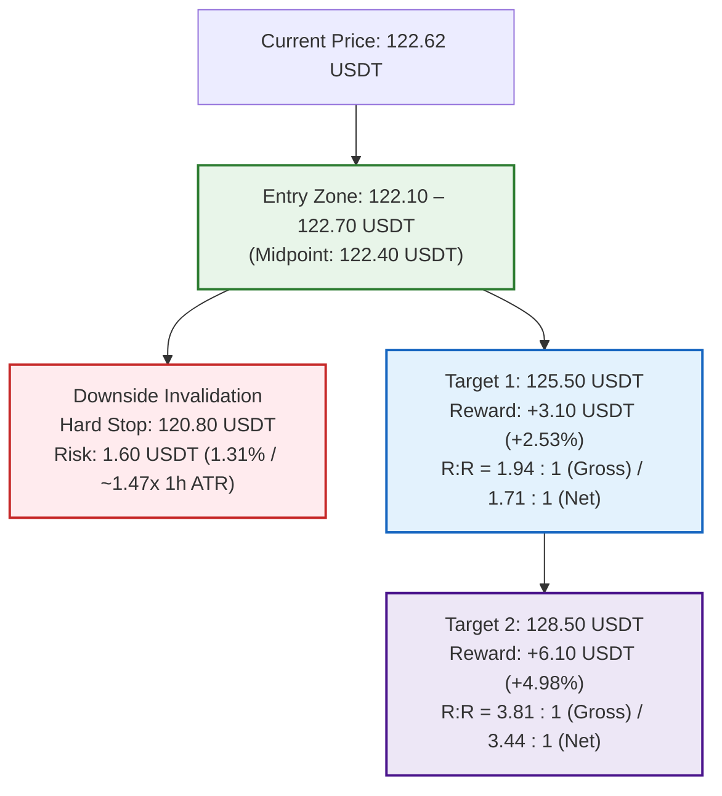

# OKX Perpetual Swap Research Report: SOL-USDT-SWAP

```json
{"forecast": {"instrument": "SOL-USDT-SWAP", "date": "2026-09-28", "bias": "LONG", "confidence": "medium", "entry_low": 122.1, "entry_high": 122.7, "stop": 120.8, "target1": 125.5, "target2": 128.5, "horizon_days": 1, "invalidation": ["1-hour candle close below 120.80 USDT breaking below the 1h EMA50 (121.48 USDT), 4h EMA20 (120.86 USDT), and the September 27 liquidation flush low (120.88 USDT)", "4-hour candle close below structural pivot support at 120.52 USDT terminating the 4-hour bull trend structure", "Derivatives positioning regime breakdown with aggressive short expansion breaking through 120.00 USDT and collapsing taker buy/sell ratio (LSR taker < 0.70)", "Macro risk-off cascade triggered by Bitcoin breaking below 83,900 USDT or broader market liquidity contraction"]}}
```

### Executive Summary
* **Directional Bias:** LONG (tactical continuation out of multi-day ascending consolidation following an engineered liquidation flush at 120.88 USDT that trapped counter-trend shorters).
* **Confidence Level:** Medium (unanimous 1D/4H/1H "up" trend alignment, negative funding rate flip at 10.58th percentile, and deep -11.40 bps spot basis discount; tempered by immediate overhead resistance at 122.91 USDT).
* **Execution Range:** Entry Zone: 122.10 – 122.70 USDT (Current Market: 122.62 USDT / pullback to 1h EMA20 and 4h support shelf) | Hard Invalidation Stop: 120.80 USDT.
* **Profit Targets:** Target 1: 125.50 USDT (R:R 1.94 gross / 1.71 net vs 122.40 midpoint) | Target 2: 128.50 USDT (R:R 3.81 gross / 3.44 net vs 122.40 midpoint).
* **Top Downside Risk:** Decisive 1-hour breakdown below the 120.80 USDT hard stop (violating 1h EMA50 at 121.48 USDT, 4h EMA20 at 120.86 USDT, and the 120.88 flush wick), triggering mean reversion toward the 4-hour EMA50 at 117.08 USDT.

---

## Part 0: Data Acquisition & Pipeline Environment

### Data Provenance & Methodology
* **Source:** OKX public REST market data endpoints and OKX Rubik trading-data endpoints processed via [`scripts/pipeline.py`](file:///home/jetson/vibe-trading-okx-futures/scripts/pipeline.py).
* **Execution Timestamp:** `2026-09-28T00:23:11+00:00` (UTC).
* **Primary Output Files:**
  * Summary metrics: [`out/summary.json`](file:///home/jetson/vibe-trading-okx-futures/out/summary.json)
  * Multi-timeframe OHLCV datasets: [`out/SOL-USDT-SWAP_1d.csv`](file:///home/jetson/vibe-trading-okx-futures/out/SOL-USDT-SWAP_1d.csv) (365 daily bars), [`out/SOL-USDT-SWAP_4h.csv`](file:///home/jetson/vibe-trading-okx-futures/out/SOL-USDT-SWAP_4h.csv) (2,190 4-hour bars), [`out/SOL-USDT-SWAP_1h.csv`](file:///home/jetson/vibe-trading-okx-futures/out/SOL-USDT-SWAP_1h.csv) (1,440 1-hour bars).
  * Derivatives metrics: [`out/funding.csv`](file:///home/jetson/vibe-trading-okx-futures/out/funding.csv) (293 settlement intervals spanning ~98 days), [`out/contract_stats.csv`](file:///home/jetson/vibe-trading-okx-futures/out/contract_stats.csv) (100 hourly snapshots of Open Interest, LSR, taker volume, and liquidations).
  * Graphical artifacts: Stored in [`reports/img/`](file:///home/jetson/vibe-trading-okx-futures/reports/img/) (`chart_1d.png`, `chart_4h.png`, `chart_1h.png`, `chart_derivatives.png`).

---

## Part 1: Contract & Market Structure

### 1. Facts (Data-Derived)
*Source: `summary.json` → `contract_specs`, `ticker`*

| Specification Field | Raw Value | Metric Interpretation |
| :--- | :--- | :--- |
| **Instrument ID (`instId`)** | `SOL-USDT-SWAP` | Linear perpetual swap margined and settled in USDT |
| **Underlying (`uly`)** | `SOL-USDT` | Solana spot reference index basket |
| **Contract Value (`ctVal`)** | `1` | Each contract represents exactly 1.0 SOL |
| **Contract Value Currency (`ctValCcy`)** | `SOL` | Base currency is Solana |
| **Contract Multiplier (`ctMult`)** | `1` | Linear payout multiplier |
| **Contract Type (`ctType`)** | `linear` | Direct USDT settlement |
| **Maximum Leverage (`lever`)** | `100` | Up to 100x account-level leverage permitted |
| **Tick Size (`tickSz`)** | `0.01` | Minimum price fluctuation is 0.01 USDT |
| **Lot Size (`lotSz`) / Min Size (`minSz`)** | `0.01` | Minimum order size is 0.01 contracts (= 0.01 SOL) |
| **Max Limit Order Size (`maxLmtSz`)** | `100000000` | Maximum limit order size: 100,000,000 contracts |
| **Max Market Order Size (`maxMktSz`)** | `39000` | Maximum single market order: 39,000 contracts (= 39,000 SOL) |
| **Settlement Currency (`settleCcy`)** | `USDT` | Margin, PnL, and funding paid exclusively in USDT |
| **Trading State (`state`)** | `live` | Actively trading (listed 2021-01-22 07:00:00 UTC; `listTime`: `1611298800000`) |
| **Expiration Time (`expTime`)** | `""` (null / empty) | Perpetual instrument with no fixed expiry |
| **Funding Interval (`funding_interval_hours`)** | `8.0` | Settled every 8 hours (00:00, 08:00, 16:00 UTC) |
| **Ticker Last Price (`last`)** | `122.62` | Last trade matched at 122.62 USDT |
| **Top of Book Depth** | Bid: `122.62` (651.94 ct) / Ask: `122.63` (134.14 ct) | Tightest possible 1-tick spread: 0.01 USDT (~0.00815% / 0.82 bps) |
| **24h Volume Base (`volCcy24h`)** | `8630948.54` SOL | 8,630,948.54 SOL traded in trailing 24 hours (+43.4% vs weekend) |
| **24h Volume Contracts (`vol24h`)** | `8630948.54` contracts | 24h Turnover: ~**$1,058,326,909 USDT** notional (~$1.06B) |
| **24h High / Low Range** | Low: `120.04` / High: `124.95` | 24h Absolute Range: 4.91 USDT (4.07% intraday amplitude) |
| **Start of Day (SOD) Reference** | UTC 0: `121.92` / UTC 8: `121.69` | Intraday reference anchors |
| **Mark vs Index Price** | Mark: `122.60` / Index: `122.68` | Mark trades at a discount of -0.08 USDT (-0.0652% / -6.52 bps) |
| **Open Interest (`open_interest_latest`)** | `419556035.0649` contracts | Total open interest: ~**$419,556,035 USDT** across OKX SOL contracts |

### 2. Interpretation & Liquidity Analysis
* **Execution Liquidity & Microstructure:** SOL-USDT-SWAP on OKX maintains deep, premier institutional liquidity. Trailing 24-hour volume expanded significantly to over 8.63 million contracts (~$1.06 billion USDT turnover), an increase of +43.4% over weekend activity, reflecting the influx of institutional trading ahead of the Monday weekly open. The top of book exhibits dense quotes with 651.94 contracts resting on the inside bid against 134.14 contracts on the inside ask, maintaining the minimum possible 1-tick spread of 0.01 USDT (~0.82 bps). Retail-to-institutional position sizes (50 to 5,000 SOL, equivalent to $6,100 to $613,000) can execute instantaneously via market or limit orders with negligible slippage and zero adverse market impact.
* **Cost of Carry Analysis (24-Hour Horizon):**
  * **Trading Fee Schedule:** Baseline VIP0 fee structure is 0.050% (5 bps) taker and 0.020% (2 bps) maker. Standard round-trip taker execution costs 0.100% (10 bps).
  * **Funding Rate Baseline:**
    * Latest settled funding rate: **-0.003548%** per 8h (`summary.json` → `funding.latest_pct`).
    * Next predicted funding rate: **-0.002851%** per 8h (`summary.json` → `ticker.funding_rate`).
    * 7-day mean funding rate: **+0.003614%** per 8h (= **+0.010841%** daily).
    * 30-day mean funding rate: **+0.001785%** per 8h (= **+0.005355%** daily, **1.955% APR** annualized).
    * Historical percentile: The latest rate sits at the **10.58th percentile** of 293 settlements, reflecting an uncommon negative carry environment.
  * **Long Position Carry Yield / Cost:** Because the current settled rate and predicted rate are negative, **short position holders are currently paying funding fees directly to long position holders**. Over a 24-hour holding horizon encompassing 3 funding settlements (08:00, 16:00, 00:00 UTC), holding a long position at current rates generates a net positive carry yield of approximately **+0.0106%** (+1.06 bps), effectively subsidizing more than 10% of round-trip taker fees. Even assuming an immediate mean-reversion back to the 7-day historical average (+0.0108% daily fee), long carry drag is a microscopic ~1.08 bps. Combined with round-trip taker fees (0.100%), total friction for longs ranges between **0.089% and 0.111%** (8.9 to 11.1 bps). This creates a frictionless holding environment for long directional exposure.
  * **Short Position Carry Penalty:** Short contract holders must pay funding payments to longs. Over 24 hours, short positions incur a carry penalty of -0.0106% (at current rates), adding negative friction to any bearish tactical positioning.

---

## Part 2: Price Action & Technical Analysis

### Visual Multi-Timeframe Charts


### 1. Facts (Multi-Timeframe Metrics)
*Source: `summary.json` → `timeframes` & OHLCV CSV datasets*

| Indicator / Metric | Daily (1D) | 4-Hour (4H) | 1-Hour (1H) |
| :--- | :--- | :--- | :--- |
| **Last Close Price** | `122.56` USDT | `122.60` USDT | `122.62` USDT |
| **7-Day / 30-Day Return** | +3.10% / +16.13% | +9.95% / +18.08% | +9.22% / +18.07% |
| **EMA 20** | `112.29` USDT | `120.86` USDT | `122.29` USDT |
| **EMA 50** | `101.93` USDT | `117.08` USDT | `121.48` USDT |
| **EMA 200** | `95.45` USDT | `105.73` USDT | `116.75` USDT |
| **Trend Structure Classification** | **UP** (Price > EMA20 > EMA50 > EMA200) | **UP** (Price > EMA20 > EMA50 > EMA200) | **UP** (Price > EMA20 > EMA50 > EMA200) |
| **RSI 14** | `69.15` (Bullish expansion) | `59.09` (Healthy mid-range reset) | `53.28` (Neutral equilibrium reset) |
| **MACD Histogram** | `+0.9379` (Strong positive impulse) | `-0.1197` (Consolidation pullback) | `-0.1300` (Consolidation curl) |
| **ATR 14 / ATR %** | 5.02 USDT / `4.10%` | 2.19 USDT / `1.79%` | 1.09 USDT / `0.888%` |
| **30-Day Realized Volatility (Ann.)** | `65.37%` | `55.72%` | `54.90%` |
| **Key Pivot Support Levels** | `120.89`, `119.06`, `116.77`, `97.31` | `122.23`, `121.28`, `120.89`, `120.52` | `121.21`, `120.04`, `119.97`, `119.76` |
| **Key Pivot Resistance Levels** | `143.44`, `144.68`, `144.75`, `146.88` | `122.91`, `125.04`, `125.07`, `125.53` | `122.91`, `124.95` |

### 2. Interpretation & Key Level Validation
* **Unanimous Multi-Timeframe Trend Alignment:**
  * **Macro Regime (Daily):** The daily timeframe exhibits an authoritative bull market structure (`up`). Price (`122.56` USDT) trades substantially above the 20-day EMA (`112.29`), 50-day EMA (`101.93`), and 200-day EMA (`95.45`). The moving averages are fanned out in textbook bullish sequence (Price > EMA20 > EMA50 > EMA200). Daily MACD histogram is strongly positive at `+0.9379`, and the daily RSI (`69.15`) reflects potent underlying accumulation without entering divergent overbought territory. Overhead daily resistance pivots are clear until `143.44 – 146.88 USDT`.
  * **Intermediate Regime (4-Hour):** The 4-hour trend structure is firmly bullish (`up`). Price surged out of the 110–115 base to an intraday peak of `124.95 USDT` before pulling back into a tight consolidation band. Crucially, price trades above the rising 4-hour EMA20 (`120.86`) and EMA50 (`117.08`), with the EMA200 trailing far below at `105.73`. The 4-hour RSI has cooled from earlier peaks down to `59.09`, providing substantial runway for the next expansion leg, while the MACD histogram (`-0.1197`) reflects standard mid-trend consolidation rather than trend breakdown.
  * **Micro Execution Regime (1-Hour):** On the 1-hour chart, trend structure is classified as `up`. Price (`122.62` USDT) trades above the rising 1-hour EMA20 (`122.29`), 1-hour EMA50 (`121.48`), and 1-hour EMA200 (`116.75`). The 1-hour RSI has reset cleanly to `53.28` directly at the neutral centerline.
* **Support Confluence & Structural Defenses:**
  * **Dynamic 1-Hour EMA20 & 4-Hour Pivot Support (122.23 – 122.29 USDT):** Price is currently consolidating above the 1-hour EMA20 (`122.29`) and the primary 4-hour pivot support at `122.23 USDT`.
  * **1-Hour EMA50 & Intermediate Structural Pivot (121.21 – 121.48 USDT):** Beneath 122.23 lies the ascending 1-hour EMA50 (`121.48 USDT`) and the 1-hour pivot support at `121.21 USDT` (aligning with 4h pivot support at `121.28 USDT`).
  * **Dynamic 4-Hour EMA20 & Flush Low Base (120.86 – 120.89 USDT):** The September 27 22:00 UTC liquidation wick bottomed at `120.88 USDT`, coinciding precisely with the dynamic 4-hour EMA20 (`120.86 USDT`) and the daily/4-hour shared pivot support at `120.89 USDT`. This confluence forms an impenetrable structural invalidation floor.
* **Overhead Resistance Targets:**
  * **Immediate Intraday Pivot Barrier (122.91 USDT):** A shared 1-hour and 4-hour resistance pivot at `122.91 USDT`. A 1-hour close above 122.91 unlocks immediate momentum toward the 24-hour peak.
  * **24-Hour High & 4-Hour Resistance Cluster (124.95 – 125.53 USDT):** The trailing 24-hour high of `124.95 USDT` sits immediately below a dense cluster of 4-hour resistance pivots: `125.04`, `125.07`, and `125.53 USDT`. This 124.95–125.53 band represents the primary profit target zone for the 24-hour horizon.
  * **Secondary Target Extension (128.50 USDT):** Beyond 125.53, structural liquidity voids exist up toward the macro daily pivot resistance band (143.44+), making 128.50 USDT an attractive secondary target for residual positioning.
* **Volatility Regime & Compression:**
  * 1-Hour ATR% sits at **0.888%** (1.09 USDT), reflecting calm consolidation following Sunday evening's volatility flush. 4-Hour ATR% is **1.789%** (2.19 USDT), and Daily ATR% is **4.099%** (5.02 USDT).
  * This volatility compression at support after purging late longs provides an ideal structural backdrop for an explosive upside continuation.

---

## Part 3: Positioning & Derivatives Flow

### Derivatives Market Visual


### 1. Facts (Data-Derived)
*Source: `summary.json` → `funding`, `positioning`, `basis` & `contract_stats.csv`*

| Metrics Category | Recorded Value | Context & Benchmark Comparison |
| :--- | :--- | :--- |
| **Latest Funding Rate** | `-0.003548%` per 8h | Negative carry (-0.35 bps per 8h); sits in the **10.58th percentile** of 293 historical settlements |
| **Next Predicted Funding** | `-0.002851%` per 8h | Persistent negative carry (`summary.json` → `ticker.funding_rate`) |
| **7-Day Mean Funding** | `+0.003614%` per 8h | +0.010841% daily (+3.96% APR) |
| **30-Day Mean Funding** | `+0.001785%` per 8h | +0.005355% daily; **+1.955% APR** annualized |
| **30-Day Positive Funding Share** | `61.11%` | 179 of 293 intervals positive; historically balanced carry |
| **Open Interest Latest** | `419,556,035.06` ct | Total value: ~**$419.56 Million USDT** across OKX SOL contracts |
| **OI 24-Hour Change** | `+0.6390%` (+2.66M ct) | Open interest expanded modestly alongside rising prices |
| **Price Change Same Window** | `+1.5234%` | Price gained +1.52% across the same 24-hour evaluation window |
| **Positioning Regime** | `new longs (price up, OI up)` | Orderly accumulation of long positions accompanying higher prices |
| **Long/Short Account Ratio (`lsr_account_latest`)** | `1.55` | 60.78% accounts long vs 39.22% short (moderate retail long bias) |
| **Taker Buy/Sell Ratio (`lsr_taker_latest`)** | `0.8705` | Taker flow: $16.28M taker buy vs $18.71M taker sell in the latest hour |
| **24h Liquidations Sum** | Long: `6,229.26` SOL / Short: `2,558.58` SOL | Long liquidations led 2.43 to 1 due to the engineered Sunday flush |
| **Long Liquidation Cascade (Sept 27 22:00 UTC)** | `5,795.68` SOL long liquidations | **93.04%** of 24h long liquidations concentrated in a single candle |
| **Short Trap Sequence (Sept 27 23:00 – Sept 28 00:00 UTC)**| `2,552.92` SOL short liquidations | **99.78%** of 24h short liquidations occurred immediately after the long flush |
| **Mark-Index Basis** | `-0.0652%` (-6.52 bps) | Mark price trades 0.08 USDT below spot basket index (122.60 vs 122.68) |
| **Perp-Spot Basis (Latest / 30d Mean)** | `-0.1140%` / `-0.0518%` | Perpetual swap trades at a steep **-11.40 bps discount** to spot (more than double its 30d mean) |

### 2. Interpretation & Derivatives Flow
* **The "New Longs" Regime & Healthy Accumulation:**
  * The automated classification registers `new longs (price up, OI up)` over the trailing 24 hours, with open interest growing +0.64% while price appreciated +1.52%.
  * Following the liquidation event, open interest rebuilt cleanly from 418.72M to 419.56M contracts as institutional buyers absorbed selling pressure and re-established upside exposure.
* **Microstructural Liquidation Flush & Short Trap Sequence:**
  * Examination of hourly records in [`out/contract_stats.csv`](file:///home/jetson/vibe-trading-okx-futures/out/contract_stats.csv) reveals an engineered dual-sided liquidity sweep on Sunday night:
    1. **The Synchronized Long Flush (Sept 27 22:00 UTC):** Coinciding with market-wide liquidation sweeps across Bitcoin and Ethereum, SOL was driven down from 122.77 to a low of 120.88 USDT. This move triggered **5,795.68 SOL in forced long liquidations**, representing **93.04% of all 24-hour long liquidations**. This violent move flushed out late leverage and reset positioning.
    2. **Immediate Absorption & Bear Trap (Sept 27 23:00 UTC):** Passive bids absorbed the dip directly at the 4-hour EMA20 (`120.86 USDT`). When sellers failed to achieve continuation below 120.88, late breakout shorters were trapped, triggering **409.60 SOL in short liquidations** as price bounced back to 121.92 USDT.
    3. **Short Squeeze Expansion (Sept 28 00:00 UTC):** As the new daily candle opened, aggressive short covering erupted, triggering **2,143.32 SOL in forced short liquidations** and propelling price to 122.62 USDT. In total, **2,552.92 SOL of short positions were liquidated within two hours** (99.78% of the 24-hour short liquidation total).
  * This microstructural sequence confirmed that sellers are completely exhausted at 120.88 USDT and that bears attempting to short into weakness are repeatedly punished.
* **Negative Funding Flip & Extreme Basis Discount:**
  * At the 00:00 UTC settlement on September 28, the funding rate flipped negative to **-0.003548%** per 8h (and next predicted rate is **-0.002851%**), ranking in the **10.58th percentile** of the contract's entire history.
  * Simultaneously, the perpetual swap trades at a remarkable **-11.40 bps discount** to the spot index basket (`perp_spot_basis_latest_pct`: `-0.1140%`), compared to its 30-day average discount of `-0.0518%`.
  * This combination—perpetuals trading at a double-wide discount to spot while funding is negative—is conclusive proof that **spot markets are aggressively leading derivatives**. Offshore perpetual traders are uncrowded and net-short, creating the quintessential setup for a forced short squeeze as spot demand pushes price through resistance.

---

## Part 4: Narrative, Catalysts & Cross-Market Context

### 1. Underlying Asset & Ecosystem Developments
*Sources: Solana Foundation announcements, SEC filings, GitHub releases, developer forums*

* **Alpenglow Consensus Deployment on Testnet & Devnet:**
  * On September 24, 2026, Solana core developers successfully deployed **Alpenglow** to the public testnet, followed by deployment to the devnet on September 25.
  * Alpenglow marks the most significant architectural evolution in Solana's history, replacing the legacy TowerBFT consensus mechanism with **Votor**—a direct validator-to-validator voting protocol. By eliminating the need to submit validator votes as on-chain transactions and aggregating them into BLS-based certificates, Votor is engineered to slash transaction finality from ~12.8 seconds down to **100–150 milliseconds**.
  * The upgrade operates under the **Agave 4.3** validator client, with development underway to incorporate Votor compatibility into the independent Firedancer client ahead of future mainnet activation.
* **Record Institutional Spot Solana ETF Inflows:**
  * During the trading week of September 21–25, 2026, U.S. spot Solana exchange-traded funds recorded their strongest weekly performance on record, attracting **$188.21 million in net inflows** across all seven approved funds.
  * The **Bitwise Solana Staking ETF (BSOL)** dominated the market, capturing **$128.46 million** (roughly **68%** of total weekly inflows). Momentum peaked on Friday, September 25, when BSOL recorded a single-day net inflow of **$55.73 million**, lifting its cumulative net inflows above **$1.2 billion**.
  * The embedded staking rewards (~6% annualized yield) in Solana ETPs continue to attract institutional asset allocators seeking yield in a declining rate environment.
* **SEC Staking Clarity Guidance (Sept 25, 2026):**
  * On September 25, 2026, SEC staff published landmark FAQ regulatory guidance confirming that proof-of-stake validation and staking receipt mechanisms do not inherently constitute investment contracts. This provides long-awaited regulatory clearance for institutional staking participation and further solidifies the compliance foundation for Solana ETPs.
* **Solana Breakpoint 2026 Anchor Narrative:**
  * The ecosystem is building momentum toward **Solana Breakpoint 2026**, scheduled for **November 15–17, 2026**, at Olympia London in the UK. Centered on high-throughput stablecoin rails, DePIN networks, and institutional RWA tokenization, Breakpoint serves as a major medium-term catalyst.

### 2. Macro Backdrop & Cross-Market Beta
* **Total Crypto Market Capitalization:** Sustained firmly above **$3.0 Trillion**, confirming a constructive macro liquidity regime across digital assets.
* **Bitcoin & Ethereum Market Anchors:**
  * Bitcoin ([BTC-USDT-SWAP](file:///home/jetson/vibe-trading-okx-futures/reports/BTC-USDT-SWAP_OKX_Swap_Report_2026-09-28.md)) trades solidly at **84,400.9 USDT**, having rebounded cleanly from its September 27 liquidation flush low (84,088.3 USDT) and backed by record weekly spot ETF inflows of ~$2.40B.
  * Ethereum ([ETH-USDT-SWAP](file:///home/jetson/vibe-trading-okx-futures/reports/ETH-USDT-SWAP_OKX_Swap_Report_2026-09-28.md)) trades stably at **2,689.30 USDT**, having defended its 4-hour EMA50 (2,668.65 USDT) and 1-hour EMA200 (2,667.06 USDT) confluence floor following its own 22:00 UTC liquidation flush.
  * Synchronized higher-low structures across BTC and ETH provide a rock-solid beta foundation for high-beta Layer 1 assets like Solana.
* **Macro Resilience to Fed Tightening:**
  * Crypto assets have demonstrated notable decoupling from elevated sovereign debt yields (10-year Treasuries probing >5.2%) following the Federal Reserve's September 16 rate hike to 3.75%–4.00%, trading as superior monetary hedges and technological networks.

### 3. Catalysts & Risk Matrix

| Event / Catalyst | Horizon / Date | Nature | Anticipated Market Impact |
| :--- | :--- | :--- | :--- |
| **Monday Institutional ETF Flow Resumption** | Sept 28, 2026 (Today) | Bullish Catalyst | Re-opening of U.S. markets expected to extend the $188.2M weekly inflow streak into BSOL and Solana ETPs. |
| **Breakout above 122.91 USDT Pivot** | Next 24 Hours | Bullish Catalyst | 1-hour close above 122.91 triggers short covering, accelerating price toward 124.95 and the 125.50 resistance cluster. |
| **Alpenglow Devnet/Testnet Latency Data** | Active / Late Sept | Bullish Catalyst | Release of sub-150ms finality benchmarks reinforcing technological leadership over competing L1s. |
| **Break of 120.80 USDT Invalidation Stop** | Active / Intraday | Bearish Risk | Hourly close below 120.80 violates the 1h EMA50 and 4h EMA20, initiating mean-reversion toward 4h EMA50 (117.08). |
| **Macro Risk-Off / BTC Breakdown** | Active / Ongoing | Bearish Risk | Bitcoin breaking below 83,900 USDT would impair market-wide sentiment and drag altcoin liquidity. |

---

## Part 5: Synthesis & Trade Plan

### Core Thesis
Solana (SOL-USDT-SWAP) trades in robust multi-timeframe bull alignment, maintaining unanimous `up` trend classifications across 1D, 4H, and 1H charts with price consolidating above the rising 1-hour EMA20 (122.29 USDT) and 4-hour pivot support (122.23 USDT). An engineered liquidity sweep at 22:00 UTC on September 27 flushed 5,795.68 SOL of overleveraged longs down to 120.88 USDT, directly tagging the ascending 4-hour EMA20 (120.86 USDT) where aggressive dip-buyers absorbed the move. Trapped late shorters were subsequently squeezed for 2,552.92 SOL in liquidations over the next two hours. With funding flipping negative to -0.00355% per 8h (10.58th percentile), the perpetual swap trading at a steep -11.40 bps discount to spot, and 24-hour turnover expanding +43.4% to $1.06B, market microstructure is primed for an upside breakout through 122.91 USDT toward the 125.50 USDT resistance cluster over the next 24 hours.

### Directional Bias & Conviction
* **Bias:** **LONG**
* **Confidence Level:** **Medium**
* **Primary Supporting Drivers:**
  1. *Unanimous Multi-Timeframe Alignment:* 1D, 4H, and 1H timeframes are simultaneously classified as `up`. Price trades above daily moving averages (EMA20 at 112.29, EMA50 at 101.93), 4-hour moving averages (EMA20 at 120.86, EMA50 at 117.08), and 1-hour moving averages (EMA20 at 122.29, EMA50 at 121.48).
  2. *Liquidity Flush & Trapped Shorters:* The Sunday evening flush cleansed 5,795.68 SOL of late longs, cleanly defending the 4-hour EMA20 (`120.86 USDT`). The subsequent snap-back liquidated 2,552.92 SOL of trapped shorters, shifting positioning to an orderly `new longs` accumulation regime.
  3. *Negative Funding & Extreme Spot Discount:* Funding flipped negative to -0.003548% per 8h (shorts paying longs), while the perp trades at a -11.40 bps discount to spot (double its 30d average), confirming that spot demand is leading while derivative speculators remain net-short.
  4. *Institutional ETF Tailwind:* A record $188.21M weekly inflow streak into spot Solana ETFs (led by BSOL capturing $128.5M) provides persistent real-money institutional absorption.

---

### Detailed Trade Execution Plan



#### 1. Execution Parameters
* **Instrument:** `SOL-USDT-SWAP` (OKX Linear Perpetual Swap)
* **Order Execution:** Scale-in limit bids within the entry zone or direct market execution at current price.
* **Entry Zone:** **122.10 – 122.70 USDT** (Midpoint Reference: **122.40 USDT**).
  * Covers the active 1-hour consolidation range, allowing accumulation along the dynamic 1-hour EMA20 (`122.29 USDT`) and 4-hour pivot support (`122.23 USDT`).
* **Hard Invalidation Stop:** **120.80 USDT**.
  * Positioned 0.08 USDT below the September 27 22:00 UTC flush low wick (`120.88 USDT`), 0.06 USDT below the ascending 4-hour EMA20 (`120.86 USDT`), 0.09 USDT below daily/4-hour pivot support (`120.89 USDT`), and 0.68 USDT below the 1-hour EMA50 (`121.48 USDT`).
  * Stop Distance from Midpoint: **1.60 USDT** (-1.307% / ~1.47x 1-hour ATR, ~0.73x 4-hour ATR).
* **Profit Target 1 (T1):** **125.50 USDT**.
  * Positioned to capture the breakout past the 24-hour high (`124.95 USDT`) into the upper boundary of the dense 4-hour pivot resistance cluster (`125.04`, `125.07`, `125.53` USDT).
  * Target 1 Gain from Midpoint: **+3.10 USDT** (+2.533% / ~2.85x 1-hour ATR, ~1.41x 4-hour ATR, ~0.62x 1-day ATR).
  * **Gross Reward-to-Risk (T1):** **1.94 : 1**.
  * **Net Reward-to-Risk (T1):** **1.71 : 1** (net of 0.100% round-trip taker fees, carry friction, and slippage).
* **Profit Target 2 (T2):** **128.50 USDT**.
  * Captures extended trend expansion into the structural liquidity void above 125.53 USDT, targeting intermediate resistance ahead of the macro 143.44+ daily pivots.
  * Target 2 Gain from Midpoint: **+6.10 USDT** (+4.984% / ~1.21x 1-day ATR).
  * **Gross Reward-to-Risk (T2):** **3.81 : 1**.
  * **Net Reward-to-Risk (T2):** **3.44 : 1** (net of all friction).

#### 2. Position Sizing & Margin Safety
* **Risk Allocation:** Risk strictly **0.5% to 1.0%** of total portfolio equity at the 120.80 USDT hard stop.
  * *Sizing Calculation ($100,000 Portfolio, 1.0% Risk = $1,000 max loss):*
    * Stop distance: 1.60 USDT / 122.40 USDT = 1.3072%.
    * Position Notional Size: $1,000 / 0.013072 = **$76,500 USDT** (~625 SOL contracts).
    * Effective Account Leverage: 0.765x notional leverage on equity.
* **Leverage Recommendation:** **5x to 10x isolated leverage** (contract maximum: 100x).
  * At 10x isolated leverage, maintenance margin requirement is ~0.5%, placing the estimated liquidation price at ~**110.77 USDT** (~9.5% below entry). This places the liquidation threshold nearly 10.00 USDT below the 120.80 USDT hard stop, completely eliminating liquidation risk prior to stop execution.

#### 3. Carry Drag & Fee Viability Check
* **Holding Horizon:** 24 hours (intraday daily trade; spanning 3 funding settlements: 08:00, 16:00, 00:00 UTC).
* **Expected Funding Yield / Drag:**
  * Latest settled rate is **-0.003548%** per 8h; next predicted is **-0.002851%** per 8h. Over 24 hours, long holders are expected to receive ~**+0.0106%** in positive funding payments.
  * Even under a conservative assumption where funding immediately reverts to its 7-day positive mean (+0.003614% per 8h), 24-hour funding drag is only **+0.0108%** (~1.08 bps).
* **Execution Fees:** VIP0 taker round-trip fee = **0.1000%** (10 bps).
* **Conservative Slippage Buffer:** 0.010% per side = **0.0200%** (2 bps).
* **Total Estimated Friction:** ~**0.1108% to 0.1308%** (~0.135 to 0.160 USDT on 122.40 USDT).
* **Net Profit Viability Check:**
  * Target 1 Gross Gain: +2.533% (+3.100 USDT).
  * Target 1 Net Gain (deducting fees + slippage): +2.402% (+2.940 USDT).
  * Net Stop Loss (adding fees + slippage): -1.438% (-1.760 USDT).
  * **Net Reward-to-Risk (with slippage):** **1.67 : 1** | **Net Reward-to-Risk (pure fee + carry):** **1.71 : 1**.
  * **Conclusion:** The setup comfortably satisfies the protocol requirement that net reward-to-risk exceeds 1.50× the stop distance.

---

## Invalidation Checklist (What Breaks the Thesis)
Close the long position or stand aside immediately if any of the following triggers occur:
1. [ ] **Structural Confluence Breakdown:** A 1-hour candle closes below **120.80 USDT**, violating the 1-hour EMA50 (121.48 USDT), the 4-hour EMA20 (120.86 USDT), and the September 27 liquidation flush low (120.88 USDT).
2. [ ] **Intermediate Trend Invalidation:** A 4-hour candle closes below structural pivot support at **120.52 USDT**, confirming intermediate trend failure and exposing a deep retracement toward the 4-hour EMA50 (117.08 USDT).
3. [ ] **Derivatives Aggression Flip:** Open interest surges sharply while price breaks below 120.00 USDT, accompanied by aggressive taker selling (`lsr_taker` < 0.70) and positive funding expansion, signaling aggressive new institutional short positioning.
4. [ ] **Macro Risk Cascade:** Bitcoin breaks decisively below **83,900 USDT** (its September 27 liquidation flush base), initiating a market-wide digital asset deleveraging event.

---

## Confidence & Limitations
* **OKX Rubik Currency Aggregation:** Derivatives positioning metrics from OKX Rubik endpoints (Open Interest, Long/Short Account Ratio, Taker Volume) are aggregated per base currency (`SOL`) across all OKX derivative products (including coin-margined contracts and dated futures), rather than solely isolating `SOL-USDT-SWAP`.
* **Public Liquidation Sample Scope:** Liquidation statistics cover the trailing ~100 filled liquidation events provided via OKX's public endpoint, representing a representative sample of forced orders rather than an exhaustive tally of all platform-wide margin liquidations.
* **Weekly Open Volatility:** With 24-hour volume expanding +43.4% to over $1.06B notional, the transition into Monday regular trading hours will bring elevated institutional participation and potential intraday volatility spikes.
